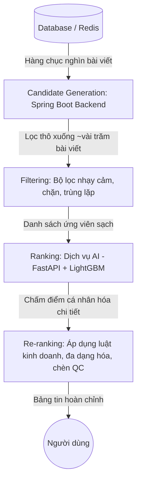
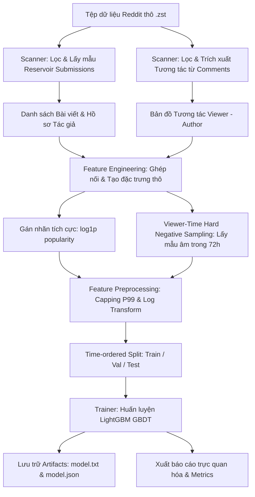
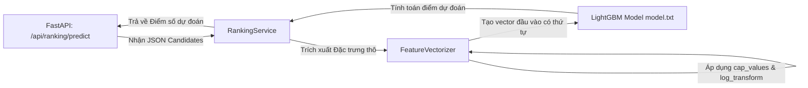

# Kiến Trúc Hệ Thống AI Pipeline - Social Pulse

Tài liệu này mô tả chi tiết kiến trúc hệ thống, quy trình xử lý dữ liệu (ETL), trích xuất đặc trưng (Feature Engineering), huấn luyện, đánh giá mô hình học máy (Offline Training), và cơ chế suy luận thời gian thực (Online Serving) của **AI Pipeline** thuộc hệ thống **Social Pulse**.

Hệ thống sử dụng mô hình xếp hạng **LightGBM Pointwise Regression** để chấm điểm mức độ liên quan cá nhân hóa của các bài đăng (candidates) đối với người dùng (viewers).

---

## 1. Tổng Quan Hệ Thống (System Overview)

Hệ thống AI Pipeline được thiết kế để giải quyết bài toán: **Cá nhân hóa nguồn cấp dữ liệu (feed ranking)** bằng cách chấm điểm và sắp xếp các bài đăng theo độ tương tác dự kiến của người dùng cụ thể.

### Công Nghệ & Công Cụ Sử Dụng (Technology Stack)
*   **Ngôn ngữ lập trình:** Python >= 3.11
*   **Quản lý thư viện & Môi trường:** `uv` (sử dụng `pyproject.toml` và `uv.lock` để đảm bảo tính đồng bộ và khả năng tái lập môi trường).
*   **Mô hình Học máy:** LightGBM (Gradient Boosting Decision Trees, phiên bản >= 4.5.0, cấu hình tối ưu GPU CUDA/CPU).
*   **Dịch vụ Dự báo (Inference Serving):** FastAPI + Uvicorn (phục vụ API REST endpoint `/api/ranking/predict`).
*   **Xử lý & Biến đổi dữ liệu:**
    *   `pandas` (>= 3.0.3) & `numpy` (>= 1.26.0) để biến đổi đặc trưng và xử lý ma trận.
    *   `scikit-learn` (>= 1.5.0) phục vụ chia tập dữ liệu và tính toán các chỉ số đánh giá.
    *   `zstandard` (>= 0.22.0) giúp đọc tuần tự dòng dữ liệu (streaming) trực tiếp từ các file nén dataset Reddit lớn mà không gây quá tải RAM.
*   **Giám sát & Trực quan hóa:** `matplotlib` (tự động vẽ biểu đồ phân phối nhãn, đường cong học tập, độ quan trọng đặc trưng) và `psutil` (giám sát tài nguyên phần cứng).

---

### Vai Trò Của Dịch Vụ AI: Candidate Generation vs. Ranking
Trong hệ thống gợi ý thực tế, quá trình phân phối tin tức được phân lớp thành nhiều giai đoạn chính nhằm đáp ứng bài toán quy mô lớn và tối ưu hóa thời gian phản hồi:



1.  **Candidate Generation (Truy xuất ứng viên):** Spring Boot Backend thực hiện lọc nhanh từ cơ sở dữ liệu hàng chục nghìn bài viết xuống khoảng vài trăm bài viết ứng viên (candidates) tiềm năng bằng các heuristics đơn giản hoặc truy vấn SQL/Redis nhanh.
2.  **Filtering (Lọc):** Loại bỏ các bài viết bị chặn, bài viết trùng lặp hoặc vi phạm chính sách của người xem hiện tại.
3.  **Ranking (Xếp hạng - Dịch vụ AI):** Dịch vụ AI (FastAPI với mô hình LightGBM) chỉ chịu trách nhiệm cho giai đoạn này. Dịch vụ nhận danh sách vài trăm ứng viên đã qua bộ lọc từ backend, chấm điểm độ liên quan cá nhân hóa cao dựa trên các đặc trưng động, và trả về điểm số tương tác dự kiến.
4.  **Re-ranking (Tái xếp hạng):** Backend nhận điểm số từ AI, áp dụng các luật kinh doanh (business rules), đa dạng hóa nội dung (diversity), chèn quảng cáo hoặc tin ghim trước khi hiển thị cho người dùng.

Hệ thống AI Pipeline hiện tại của Social Pulse chỉ đảm nhận giai đoạn **Ranking**, giúp giảm thiểu tối đa tài nguyên tính toán bằng cách ủy thác khâu lọc thô và truy xuất ban đầu cho tầng backend thượng nguồn.

---

### Sơ Đồ Quy Trình Đầu Đến Cuối (End-to-End Pipeline Workflow)

#### A. Quy trình Huấn luyện Mô hình Offline (Offline Training Pipeline)


#### B. Quy trình Dự đoán và Phục vụ API Online (Online Inference Serving)


---

## 2. Quy Trình 1: Thu Thập & Làm Sạch Dữ Liệu Thô (Data Ingestion & ETL)

Quy trình thu thập và làm sạch dữ liệu thô (ETL) được thực hiện thông qua module [scanner.py](file:///home/phuquydam/Documents/Social-Pulse/ai_pipeline/training/scanner.py) với lớp `PushshiftDatasetScanner`.

### 2.1. Đọc và Lọc Bài viết (`scan_submissions`)
*   **Cơ chế Đọc luồng (Streaming):** Sử dụng `JsonLineReader` để đọc tuần tự dòng dữ liệu từ file nén Reddit Submissions (`RS_2019-04.zst`) giúp tiết kiệm RAM khi xử lý tệp kích thước lớn.
*   **Bộ lọc Chất lượng (Quality Filters):**
    *   **Trường bắt buộc:** Loại bỏ các bản ghi thiếu `id`, `author`, hoặc `created_utc`.
    *   **Bộ lọc Bot:** Loại bỏ các tác giả trong danh sách nghi ngờ (`_LIKELY_BOT_AUTHORS` như `automoderator`, `tweetposter`, v.v.) hoặc có tên kết thúc bằng `bot`/`_bot`/`-bot`.
    *   **Bộ lọc NSFW:** Loại bỏ bài viết người lớn nếu `exclude_nsfw=True`.
    *   **Độ dài nội dung:** Độ dài tiêu đề + nội dung phải nằm trong khoảng từ `min_content_length` (mặc định 20) đến `max_content_length` (mặc định 20,000).
    *   **Bộ lọc Spam & Tín hiệu thấp (`_low_signal_reason`):** Bài viết phải chứa tối thiểu 3 từ phân biệt (`min_distinct_token_count`), 12 ký tự chữ cái (`min_alpha_char_count`), và tối đa 8 liên kết URL (`max_url_count`).
    *   **Loại bỏ trùng lặp (Deduplication):** Sử dụng mã băm SHA-1 của tiêu đề và nội dung để loại bỏ bài viết trùng lặp nội dung khi `dedupe_posts=True`.
*   **Lấy mẫu hồ chứa (Reservoir Sampling):** Sử dụng thuật toán lấy mẫu để duy trì một tập hợp ngẫu nhiên kích thước `sample_size` cố định (ví dụ: 50,000 bài viết) mà không cần nạp toàn bộ dữ liệu vào bộ nhớ.

### 2.2. Trích xuất Tương tác từ Bình luận (`scan_interactions`)
*   Quét luồng comments (`RC_2019-04.zst`) và lọc bỏ các bình luận của bot hoặc tài khoản bị xóa (`[deleted]`).
*   Chỉ giữ lại các bình luận trên bài đăng của những tác giả đã được ghi nhận trong tập bài viết (`post_author_map`).
*   Loại bỏ tự tương tác (self-comment) nơi người viết bình luận (commenter) trùng với tác giả bài đăng (author).
*   Lưu trữ ánh xạ lịch sử tương tác:
    *   `interactions[commenter][post_author] -> list[created_utc]`: Thời gian commenter bình luận bài viết của tác giả đó.
    *   `post_interactions[post_id][commenter] -> list[created_utc]`: Lịch sử tương tác của commenter trên bài viết cụ thể.

---

## 3. Quy Trình 2: Trích Xuất & Biến Đổi Đặc Trưng (Feature Engineering)

Phần này tập trung vào việc biến đổi toán học các cột dữ liệu thô thành đặc trưng số học (features) tối ưu cho mô hình học máy. Các bước được cài đặt trong lớp `PushshiftFeatureEngineering` của [feature_engineering.py](file:///home/phuquydam/Documents/Social-Pulse/ai_pipeline/training/feature_engineering.py).

### 3.1. Thiết Kế Đặc Trưng - Feature Schema v2
Hệ thống sử dụng **Feature Schema v2** gồm 11 đặc trưng cốt lõi (được chứng minh là an toàn trước hiện tượng rò rỉ dữ liệu). Thứ tự đặc trưng được định nghĩa cố định tại [schema.py](file:///home/phuquydam/Documents/Social-Pulse/ai_pipeline/shared/schema.py):

| Thứ tự | Tên Đặc Trưng | Nhóm Đặc Trưng | Ý Nghĩa / Cách Tính |
| :---: | :--- | :--- | :--- |
| **0** | `content_length` | Bài đăng | Tổng độ dài tiêu đề và nội dung bài viết. |
| **1** | `has_multimedia` | Bài đăng | Cờ nhị phân (1.0/0.0) biểu thị bài đăng có chứa video, ảnh, link đa phương tiện. |
| **2** | `is_share_post` | Bài đăng | Cờ nhị phân (1.0/0.0) biểu thị bài viết là crosspost. |
| **3** | `post_age_hours` | Bài đăng | Số giờ kể từ khi bài đăng được tạo đến thời điểm người xem truy cập (`query_utc`). |
| **4** | `author_seniority` | Tác giả | Tuổi thọ tài khoản của tác giả tính bằng năm tại thời điểm đăng bài. |
| **5** | `author_post_count` | Tác giả | Số lượng bài đăng lịch sử của tác giả trong tập dữ liệu. |
| **6** | `author_engagement_rate`| Tác giả | Điểm tương tác trung bình lịch sử của tác giả trước bài viết hiện tại. |
| **7** | `interaction_count_7d` | Tương tác | Số lần người xem bình luận bài viết của tác giả này trong 7 ngày trước đó. |
| **8** | `interaction_count_30d`| Tương tác | Số lần người xem bình luận bài viết của tác giả này trong 30 ngày trước đó. |
| **9** | `hours_since_last_interaction`| Tương tác| Số giờ trôi qua kể từ lần tương tác gần nhất giữa người xem và tác giả. |
| **10**| `affinity_score` | Tương tác | Tỷ lệ tương tác với tác giả này trên tổng số tương tác của người xem trong 30 ngày. |

### 3.2. Chiến Lược Lựa Chọn Đặc Trưng (Feature Selection)
Hệ thống loại bỏ hoàn toàn các đặc trưng văn bản thô (NLP nhúng sâu) tại v2 để đảm bảo tốc độ tính toán cực nhanh ở backend và tránh quá tải bộ nhớ. Thứ tự truyền đặc trưng vào mô hình được kiểm soát chặt chẽ bằng danh sách `RankingFeatureSchema.FEATURE_ORDER` để ngăn ngừa lỗi lệch thứ tự dữ liệu giữa lúc huấn luyện và lúc suy luận.

### 3.3. Các Biến Đổi Toán Học (Feature Transformation)
1.  **Xử lý giá trị khuyết thiếu (Imputation & Defaults):**
    *   Thay thế các trường số bị thiếu bằng giá trị mặc định `0.0`.
    *   Đặc trưng `hours_since_last_interaction` khi không có tương tác trước đó sẽ được gán giá trị mặc định là `999.0` (quy định tại `RankingFeatureSchema.DEFAULT_LAST_INTERACTION_HOURS`).
2.  **Giới Hạn Biên (Capping):**
    *   Để hạn chế nhiễu từ các điểm dữ liệu dị biệt (outliers), các đặc trưng phân phối đuôi dài được cắt cụt tại phân vị thứ 99 (`DEFAULT_CAP_PERCENTILE = 99.0`) của tập huấn luyện.
    *   Các đặc trưng áp dụng capping bao gồm: `content_length`, `post_age_hours`, `author_seniority`, `author_post_count`, `author_engagement_rate`, `hours_since_last_interaction`.
3.  **Biến đổi Logarit (Log Transformation):**
    *   Áp dụng biến đổi $y = \ln(1 + x)$ (`log1p`) để thu hẹp khoảng phân phối của các đặc trưng đếm tích lũy: `interaction_count_7d` và `interaction_count_30d`.
4.  **Đóng gói tham số:** Các giá trị cap thu được từ tập train được lưu trữ trong `model.json` phục vụ trực tiếp cho quá trình vector hóa online.

### 3.4. Phòng Chống Rò Rỉ Dữ Liệu (Data Leakage Prevention)
*   **Loại bỏ ảnh chụp tương tác cuối kỳ (Target-Time Snapshots):** Các thông số tương tác của chính bài viết tại thời điểm thu thập (như tổng vote score, comment count thực tế cuối cùng, vote ratio) **hoàn toàn không** được làm đặc trưng. Chúng chỉ được dùng làm nhãn (label).
*   **Tính toán lịch sử tác giả theo dòng thời gian (Chronological Author State):** Khi duyệt qua các bài đăng theo trật tự thời gian để tính toán `author_post_count` và `author_engagement_rate`, trạng thái của tác giả được chụp lại **trước** khi cộng dồn chỉ số của chính bài viết hiện tại.
*   **Lọc mốc thời gian tương tác (Time-bound Interactions):** Khi tính các đặc trưng tương tác của viewer (ví dụ: `interaction_count_7d`), hệ thống chỉ quét các mốc thời gian bình luận xảy ra **trước** thời điểm tạo bài đăng cần chấm điểm (`created_utc`).
*   **Kiểm tra tính toàn vẹn phân tách (`split_integrity`):** Pipeline tự động chạy kiểm tra chéo tập hợp `post_id` giữa các tập split. Nếu phát hiện bất kỳ sự trùng lặp nào, cảnh báo rò rỉ sẽ được kích hoạt.

---

## 4. Quy Trình 3: Huấn Luyện & Đánh Giá Mô Hình (Model Training & Evaluation)

### 4.1. Chiến Lược Lấy Mẫu Âm (Negative Sampling Strategy)
Do dữ liệu thực tế chỉ ghi nhận tương tác tích cực (Positive - Viewer bình luận bài viết), hệ thống tích hợp một quy trình sinh dữ liệu không tương tác (Implicit Negative) trong [feature_engineering.py](file:///home/phuquydam/Documents/Social-Pulse/ai_pipeline/training/feature_engineering.py):
*   **Viewer-Time Hard Negative Sampling (Lấy mẫu âm khó theo thời gian người xem):** Với mỗi tương tác tích cực (viewer tương tác với bài viết A vào thời điểm $t$), hệ thống tìm kiếm các bài viết mà người dùng *không* tương tác từ các tác giả khác trong khoảng thời gian $\pm 72$ giờ (`_NEGATIVE_LOOKBACK_HOURS`) xung quanh thời điểm tương tác tích cực.
*   **Kiểm soát mất cân bằng lớp (Class Imbalance):** Tham số `negative_samples_per_positive = 2` tạo ra tỷ lệ nhãn dương:âm là $1:2$. Tỷ lệ này đủ để mô hình học cách phân biệt sự ưu tiên mà không bị lệch dự đoán quá mức về phía lớp âm, giúp tăng độ ổn định huấn luyện lên gấp 3 lần và giảm sai số dự báo.

### 4.2. Chiến Lược Chia Tập Dữ Liệu (Validation Strategy)
Hệ thống sử dụng chiến lược **Phân chia theo thời gian gom cụm (Time-Ordered Grouped Split)**:
1.  **Gom cụm:** Gom toàn bộ dòng dữ liệu theo thuộc tính phân tách `post_id`. Toàn bộ các dòng dữ liệu (tích cực/tiêu cực) liên quan đến cùng một `post_id` phải cùng nằm chung trong một tập.
2.  **Sắp xếp:** Sắp xếp các cụm này theo thuộc tính thời gian tạo bài viết tăng dần (`created_utc`).
3.  **Phân chia:** Chia theo tỷ lệ định sẵn (ví dụ: 70% Train, 20% Validation, 10% Test). Tập Validation và Test sẽ luôn chứa các bài viết được đăng tải *sau* tập Train để mô phỏng chính xác kịch bản triển khai thực tế.

### 4.3. Kiến Trúc Mô Hình & Thuật Toán Huấn Luyện
*   **Mô hình:** Gradient Boosted Decision Trees (GBDT) thông qua thư viện **LightGBM** (`lightgbm.Booster`).
*   **Cơ chế Cập nhật Gradient Boosting (Toán học):**
    Mô hình cuối cùng $F_M(x)$ được xây dựng dưới dạng cộng dồn (additive) của $M$ cây quyết định độc lập:
    $$F_m(x) = F_{m-1}(x) + \eta h_m(x)$$
    Trong đó, $\eta$ là tốc độ học (`learning_rate`, mặc định 0.05).
    LightGBM tối ưu hóa hàm mục tiêu bằng xấp xỉ Taylor bậc hai:
    $$\text{Obj}^{(m)} \approx \sum_{i=1}^N \left[ l(y_i, \hat{y}_i^{(m-1)}) + g_i f_m(x_i) + \frac{1}{2} h_i f_m^2(x_i) \right] + \Omega(f_m)$$
    Với bài toán hồi quy sử dụng hàm lỗi bình phương L2 (MSE):
    $$l(y_i, \hat{y}_i) = \frac{1}{2} (y_i - \hat{y}_i)^2 \implies g_i = \hat{y}_i - y_i, \quad h_i = 1$$
*   **Leaf-wise Tree Growth & Histogram Split Optimization:** LightGBM tìm lá có độ giảm tổn thất lớn nhất để chia nhánh (Leaf-wise), kết hợp gom các đặc trưng liên tục vào các hộp rời rạc (`max_bin = 256`) giúp tăng tốc độ huấn luyện lên nhiều lần.

### 4.4. Xây Dựng Nhãn Mục Tiêu (Label Engineering)
Hệ thống sử dụng chiến lược **Pointwise Regression** trên nhãn liên tục được biến đổi logarit từ độ phổ biến tổng hợp:
$$popularity = \max(score, 0) + \max(num\_comments, 0) + \max(num\_crossposts, 0)$$
$$label = \ln(1 + popularity)$$
*   **Lý do lựa chọn:** Do tương tác trên mạng xã hội phân phối lũy thừa (Power Law), biến đổi log giúp nén dải giá trị cực lớn về phân phối chuẩn hơn, giúp mô hình hội tụ tốt hơn và tạo ra khoảng cách điểm số mịn màng hơn khi sắp xếp.
*   **Sử dụng Popularity Proxy thay vì CTR:** Lịch sử Reddit không ghi nhận nhật ký hiển thị (impressions), do đó việc tính CTR thực tế ($Clicks / Impressions$) là bất khả thi. Lượng bình luận, điểm số đóng vai trò như một chỉ báo ngầm (implicit feedback) phản ánh mức độ hấp dẫn tổng thể của bài đăng.

### 4.5. Tối Ưu Siêu Tham Số & Cơ Chế Dừng Sớm
*   **Tham số chính:** `max_depth` (mặc định 8), `num_leaves` ($2^{max\_depth} - 1 = 255$), `min_child_samples` (32), `reg_lambda` (1.5), `reg_alpha` (0.05).
*   **Cơ chế dừng sớm (Early Stopping):** Huấn luyện tối đa `n_estimators` (ví dụ: 1200) vòng lặp. Nếu RMSE trên tập Validation không giảm sau liên tiếp `early_stopping_rounds` (mặc định 50) vòng lặp, quá trình huấn luyện dừng lại và lấy mô hình tại vòng lặp tốt nhất.
*   **Tự động chuyển đổi phần cứng:** Yêu cầu GPU CUDA (`--device cuda`). Nếu lỗi phần cứng hoặc thiếu driver, hệ thống tự động rơi về chế độ CPU (`allow_cpu_fallback=True`).

### 4.6. Chỉ Số Đánh Giá (Evaluation Metrics)
Đo lường hiệu năng mô hình qua bộ chỉ số đa chiều trong [trainer.py](file:///home/phuquydam/Documents/Social-Pulse/ai_pipeline/training/trainer.py):
*   **RMSE & MAE:** Đo lường sai lệch tuyệt đối của điểm dự báo so với nhãn thực tế.
*   **R2 Score:** Đo lường mức độ cải thiện giải thích phương sai của mô hình so với dự báo hằng số bằng giá trị trung bình nhãn huấn luyện.
*   **NDCG@10 (Normalized Discounted Cumulative Gain):** Tính toán chất lượng của thứ tự sắp xếp bài viết trong danh sách của từng viewer riêng biệt.
*   **Pairwise Accuracy:** Tỷ lệ số cặp bài viết của cùng một viewer mà mô hình dự đoán đúng thứ tự ưu tiên (bài đăng có tương tác cao nhận điểm cao hơn).

### 4.7. Thí Nghiệm & Giám Sát (Experiment Tracking)
*   **model.json:** Tệp cấu hình chứa siêu tham số, thông tin phần cứng chạy, lịch sử học tập (loss history) qua từng vòng lặp, độ quan trọng đặc trưng (feature importance).
*   **metrics.json:** Tệp tóm tắt ngắn gọn các điểm số RMSE, MAE, R2, NDCG trên cả 3 tập split.
*   **Biểu đồ phân tích (Plots):** Xuất tự động ra thư mục `ai_pipeline/model/plots/`:
    *   `label_distribution.png`: Phân phối tần suất của nhãn tương tác.
    *   `split_label_distribution.png`: So sánh phân phối nhãn giữa 3 tập split.
    *   `training_curves.png`: Đường cong học tập của RMSE/MAE trên tập Train và Valid.
    *   `feature_importance.png`: Xếp hạng mức đóng góp độ lợi (gain) của 11 đặc trưng.

---

## 5. Quy Trình 4: Đánh Giá An Toàn & Cập Nhật Mô Hình (Model Update Strategy)

Mô hình mới chỉ được phép triển khai lên môi trường Production nếu vượt qua **Bảng kiểm định an toàn (Train Checklist)**:

```markdown
- [ ] Không rò rỉ dữ liệu: Trùng lặp post_id giữa các tập (Train, Val, Test) phải bằng 0.
- [ ] Độ chính xác cặp: pairwise_accuracy trên tập Test phải >= 0.55.
- [ ] Độ uplift NDCG: NDCG của mô hình phải cải thiện tối thiểu 0.02 so với baseline trung bình.
- [ ] Kiểm tra Overfitting: RMSE tập Train không được thấp hơn 75% so với RMSE tập Validation.
- [ ] Kiểm tra tính trung thực: NDCG không được phép quá hoàn hảo (>= 0.995 - dấu hiệu rò rỉ đặc trưng).
- [ ] Độ tập trung đặc trưng: Không có đặc trưng đơn lẻ nào chiếm > 70% tổng mức đóng góp độ lợi (gain importance).
```

### Quản Lý Phiên Bản (Model Versioning)
Phiên bản mô hình được kiểm soát thông qua cấu trúc dữ liệu `RankingModelArtifact` tại [model.py](file:///home/phuquydam/Documents/Social-Pulse/ai_pipeline/shared/model.py):
*   `artifact_version`: Mã định danh phiên bản (Mặc định là `"1"`).
*   `feature_schema_version`: Phiên bản cấu trúc đặc trưng (Hiện tại là `"v2"`).
*   `model_file`: Trỏ tới tệp chứa cấu trúc cây nhị phân LightGBM thực tế (`model.txt` nằm cùng thư mục với `model.json`).

---

## 6. Quy Trình 5: Phục Vụ Dự Đoán Thời Gian Thực (Inference Serving)

Kiến trúc phục vụ dự đoán thời gian thực (Inference Runtime) được cài đặt như một dịch vụ độc lập sử dụng **FastAPI** tại [server.py](file:///home/phuquydam/Documents/Social-Pulse/ai_pipeline/server.py), được điều phối chính bởi [ranking_service.py](file:///home/phuquydam/Documents/Social-Pulse/ai_pipeline/inference/ranking_service.py) và [vectorizer.py](file:///home/phuquydam/Documents/Social-Pulse/ai_pipeline/inference/vectorizer.py).

### 6.1. Quy Trình Xử Lý Yêu Cầu Runtime (Runtime Flow)
1.  **Nhận Yêu cầu:** Spring Boot Backend gửi yêu cầu POST đến `/api/ranking/predict` kèm theo danh sách các ứng viên bài viết và các đặc trưng thô tương ứng (`post_features`, `author_features`, `interaction_features`).
2.  **Xác Thực Giao Ước:** Xác thực thuộc tính `feature_schema_version` của request phải khớp với cấu hình của dịch vụ (mặc định `v2`).
3.  **Vector hóa Đặc trưng (`FeatureVectorizer`):**
    *   Áp dụng các giá trị cap (cắt cụt phân vị 99) được nạp cứng từ `model.json`.
    *   Áp dụng biến đổi logarit cho các đặc trưng đếm tương tác 7 ngày/30 ngày.
    *   Sắp xếp các đặc trưng vào mảng numpy đúng theo thứ tự 11 cột mô hình yêu cầu.
4.  **Dự báo:** Gọi `booster.predict(matrix)` sử dụng đối tượng LightGBM đã tải sẵn vào RAM lúc khởi động dịch vụ từ file sidecar `model.txt`.
5.  **Trả kết quả:** Trả về danh sách JSON chứa `post_id`, predicted `score` và phiên bản schema tương ứng.
6.  **Cơ chế dự phòng (Inference Fallback):** Nếu FastAPI gặp sự cố mạng hoặc phản hồi quá lâu, backend sẽ chuyển hướng sử dụng `FallbackRankingService` để sắp xếp danh sách bằng các chỉ số tương tác tĩnh trong database mà không làm gián đoạn trải nghiệm người dùng.

### 6.2. Tính Nhất Quán Đặc Trưng (Online/Offline Consistency)
Hệ thống ngăn ngừa hiện tượng lệch phân phối giữa huấn luyện và chạy thực tế (Train-Serve Skew) bằng cơ chế đồng bộ hóa:
*   **Parity of Feature Logic:** Cả quá trình huấn luyện offline và suy luận trực tuyến đều sử dụng chung một giao ước định danh và giá trị mặc định từ `RankingFeatureSchema`.
*   **Configuration Parity (Nhất quán tham số tiền xử lý):** Tránh tính toán lại giá trị capping trên traffic thực tế. Toàn bộ giá trị capped tối đa (`cap_values`) và danh sách các trường cần lấy log thu được từ tập huấn luyện được ghi vào `model.json` và tải cứng vào dịch vụ khi khởi động.
*   **Feature Freshness:** Các đặc trưng tác giả và tương tác được backend cập nhật định kỳ vào cơ sở dữ liệu. Khi có request xếp hạng, backend trích xuất các đặc trưng này tại thời điểm hiện tại và truyền trực tiếp qua API, đảm bảo mô hình nhận được dữ liệu phản ánh đúng trạng thái thực tế nhất.

---

## 7. Quy Trình 6: Triển Khai & Vận Hành (Deployment & Monitoring)

### 7.1. Đóng Gói Container (Docker)
*   Dịch vụ được container hóa bằng `Dockerfile` tối ưu hóa dựa trên công cụ quản lý thư viện Python `uv`. Quá trình build đồng bộ các thư viện từ tệp `pyproject.toml` và `uv.lock`.
*   Trong cụm Docker Compose, dịch vụ chạy dưới tên container `ai-pipeline` trên cổng `8000`, liên kết mạng nội bộ với container backend chính.

### 7.2. Giám Sát và Phát Hiện Lệch Dữ Liệu
*   **Liveness & Readiness Probe:** Endpoint `/health` của FastAPI trả về trạng thái hoạt động, thông tin mô hình đã tải (`model_loaded`), vị trí file mô hình và tính sẵn sàng của schema.
*   **Cảnh báo lệch phân phối dữ liệu (Distribution Shift Warnings):** Lúc huấn luyện, hệ thống tính toán độ lệch trung bình nhãn giữa Train/Val/Test. Nếu vượt ngưỡng quy định, cảnh báo `validation/test label distribution is shifted` sẽ được ghi nhận vào file metadata để cảnh báo kỹ sư AI cần điều chỉnh bộ lọc dữ liệu đầu vào.

---

## 8. Đánh Đổi Thiết Kế Hệ Thống (System Design Trade-offs)

### 8.1. Tại sao chọn LightGBM thay vì Deep Learning?
*   **Độ trễ dự đoán thấp (Inference Latency):** LightGBM chạy trên CPU với các cấu trúc cây IF-ELSE biên dịch trực tiếp, giúp thời gian phản hồi ở mức dưới mili-giây (sub-millisecond) cho hàng trăm ứng viên. Mô hình Deep Learning (ví dụ: DLRM) đòi hỏi tính toán ma trận lớn, có thể đẩy độ trễ vượt ngưỡng 50ms nếu không có phần cứng GPU tăng tốc.
*   **Chi phí vận hành thấp:** LightGBM cực kỳ nhẹ về tài nguyên, có thể chạy trực tiếp trên các nhân CPU giá rẻ của máy chủ ứng dụng mà không cần duy trì các cụm GPU đắt đỏ.
*   **Ưu thế trên dữ liệu bảng (Tabular Data):** Các đặc trưng của Social Pulse chủ yếu là dữ liệu dạng bảng. Các mô hình cây quyết định (GBDT) vẫn vượt trội hơn Deep Learning về cả độ chính xác lẫn tính ổn định trên các định dạng dữ liệu này.
*   **Khả năng chịu lỗi khởi đầu lạnh (Cold-Start):** Khác với Deep Learning dễ bị sai lệch nghiêm trọng khi thiếu dữ liệu, mô hình cây có thể xử lý các giá trị khuyết thiếu (NaN) của người dùng mới bằng các nhánh mặc định đã được tính toán tối ưu từ trước.

### 8.2. Tại sao chọn Pointwise thay vì LambdaMART (Listwise)?
*   **Dễ dàng gỡ lỗi:** Phương pháp Pointwise mô hình hóa bài toán dưới dạng hồi quy (Regression). Điểm số đầu ra của mô hình có ý nghĩa vật lý trực quan (log-popularity ước tính), giúp các kỹ sư dễ dàng kiểm tra và thiết lập các ngưỡng chặn.
*   **Huấn luyện ổn định hơn:** Pointwise Regression tối ưu hóa trực tiếp hàm lỗi L2 (MSE), một hàm lồi có bề mặt gradient cực kỳ mịn và ổn định. Ngược lại, LambdaMART tối ưu hóa hàm loss dựa trên NDCG (vốn không khả vi trực tiếp), dễ dẫn đến mất ổn định trong quá trình hội tụ trên các tập dữ liệu nhỏ hoặc mất cân bằng.
*   **Quy mô dữ liệu nhỏ:** Ở quy mô ban đầu của dự án, số lượng tương tác lịch sử chưa đạt mức hàng triệu. Huấn luyện Pointwise Regression giúp tận dụng hiệu quả từng dòng dữ liệu lấy mẫu âm/dương mà không đòi hỏi số lượng nhóm (queries/groups) khổng lồ như các thuật toán so sánh cặp hoặc danh sách.

### 8.3. Tại sao không dùng Transformer Embeddings?
*   **Quá tải bộ nhớ:** Việc tích hợp các mô hình ngôn ngữ lớn (LLMs/Transformers) để sinh vector nhúng cho tiêu đề/nội dung bài viết đòi hỏi dung lượng RAM/VRAM khổng lồ ở cả tầng offline lẫn online.
*   **Độ trễ thời gian thực:** Chạy một mô hình Transformer trực tiếp tại thời điểm người dùng load feed sẽ tạo ra nút thắt cổ chai về hiệu năng (thường mất từ 100ms - 500ms), vi phạm nghiêm trọng yêu cầu phi chức năng (< 50ms).
*   **Độ phức tạp vận hành:** Nếu không sinh vector trực tiếp, hệ thống sẽ phải lưu trữ sẵn vector nhúng của tất cả bài viết vào cơ sở dữ liệu vector (Vector Database) và truy xuất thời gian thực, điều này làm phức tạp hóa đáng kể kiến trúc hệ thống (cần duy trì Milvus/Qdrant, xử lý đồng bộ hóa vector).

---

## 9. Định Hướng Phát Triển (Future Improvements)

1.  **Xây dựng Online Feature Store:** Tích hợp Redis hoặc một giải pháp Feature Store chuyên dụng nhằm lưu trữ và truy vấn nhanh các chỉ số tương tác thời gian thực của tác giả/người dùng thay vì tính toán ad-hoc tại database của backend.
2.  **Chuyển đổi sang Listwise Learning-to-Rank:** Chuyển đổi hàm mục tiêu huấn luyện của LightGBM từ hồi quy điểm (Pointwise Regression) sang tối ưu hóa thứ tự trực tiếp (**LambdaMART/LambdaRank**) để cải thiện trực tiếp chỉ số NDCG@10.
3.  **Tự động hóa phát hiện trôi lệch dữ liệu thời gian thực (Real-time Drift Detection):** Phát triển cơ chế định kỳ thu thập phân phối đặc trưng thực tế từ dữ liệu yêu cầu (request payloads) để so sánh với phân phối lúc huấn luyện trong `model.json`, từ đó tự động đưa ra cảnh báo cần huấn luyện lại mô hình (retraining trigger).
4.  **Nạp lại mô hình động (Dynamic Hot-reloading):** Cho phép dịch vụ FastAPI tự động phát hiện tệp mô hình mới được cập nhật trên đĩa và tải lại mô hình vào bộ nhớ RAM mà không cần phải khởi động lại container dịch vụ.
