# Backend Spring Boot Architecture (Sơ đồ Kiến trúc Spring Boot Backend)

Sơ đồ này biểu diễn chi tiết cấu trúc các lớp (packages) trong Backend Spring Boot theo mô hình **Clean Architecture / DDD (Domain-Driven Design)**, thể hiện rõ ranh giới giữa các tầng và luồng xử lý nghiệp vụ khi tạo bảng tin.

```mermaid
flowchart TD
  %% Style definitions
  classDef web fill:#f0fdf4,stroke:#10b981,stroke-width:2px,color:#15803d;
  classDef app fill:#f0f9ff,stroke:#0284c7,stroke-width:2px,color:#0369a1;
  classDef domain fill:#fefce8,stroke:#ca8a04,stroke-width:2px,color:#854d0e;
  classDef infra fill:#fff7ed,stroke:#ea580c,stroke-width:2px,color:#c2410c;
  classDef db fill:#f1f5f9,stroke:#64748b,stroke-width:2px,color:#475569;

  subgraph Presentation_Web_Layer ["Presentation & Web Layer (Adapters)"]
    Controller["FeedController<br>(/api/v1/feed)"]:::web
    Security["JwtAuthenticationFilter<br>(& SecurityConfig)"]:::web
    SSEAdapter["SseEmitterRegistry<br>(Server-Sent Events)"]:::web
  end

  subgraph Application_Layer ["Application Layer (Use Cases & Services)"]
    GetFeed["GetFeedService<br>(implements GetFeedUseCase)"]:::app
    
    subgraph Ranking_Orchestrator ["Ranking Engine Core"]
      RankFeed["FeedRankingService<br>(implements RankFeedUseCase)"]:::app
      SelectCandidates["CandidateSelectionService<br>(SelectCandidatesUseCase)"]:::app
      ExtractFeatures["FeatureExtractionService<br>(ExtractFeaturesUseCase)"]:::app
      
      subgraph Extractors ["Feature Extractors"]
        AuthorExt["AuthorFeatureExtractor"]:::app
        PostExt["PostFeatureExtractor"]:::app
        InterExt["InteractionFeatureExtractor"]:::app
      end
      
      Fallback["FallbackRankingService"]:::app
      Boost["ScoreBoostService"]:::app
      CacheFeed["FeedCacheService<br>(CacheFeedUseCase)"]:::app
    end
  end

  subgraph Domain_Layer ["Domain Layer (Core Entities & Interfaces)"]
    Entities["Domain Entities<br>- User, Post, Follow<br>- FeedItem, CandidatePost"]:::domain
    
    subgraph Repo_Interfaces ["Repository Interfaces"]
      FeedRepo["FeedRepository"]:::domain
      ImpressionRepo["FeedImpressionRepository"]:::domain
      InteractionRepo["UserInteractionRepository"]:::domain
    end
  end

  subgraph Infrastructure_Layer ["Infrastructure & Persistence Layer"]
    subgraph Adapters ["Persistence Adapters"]
      FeedRepoAdp["FeedRepositoryAdapter"]:::infra
      ImpressionRepoAdp["FeedImpressionRepositoryAdapter"]:::infra
      InteractionRepoAdp["UserInteractionRepositoryAdapter"]:::infra
    end
    
    subgraph JPA_Redis_Templates ["Spring Data & Templates"]
      JpaRepo["JpaUserRepository / JpaUserInteractionRepository"]:::infra
      RedisTemplate["StringRedisTemplate"]:::infra
      AIClient["AiPipelineRankingClient<br>(implements PredictRankingUseCase)"]:::infra
    end
  end

  subgraph Datastores ["External Services & Databases"]
    PostgreSQL[("PostgreSQL DB")]:::db
    Redis[("Redis Memory Cache")]:::db
    FastAPI[("FastAPI AI Service")]:::db
  end

  %% Flow and Dependencies (Clean Architecture rule: outer depends on inner)
  %% 1. Request Flow
  Controller -->|1. Invokes| GetFeed
  Security -->|Authenticates| Controller
  GetFeed -->|2. Queries Ranked Feed| RankFeed
  
  %% 2. Ranking Flow inside Application Layer
  RankFeed -->|3. Get Cached| CacheFeed
  RankFeed -->|4. Get Candidates| SelectCandidates
  RankFeed -->|5. Extract Features| ExtractFeatures
  ExtractFeatures -->|5a. Extract| AuthorExt
  ExtractFeatures -->|5b. Extract| PostExt
  ExtractFeatures -->|5c. Extract| InterExt
  
  RankFeed -->|6. Call AI Predict| AIClient
  RankFeed -->|7. Adjust Scores| Boost
  RankFeed -.->|8. If Timeout: Fallback| Fallback
  
  %% 3. Interface Dependencies (Dependency Inversion)
  SelectCandidates -->|Calls| FeedRepo
  ExtractFeatures -->|Calls| InteractionRepo
  GetFeed -->|Saves Impressions| ImpressionRepo
  CacheFeed -->|Calls Redis| RedisTemplate
  
  %% 4. Adapter Implementations (Domain to Infrastructure)
  FeedRepoAdp -.->|implements| FeedRepo
  ImpressionRepoAdp -.->|implements| ImpressionRepo
  InteractionRepoAdp -.->|implements| InteractionRepo
  
  %% 5. Databases
  FeedRepoAdp --> JpaRepo
  ImpressionRepoAdp --> JpaRepo
  InteractionRepoAdp --> JpaRepo
  JpaRepo --> PostgreSQL
  
  RedisTemplate --> Redis
  AIClient --> FastAPI
  
  %% 6. Realtime Notification Flow
  JpaRepo -.->|On Post Create/Delete| SSEAdapter
  SSEAdapter -.->|Broadcast Emitter| Redis
```

## 1. Cơ Cấu Tổ Chức Theo Clean Architecture

*   **Presentation / Web Layer:** Nơi định nghĩa các REST controller và cấu hình bảo mật. `FeedController` nhận các tham số phân trang (`page`, `size`) và bộ lọc chủ đề (`topicSlug`). Dùng `JwtAuthenticationFilter` để chuyển hóa token thành đối tượng bảo mật `CustomUserDetails`.
*   **Application Layer:** Chứa toàn bộ logic nghiệp vụ (business logic) của hệ thống gợi ý.
    *   `GetFeedService`: Điều phối luồng, kiểm tra xem trang yêu cầu có phải trang đầu (page 0) để invalidate cache cũ, lưu vết impression và đánh dấu seen posts.
    *   `FeedRankingService`: Trái tim xếp hạng. Chịu trách nhiệm gọi nạp ứng viên, trích xuất đặc trưng động qua các extractor con (Author, Post, Interaction), gửi request cho AI Client, và tái xếp hạng bằng `ScoreBoostService` trước khi đẩy vào cache.
*   **Domain Layer:** Phần độc lập nhất trong Clean Architecture. Chứa các thực thể cốt lõi (`User`, `Post`, `FeedItem`) và các định nghĩa cổng (Repository Interfaces). Việc tách biệt interface ở đây giúp tầng ứng dụng không phụ thuộc vào cơ sở dữ liệu cụ thể (Dependency Inversion Principle).
*   **Infrastructure Layer:** Triển khai các cổng từ Domain Layer (Adapters). Lớp này tương tác trực tiếp với các thư viện bên thứ ba như Spring Data JPA (`JpaUserRepository`), `StringRedisTemplate` và `AiPipelineRankingClient` (thực hiện kết nối REST API đến FastAPI).

## 2. Quy Trình Xử Lý Một Request Bảng Tin (Feed Request Flow)

1.  **Xác thực:** Yêu cầu đi qua `JwtAuthenticationFilter` để trích xuất `userId`.
2.  **Controller & UseCase:** `FeedController` gọi `GetFeedService.getFeed()`.
3.  **Kiểm tra Cache:** `FeedRankingService` kiểm tra Redis Key `user:feed:<userId>`. Nếu có dữ liệu, trả về tập phân trang ngay lập tức (không cần tính toán lại).
4.  **Tải ứng viên (Candidate Generation):** Nếu cache trống, `SelectCandidatesUseCase` truy vấn PostgreSQL lấy ra tối đa vài trăm bài viết tiềm năng (loại bỏ các bài viết nhạy cảm hoặc của tác giả bị chặn).
5.  **Trích xuất đặc trưng (Feature Extraction):** `FeatureExtractionService` gọi song song các Extractor để tổng hợp 11 đặc trưng (ví dụ: số bình luận trong 7 ngày gần nhất, điểm thân mật giữa viewer và author).
6.  **Gọi AI Service:** `AiPipelineRankingClient` gửi JSON qua RestClient đến FastAPI. Nếu FastAPI phản hồi thành công trong vòng 5 giây, điểm số được trả về. Nếu thất bại (timeout/lỗi kết nối), `FallbackRankingService` sẽ chạy thuật toán heuristics thay thế.
7.  **Tái xếp hạng & Caching:** Áp dụng trọng số cộng thêm (Boost) cho các bài viết thuộc chủ đề người dùng yêu thích -> Lưu kết quả sắp xếp vào Redis -> Trả về trang dữ liệu hiện tại cho client.
8.  **Hậu xử lý:** Đánh dấu các bài viết vừa trả về vào set `user:seen:<userId>` trong Redis và ghi nhận lịch sử hiển thị vào PostgreSQL không đồng bộ (Async Logging).
