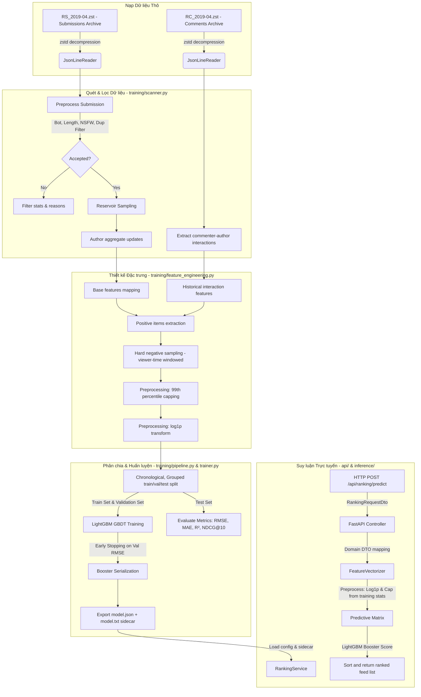

# Phân tích Sâu Mã nguồn AI/ML Social Pulse: Chấm điểm Ứng viên & Hiệu năng Pipeline

Tài liệu này cung cấp một bài phân tích chuyên sâu, chuẩn sản xuất về mã nguồn AI/ML xếp hạng tin tức (feed ranking) của Social Pulse. Nội dung tập trung vào trực giác toán học, đánh đổi kỹ thuật, kiến trúc hệ thống, chất lượng đặc trưng (feature)/nhãn (label), chỉ số đánh giá, và tính sẵn sàng vận hành của đường ống (pipeline) nằm trong thư mục [ai_pipeline](file:///home/damphuquy/Documents/Social-Pulse/ai_pipeline).

### Bản đồ Ánh xạ Phân đoạn Mã nguồn (Codebase Phase Mapping)

| Phân đoạn (Phase) | File đảm nhận nhiệm vụ chính | Lớp / Hàm chịu trách nhiệm chính |
| :--- | :--- | :--- |
| **Giai đoạn 1 - Kiến trúc** | [pipeline.py](file:///home/damphuquy/Documents/Social-Pulse/ai_pipeline/training/pipeline.py) | Lớp `PushshiftTrainingPipeline` |
| **Giai đoạn 2 - Tập dữ liệu** | [scanner.py](file:///home/damphuquy/Documents/Social-Pulse/ai_pipeline/training/scanner.py) | Lớp `PushshiftDatasetScanner` |
| **Giai đoạn 3 - Đặc trưng** | [feature_engineering.py](file:///home/damphuquy/Documents/Social-Pulse/ai_pipeline/training/feature_engineering.py) | Lớp `PushshiftFeatureEngineering` |
| **Giai đoạn 4 - Phân chia** | [feature_engineering.py](file:///home/damphuquy/Documents/Social-Pulse/ai_pipeline/training/feature_engineering.py) | Hàm `PushshiftFeatureEngineering.split_rows` |
| **Giai đoạn 5 & 6 - Huấn luyện**| [trainer.py](file:///home/damphuquy/Documents/Social-Pulse/ai_pipeline/training/trainer.py) | Lớp `LightGbmRankingTrainer` |
| **Giai đoạn 7 - Siêu tham số** | [arguments.py](file:///home/damphuquy/Documents/Social-Pulse/ai_pipeline/training/arguments.py) | Lớp `TrainingArguments` |
| **Giai đoạn 8 - Đánh giá** | [trainer.py](file:///home/damphuquy/Documents/Social-Pulse/ai_pipeline/training/trainer.py) | Hàm `LightGbmRankingTrainer.evaluate` |
| **Giai đoạn 10 - Giải thích** | [trainer.py](file:///home/damphuquy/Documents/Social-Pulse/ai_pipeline/training/trainer.py) | Hàm `booster.feature_importance` |
| **Giai đoạn 11 - Suy luận** | [ranking_service.py](file:///home/damphuquy/Documents/Social-Pulse/ai_pipeline/inference/ranking_service.py) <br> [vectorizer.py](file:///home/damphuquy/Documents/Social-Pulse/ai_pipeline/inference/vectorizer.py) | Lớp `RankingService` <br> Lớp `FeatureVectorizer` |
| **Giai đoạn 12 - MLOps & Chẩn đoán**| [visualize_metrics.ipynb](file:///home/damphuquy/Documents/Social-Pulse/ai_pipeline/model/visualize_metrics.ipynb) | Jupyter Notebook Diagnostics |
| **Giai đoạn 13 - Thiết kế** | [FeedRankingService.java](file:///home/damphuquy/Documents/Social-Pulse/backend/src/main/java/com/socialpulse/app/feed/application/service/ranking/FeedRankingService.java) | Tầng nghiệp vụ Java tích hợp & dự phòng |

---

## Giai đoạn 1 - Kiến trúc Thượng tầng & Ngữ cảnh Hệ thống

> [!NOTE]
> **File đảm nhận chính:** [pipeline.py](file:///home/damphuquy/Documents/Social-Pulse/ai_pipeline/training/pipeline.py) | **Lớp:** `PushshiftTrainingPipeline`

### 1.1 Chấm điểm Ứng viên (Candidate Scoring) so với Hệ thống Xếp hạng Đầy đủ (Full Ranking System)

Module `ai_pipeline` thực tế là một thành phần **Chấm điểm Ứng viên (Candidate Scoring)**, tương ứng với giai đoạn thứ ba trong phễu khuyến nghị (recommendation funnel) hiện đại. Bản thân nó không phải là một hệ thống xếp hạng đầy đủ. Một hệ thống khuyến nghị hoàn chỉnh hoạt động theo mô hình phễu nhiều tầng như sau:

```
               ┌─────────────────────────────────────────┐
               │    Hàng triệu bài viết trong Database   │
               └────────────────────┬────────────────────┘
                                    │
                                    ▼
       1. Tìm kiếm / Gợi ý ứng viên (Retrieval/Candidate Gen - Lấy ra ~1000 mục)
          - Lọc cộng tác (Collaborative Filtering), Tìm kiếm vector (Vector Search)
          - Truy vấn theo luật (ví dụ: các kênh người dùng đã đăng ký)
                                    │
                                    ▼
       2. Lọc thô / Hàng rào bảo vệ (Filtering/Guardrails - Giảm xuống ~200 mục)
          - Chặn nội dung nhạy cảm (NSFW), danh sách đen (blocklist), kiểm tra độ tuổi
          - Loại bỏ trùng lặp (Kiểm tra chữ ký SHA1 content)
                                    │
                                    ▼
       3. Chấm điểm Ứng viên [PIPELINE NÀY] (Candidate Scoring - Chấm điểm)
          - Các mô hình ML phức tạp (LightGBM GBDT, Mạng nơ-ron)
          - Kết hợp lịch sử tương tác, đặc trưng bài viết, mức độ suy giảm theo thời gian
                                    │
                                    ▼
       4. Tái xếp hạng & Đa dạng hóa (Re-ranking & Diversification - Lấy ra ~20 mục)
          - Logic nghiệp vụ, chèn quảng cáo, đa dạng hóa danh mục/thể loại bài viết
          - Trả về danh sách đã sắp xếp cuối cùng cho thiết bị người dùng
```

* **Vai trò trong dự án**: Tầng backend Java ([FeedRankingService](file:///home/damphuquy/Documents/Social-Pulse/backend/src/main/java/com/socialpulse/app/feed/application/service/ranking/FeedRankingService.java)) trích xuất các đặc trưng của danh sách bài viết ứng viên, gửi yêu cầu chấm điểm đến API dịch vụ AI viết bằng FastAPI, và tiến hành sắp xếp chúng. Nếu dịch vụ FastAPI gặp sự cố, hệ thống sẽ tự động chuyển sang chế độ dự phòng dựa trên các quy tắc tĩnh (`FallbackRankingService`), bảo toàn tính sẵn sàng cho toàn hệ thống.

### 1.2 Sơ đồ Luồng Hoạt động của Pipeline



### 1.3 Phân tích Chi tiết Từng Bước

#### 1. Nạp Dữ liệu Thô & Giải nén Stream
* **Đầu vào**: Các file nén định dạng `.zst` chứa bài đăng (submissions) và bình luận (comments) trên Reddit.
* **Đầu ra**: Trả về từng dòng payload dạng JSON (dictionary) thông qua cơ chế generator.
* **File chịu trách nhiệm**: [json_support.py](file:///home/damphuquy/Documents/Social-Pulse/ai_pipeline/training/json_support.py) -> `JsonLineReader`.
* **Phụ thuộc**: `zstandard` (thư viện liên kết zstd của Python), `io.TextIOWrapper`, `json`.
* **Mục đích**: Giải nén thời gian thực với hiệu năng cao đối với các tập dữ liệu dạng văn bản cực lớn. Phương pháp này tránh tải toàn bộ tệp vào bộ nhớ RAM bằng cách sử dụng luồng đọc dữ liệu tuần tự.

#### 2. Quét & Lọc Dữ liệu
* **Đầu vào**: Các đối tượng JSON thô sau khi giải nén.
* **Đầu ra**: Danh sách các bài viết sạch đã được lấy mẫu (`SubmissionRecord`), ma trận tương tác lịch sử giữa người xem và tác giả (`interactions`), và thống kê tích lũy ban đầu của tác giả.
* **File chịu trách nhiệm**: [scanner.py](file:///home/damphuquy/Documents/Social-Pulse/ai_pipeline/training/scanner.py) -> `PushshiftDatasetScanner`.
* **Mục đích**: Loại bỏ tin nhắn rác, tài khoản ảo (bots), bài viết trùng lặp, nội dung quá ngắn và NSFW. Bước này áp dụng thuật toán lấy mẫu hồ chứa (reservoir sampling) để thu được một tập con đại diện có ý nghĩa thống kê từ dữ liệu Reddit, đảm bảo tính tuần tự theo thời gian nhằm tránh rò rỉ dữ liệu.

#### 3. Thiết kế Đặc trưng & Lấy mẫu Tiêu cực (Negative Sampling)
* **Đầu vào**: Bài viết đã lấy mẫu, ma trận tương tác và số liệu thống kê thô của tác giả.
* **Đầu ra**: Tập dữ liệu `TrainingDataset` hoàn chỉnh chứa ma trận đặc trưng, nhãn mục tiêu và các tham số giới hạn giá trị ngoại lai (capping parameters).
* **File chịu trách nhiệm**: [feature_engineering.py](file:///home/damphuquy/Documents/Social-Pulse/ai_pipeline/training/feature_engineering.py) -> `PushshiftFeatureEngineering`.
* **Mục đích**: Tính toán động các đặc trưng cho mỗi tương tác tích cực (người xem bình luận trên bài đăng) và các mẫu tiêu cực đi kèm. Hệ thống sử dụng chiến lược lấy mẫu tiêu cực dựa trên cửa sổ thời gian xem để tạo ra các mẫu tiêu cực "cận thực tế" (hard negatives), đồng thời triệt tiêu rò rỉ nhãn (label leakage) bằng cách chỉ tính toán đặc trưng lịch sử tính đến thời điểm xảy ra tương tác.

#### 4. Tiền xử lý (Giới hạn Ngưỡng & Biến đổi Logarit)
* **Đầu vào**: Các dòng dữ liệu đặc trưng thô.
* **Đầu ra**: Dữ liệu đã xử lý sẵn sàng cho việc huấn luyện; file cấu hình sidecar lưu trữ ngưỡng giới hạn (capping) ở phân vị 99 và cờ biến đổi logarit của tập huấn luyện.
* **File chịu trách nhiệm**: [feature_engineering.py](file:///home/damphuquy/Documents/Social-Pulse/ai_pipeline/training/feature_engineering.py) -> `PushshiftFeatureEngineering._preprocess_features`.
* **Mục đích**: Chuẩn hóa phân phối của các biến. Các biến số dạng đếm có độ lệch cao (như số lượng tương tác) sẽ được biến đổi logarit, trong khi các giá trị ngoại lai cực đoan được cắt bớt ở phân vị 99 của tập huấn luyện. Các thông số này được lưu lại để áp dụng tương tự khi vector hóa dữ liệu thực tế (online inference).

#### 5. Phân chia Dữ liệu Tuần tự theo Nhóm Bài viết
* **Đầu vào**: Các bản ghi dữ liệu đã qua tiền xử lý.
* **Đầu ra**: Đối tượng `DatasetSplit` chứa các tập `train_rows`, `validation_rows` và `test_rows` riêng biệt.
* **File chịu trách nhiệm**: [feature_engineering.py](file:///home/damphuquy/Documents/Social-Pulse/ai_pipeline/training/feature_engineering.py) -> `PushshiftFeatureEngineering.split_rows`.
* **Mục đích**: Gom nhóm tất cả các dòng dữ liệu (tương tác tích cực và tiêu cực) thuộc cùng một bài đăng bằng trường `split_key` (ngăn rò rỉ dữ liệu nhóm). Sau đó, sắp xếp các nhóm bài viết theo thứ tự thời gian xuất bản (`created_utc`) rồi phân chia theo tỷ lệ, mô phỏng đúng môi trường thực tế khi mô hình được dùng để dự đoán các bài viết tương lai.

#### 6. Huấn luyện & Xác thực Mô hình
* **Đầu vào**: Các tập dữ liệu huấn luyện (train) và xác thực (validation).
* **Đầu ra**: Đối tượng `TrainedRankingModel` chứa mô hình booster đã huấn luyện, lịch sử hao hụt (loss history) và độ quan trọng đặc trưng đo theo độ lợi thông tin (gain-based importances).
* **File chịu trách nhiệm**: [trainer.py](file:///home/damphuquy/Documents/Social-Pulse/ai_pipeline/training/trainer.py) -> `LightGbmRankingTrainer.train`.
* **Mục đích**: Khớp mô hình hồi quy LightGBM trên các đặc trưng đã thiết kế để dự đoán log-popularity của bài viết. Quá trình này theo dõi RMSE và MAE trên tập xác thực, tự động dừng sớm (early stopping) nếu sai số trên tập xác thực không cải thiện sau một số vòng lặp nhất định.

#### 7. Đánh giá & Lưu trữ Mô hình (Serialization)
* **Đầu vào**: Booster LightGBM đã huấn luyện và tập kiểm thử (test).
* **Đầu ra**: Các chỉ số đánh giá cuối cùng trên tập kiểm thử, cảnh báo chẩn đoán và hai tệp mô hình đã tuần tự hóa (`model.json` chứa siêu dữ liệu và `model.txt` chứa mô hình LightGBM thô).
* **File chịu trách nhiệm**: [trainer.py](file:///home/damphuquy/Documents/Social-Pulse/ai_pipeline/training/trainer.py) -> `LightGbmRankingTrainer.evaluate`, [pipeline.py](file:///home/damphuquy/Documents/Social-Pulse/ai_pipeline/training/pipeline.py) -> `PushshiftTrainingPipeline._persist_runtime_model`.
* **Mục đích**: Đo lường hiệu năng tổng quát (RMSE, MAE, R²) và chất lượng xếp hạng (NDCG@10, độ chính xác so sánh cặp) trên tập kiểm thử độc lập. Tuần tự hóa các tham số tiền xử lý cùng cấu trúc cây quyết định để sẵn sàng phục vụ online.

#### 8. Phục vụ Dự đoán (Inference Serving)
* **Đầu vào**: Yêu cầu HTTP POST chứa thông tin bài viết ứng viên và lịch sử tương tác của người xem (`RankingRequestDto`).
* **Đầu ra**: Payload JSON chứa điểm dự đoán khả năng tương tác của từng ứng viên để tiến hành xếp hạng.
* **File chịu trách nhiệm**: [controller.py](file:///home/damphuquy/Documents/Social-Pulse/ai_pipeline/api/controller.py) -> `RankingController.predict`, [ranking_service.py](file:///home/damphuquy/Documents/Social-Pulse/ai_pipeline/inference/ranking_service.py) -> `RankingService.predict_scores`, [vectorizer.py](file:///home/damphuquy/Documents/Social-Pulse/ai_pipeline/inference/vectorizer.py) -> `FeatureVectorizer`.
* **Mục đích**: Đáp ứng yêu cầu dự đoán trực tuyến dưới ngưỡng trễ thấp. Dịch vụ chuyển đổi DTO yêu cầu thành đối tượng domain, vector hóa chúng (áp dụng phép cắt ngưỡng phân vị và biến đổi logarit kế thừa từ tập huấn luyện trong `model.json`), gọi nhân C++ của LightGBM để chấm điểm hàng loạt rồi trả về kết quả.

### 1.4 Chấm điểm bằng Machine Learning so với Chấm điểm theo Công thức/Heuristic thông thường

Các nền tảng mạng xã hội truyền thống thường chấm điểm bài viết bằng các công thức tĩnh. Bảng dưới đây so sánh sự khác biệt giữa các phương pháp heuristic truyền thống và mô hình chấm điểm dựa trên Machine Learning của pipeline này:

| Tiêu chí | Chấm điểm Heuristic Truyền thống (ví dụ: Reddit Hot, Hacker News) | Chấm điểm Pointwise bằng Machine Learning (LightGBM) |
| :--- | :--- | :--- |
| **Công thức Toán học** | **Công thức Reddit Hot**: <br> $S = \text{sgn}(R) \cdot \log_{10}(\max(\lvert R\rvert, 1)) + \frac{t - t_0}{45000}$ <br> với $R = \text{upvotes} - \text{downvotes}$. <br><br> **Hao hụt thời gian Hacker News**: <br> $S = \frac{U - 1}{(T + 2)^{1.8}}$ <br> với $U = \text{upvotes}$, $T = \text{tuổi bài viết (giờ)}$. | **Dự đoán Kỳ vọng Log-Popularity**: <br> $S_i = F(X_i)$ <br> với $F(X_i) = \sum_{t=1}^M \eta \cdot h_t(X_i)$ đại diện cho tổ hợp của $M$ cây quyết định, và $X_i$ là vector đặc trưng 11 chiều của bài viết và người dùng. |
| **Khả năng Thích ứng Hệ số**| **Tĩnh / Cố định**: Các hệ số (như trọng lực $1.8$, số chia thời gian $45000$ giây) được cấu hình cứng. Thay đổi chúng yêu cầu kỹ sư phải sửa code và deploy lại. | **Động / Tự học**: Các hệ số trọng số và ngưỡng phân nhánh cây được tối ưu tự động từ dữ liệu thực tế nhằm giảm thiểu Sai số Bình phương Trung bình (MSE), tự điều chỉnh qua mỗi lần train lại. |
| **Tính Cá nhân hóa** | **Không có**: Tất cả người dùng truy cập vào một chuyên mục đều nhìn thấy thứ tự bài viết giống hệt nhau. Công thức không chứa biến số về sở thích cá nhân. | **Cá nhân hóa cao**: Dự đoán điểm dựa trên đặc trưng tương tác lịch sử riêng biệt giữa từng cặp người xem - tác giả (như `affinity_score`, `interaction_count_30d`). |
| **Tương tác Đặc trưng** | **Tuyến tính / Đơn lẻ**: Các tham số được kết hợp tuyến tính hoặc qua tỷ lệ cố định. Không thể tự phát hiện các mối quan hệ chéo phức tạp giữa các tín hiệu. | **Phi tuyến tính**: Cây quyết định tự học các luật kết hợp phức tạp (ví dụ: nếu bài viết dưới 2 giờ tuổi VÀ có chứa video/ảnh, tăng điểm mạnh hơn bình thường). |
| **Khả năng Chống Spam** | **Thấp**: Dễ bị thao túng. Các tài khoản ảo chỉ cần spam lượt upvote hoặc comment ảo là có thể đẩy bài viết lên đầu trang, do công thức phụ thuộc hoàn toàn vào số đếm thô. | **Cao**: Mô hình kiểm soát các biến số đột biến bằng cơ chế cắt ngưỡng phân vị $P_{99}$ và biến đổi logarit, giảm thiểu sức ảnh hưởng của các hoạt động spam đơn lẻ. |
| **Độ trễ & Chi phí Vận hành**| **Rất thấp**: Chỉ mất chưa đầy một phần triệu giây để tính toán trực tiếp trong câu lệnh cơ sở dữ liệu hoặc tầng ứng dụng. | **Trung bình**: Đòi hỏi duy trì các đường ống xử lý dữ liệu (giải nén, lấy mẫu, tính toán đặc trưng), hạ tầng huấn luyện và API phục vụ dự đoán. |

---

## Giai đoạn 2 - Phân tích Chất lượng Tập dữ liệu & Nhãn (Label)

> [!NOTE]
> **File đảm nhận chính:** [scanner.py](file:///home/damphuquy/Documents/Social-Pulse/ai_pipeline/training/scanner.py) | **Lớp:** `PushshiftDatasetScanner`

Pipeline sử dụng tập dữ liệu **Reddit Pushshift tháng 4 năm 2019**, gồm dữ liệu bài đăng nén (`RS_2019-04.zst`) và dữ liệu bình luận (`RC_2019-04.zst`).

### 2.1 Định nghĩa Cấu trúc Schema

#### 1. Cấu trúc bảng Bài đăng (Submissions)
* `id` (string): Định danh duy nhất của bài viết (ví dụ: `b9z4f`).
* `author` (string): Tên tài khoản người đăng bài.
* `title` (string) & `selftext` (string): Tiêu đề và nội dung văn bản của bài viết.
* `created_utc` (double): Thời điểm đăng bài (dạng timestamp POSIX).
* `retrieved_on` (double): Thời điểm Pushshift cào bài viết này về hệ thống.
* `score` (int): Điểm số bài viết (lượt upvote trừ downvote, tối thiểu bằng 0).
* `num_comments` (int): Tổng số bình luận dưới bài viết.
* `num_crossposts` (int): Số lần bài viết này được chia sẻ sang các subreddit khác.
* `over_18` (bool): Đánh dấu nội dung giới hạn độ tuổi (NSFW).
* `is_video` / `media` / `secure_media` / `thumbnail` / `url` (đa dạng): Các trường nhận diện định dạng đa phương tiện.
* `author_created_utc` (double | null): Thời điểm tạo tài khoản của tác giả bài đăng.

#### 2. Cấu trúc bảng Bình luận (Comments - Tương tác lịch sử)
* `author` (string): Tên tài khoản người bình luận (đóng vai trò "người xem" khi suy luận trực tuyến).
* `link_id` (string): Định danh bài viết chứa bình luận đó (có tiền tố `t3_`).
* `created_utc` (double): Thời điểm bình luận được tạo.

### 2.2 Chất lượng Dữ liệu & Logic Lọc Bỏ rác

```
   Bản ghi thô
       │
       ├──► Thiếu tác giả/ID? ──► [Lọc bỏ: missing_author / missing_post_id]
       │
       ├──► Tài khoản ảo/Bot? (Automoderator, imgurtranscriber...) ──► [Lọc bỏ: bot_author]
       │
       ├──► Nội dung người lớn? (Nếu cấu hình loại bỏ NSFW) ──► [Lọc bỏ: nsfw]
       │
       ├──► Độ dài ký tự quá ngắn (<20) hoặc quá dài (>20000)? ──► [Lọc bỏ: too_short / too_long]
       │
       ├──► Tín hiệu rác (nhiều link, từ vựng nghèo nàn, ít chữ cái)? ──► [Lọc bỏ: low_signal]
       │
       ├──► Văn bản lặp đi lặp lại (1 ký tự chiếm >45% nội dung)? ──► [Lọc bỏ: repetitive_content]
       │
       └──► Trùng lặp nội dung (Trùng chữ ký SHA1 của tiêu đề + thân bài)? ──► [Lọc bỏ: duplicate_content]
```

#### Giá trị Ngoại lai, Mất cân bằng Dữ liệu và Sai lệch Lấy mẫu
1. **Giá trị Ngoại lai (Outliers)**: Các đặc trưng như `content_length` và `author_post_count` thường có các giá trị cực kỳ lớn do spam bots hoặc người dùng siêu hoạt động. Hệ thống xử lý bằng cách tính toán phân vị 99 trên tập huấn luyện rồi thực hiện cắt cụt (clip) các giá trị vượt ngưỡng này.
2. **Mất cân bằng dữ liệu (Data Imbalance)**: Thực tế người dùng chỉ tương tác với một phần rất nhỏ bài viết trên mạng xã hội. Nếu ghép cặp toàn bộ người dùng với tất cả bài viết, tập dữ liệu sẽ chứa tới 99.9% mẫu tiêu cực (không tương tác). Pipeline giải quyết bằng cách lấy các tương tác bình luận thực tế làm mẫu tích cực, sau đó sinh ngẫu nhiên đúng $N$ (mặc định = 2) mẫu tiêu cực trong cùng cửa sổ 72 giờ trước đó mà người xem này chưa từng tương tác.
3. **Sai lệch lấy mẫu (Sampling Bias)**: Thuật toán lấy mẫu hồ chứa (reservoir sampling) giúp giữ lại mật độ phân bổ tự nhiên của các bài viết theo thời gian, tránh hiện tượng lệch phân phối nếu lấy mẫu ngẫu nhiên không tính đến yếu tố thời gian.

### 2.3 Phân tích Chất lượng Nhãn & Biến Mục tiêu

Công thức tính nhãn huấn luyện:
$$y = \ln(1 + \max(\text{score}, 0) + \text{num\_comments} + \text{num\_crossposts})$$
Các mẫu tiêu cực sinh ra trong quá trình lấy mẫu được gán nhãn mặc định là `0.0`.

#### Đánh giá Chất lượng Nhãn
* **Nhãn tương tác thay thế (Proxy) so với Sự quan tâm thực tế**: Do hệ thống không thể quan sát trực tiếp mức độ hài lòng thực sự của người dùng khi đọc bài viết, tổng tương tác tích lũy (upvote, comment, share) được chọn làm nhãn thay thế. Tuy nhiên, nhãn này phản ánh tính phổ biến toàn cục (global popularity) hơn là sự quan tâm cá nhân. Một bài viết lan truyền (viral) sẽ luôn có nhãn rất cao, khiến mô hình có xu hướng đề xuất các nội dung thu hút số đông thay vì cá nhân hóa.
* **Sai lệch nhãn âm ngẫu nhiên (Implicit Negative Bias)**: Việc gán nhãn `0.0` cho các bài viết mà người dùng không bình luận mang tính khiên cưỡng. Người dùng không tương tác có thể vì họ chưa bao giờ nhìn thấy bài viết đó trên màn hình, chứ không hẳn vì họ không thích nội dung đó (tín hiệu nhiễu). Điều này tạo ra sai số hệ thống trong việc huấn luyện nhãn âm.
* **Hiệu quả của phép biến đổi Logarit ($\ln(1+x)$)**: Phép biến đổi này vô cùng quan trọng đối với các dữ liệu dạng đếm phân phối theo luật lũy thừa (power-law). Nó kéo phân phối lệch về dạng đối xứng hơn, ổn định phương sai sai số (homoscedasticity) giúp quá trình tối ưu hàm MSE của LightGBM không bị chi phối hoàn toàn bởi một vài bài viết có lượt tương tác khổng lồ.

### 2.4 Nguy cơ Rò rỉ Dữ liệu & Biện pháp Khắc phục
* **Rò rỉ dữ liệu lịch sử tác giả**: Nếu đặc trưng số lượng bài viết và điểm tương tác trung bình của tác giả tính gộp cả bài viết hiện tại hoặc các bài viết tương lai, mô hình sẽ bị rò rỉ thông tin mục tiêu.
  * *Khắc phục*: Tầng quét dữ liệu (`scanner.py`) duy trì trạng thái tích lũy của tác giả và luôn gọi lệnh `.snapshot()` để sao lưu các chỉ số *trước* khi ghi nhận bài viết hiện tại vào hệ thống.
* **Rò rỉ dữ liệu tương tác người xem**: Khi xây dựng các đặc trưng lịch sử tương tác của người xem (như số comment trong 7 ngày/30 ngày qua), nếu tính gộp cả thời điểm sau khi bài viết hiện tại được đăng, mô hình sẽ biết trước việc người dùng có tương tác với bài viết này hay không.
  * *Khắc phục*: Logic thiết kế đặc trưng giới hạn nghiêm ngặt việc đếm các tương tác lịch sử chỉ được lấy mốc thời gian *trước* khi bài đăng hiện tại được tạo (`post_created_utc`).

---

## Giai đoạn 3 - Thiết kế Đặc trưng & Phân tích Chất lượng

> [!NOTE]
> **File đảm nhận chính:** [feature_engineering.py](file:///home/damphuquy/Documents/Social-Pulse/ai_pipeline/training/feature_engineering.py) | **Lớp:** `PushshiftFeatureEngineering`

### 3.1 Định nghĩa Đặc trưng & Trực giác Mô hình

| Tên Đặc trưng | Loại dữ liệu | Công thức / Phép biến đổi | Trực giác Nghiệp vụ & Mô hình |
| :--- | :--- | :--- | :--- |
| `content_length` | Số thực | $\min(\text{ký\_tự}, P_{99})$ | Đo lường độ chi tiết của bài đăng. Bài viết quá ngắn thường ít thông tin; bài viết quá dài dễ gây nhàm chán. Ngăn chặn giá trị cực đoan bằng phép cắt ngưỡng phân vị 99. |
| `has_multimedia` | Nhị phân | $\{0.0, 1.0\}$ | Đánh dấu bài viết có chứa hình ảnh, video hoặc liên kết ngoài. Định dạng đa phương tiện trực quan thường có tỷ lệ nhấp chuột cao hơn. |
| `is_share_post` | Nhị phân | $\{0.0, 1.0\}$ | Đánh dấu bài viết chia sẻ lại (crosspost). Biểu thị nội dung được tuyển chọn, dễ thu hút người dùng quan tâm đến các chủ đề chéo. |
| `post_age_hours` | Số thực | $\min(\frac{t_{\text{truy\_vấn}} - t_{\text{tạo}}}{3600}, P_{99})$ | Biểu thị độ tươi mới (freshness). Giá trị thông tin của mạng xã hội giảm cực nhanh theo thời gian, giúp mô hình học đường cong suy giảm tương tác. |
| `author_seniority` | Số thực | $\min(\text{năm\_hoạt\_động}, P_{99})$ | Biểu thị uy tín của tác giả. Các tài khoản có thâm niên cao thường có xu hướng đăng tải nội dung chất lượng và tuân thủ nội quy tốt hơn. |
| `author_post_count` | Số thực | $\min(\text{số\_bài\_đăng}, P_{99})$ | Đo lường mức độ tích cực của tác giả. Tác giả đăng bài đều đặn dễ duy trì lượng người đọc trung thành, nhưng đăng quá nhiều có thể là spam. |
| `author_engagement_rate`| Số thực | $\min(\text{điểm\_trung\_bình}, P_{99})$ | Sức hút lịch sử của tác giả. Tính bằng trung bình cộng lượng tương tác của các bài viết trước đó, đóng vai trò là điểm uy tín nội dung. |
| `interaction_count_7d` | Số thực | $\ln(1 + \text{comments\_7d})$ | Đo lường mức độ thân thiết ngắn hạn. Đếm số bình luận của người xem lên tác giả này trong 7 ngày qua, biểu thị sự quan tâm đặc biệt gần đây. |
| `interaction_count_30d` | Số thực | $\ln(1 + \text{comments\_30d})$ | Đo lường mức độ thân thiết trung hạn. Thiết lập tần suất tương tác nền của người xem đối với tác giả. |
| `hours_since_last` | Số thực | $\min(\Delta t_{\text{lần\_cuối}}, 999.0)$ | Khoảng thời gian từ lần tương tác cuối cùng. Gán giá trị mặc định rất lớn (999.0 giờ) nếu hai người chưa từng có tương tác lịch sử. |
| `affinity_score` | Số thực | $\frac{\text{comments\_30d}}{\text{tổng\_comments\_người\_xem}}$ | Điểm thân thiết tương đối. Chuẩn hóa số tương tác với tác giả trên tổng số tương tác của người xem, phân biệt fan cứng với người dùng tương tác dạo. |

### 3.2 Phân tích Chất lượng Đặc trưng & Sự Lệch pha

Dựa trên kết quả huấn luyện thực tế, mức độ đóng góp của các nhóm đặc trưng đang bị mất cân bằng nghiêm trọng:
* **`post_age_hours` (Chiếm 69.52%)**: Độ tươi mới là tín hiệu mạnh nhất để quyết định vị trí bài viết trên mạng xã hội. Tuy nhiên, việc mô hình phụ thuộc quá mức vào thời gian đăng bài sẽ tạo ra "bẫy recency" (recency trap), đẩy các bài viết cũ nhưng chất lượng cao xuống dưới để ưu tiên các bài viết mới đăng dù nội dung nghèo nàn.
* **Đặc trưng lịch sử tác giả (`author_engagement_rate` 9.34%, `author_post_count` 6.69%) và `is_share_post` (6.91%)**: Chiếm phần lớn lượng thông tin còn lại, phản ánh mức độ ưu tiên của mô hình đối với các tác giả nổi tiếng và nội dung dạng chia sẻ.
* **Đặc trưng tương tác cá nhân ($< 0.1\%$ tổng cộng)**: Lịch sử tương tác trực tiếp gần như không đóng góp vào độ lợi thông tin khi phân nhánh cây. Điều này xảy ra do hành vi bình luận (comments) trên mạng xã hội rất thưa thớt (sparsity). Đa số các dòng dữ liệu huấn luyện đều ghi nhận tương tác bằng 0, khiến các đặc trưng này mất đi phương sai cần thiết để mô hình phân tách nhãn.
* **Hệ quả**: Mô hình đang xếp hạng chủ yếu dựa trên xu hướng chung (bài viết mới, tác giả nổi tiếng) thay vì đưa ra các gợi ý cá nhân hóa cho từng người xem cụ thể.

### 3.3 Phép Biến đổi: Lý do & Trực giác Toán học

#### 1. Giới hạn Ngưỡng Phân vị ($P_{99}$)
* **Lý do sử dụng**: Triệt tiêu ảnh hưởng của các giá trị ngoại lai cực đoan (như tài khoản đăng 10.000 bài viết hoặc bài viết dài hàng trăm ngàn ký tự do spam).
* **Trực giác Toán học**: Khi xây dựng cây quyết định, các giá trị ngoại lai quá lớn sẽ buộc thuật toán phân nhánh tạo ra các nút lá sâu chỉ để cô lập một vài mẫu cá biệt (gây overfitting). Việc cắt cụt giá trị ở phân vị 99 ($\tau = P_{99}$) giúp ổn định phân phối đặc trưng mà vẫn giữ nguyên thứ tự tương đối của phần lớn dữ liệu.

#### 2. Biến đổi Logarit ($\log(1+x)$)
* **Lý do sử dụng**: Áp dụng cho đặc trưng dạng đếm số lượng tương tác 7 ngày và 30 ngày.
* **Trực giác Toán học**: Dữ liệu tương tác phân phối theo luật lũy thừa có đuôi dài (long-tail). Nếu giữ nguyên giá trị thô, LightGBM (vốn phân chia dựa trên các đường cắt vuông góc) sẽ phải tốn rất nhiều nhánh cắt liên tiếp để biểu diễn khoảng cách ở phần đuôi. Phép biến đổi $\log(1+x)$ giúp tuyến tính hóa khoảng cách này, giúp quá trình phân nhánh cây diễn ra hiệu quả hơn.

```
Số đếm thô (Lệch nhiều):
[0][1][2]...[10].............................................................[500]
Biến đổi Logarit (Tuyến tính hóa):
[0.0][0.69][1.09]...[2.39].........................................[6.21]
```

### 3.4 Lựa chọn Đặc trưng (Feature Selection)
Mô hình không sử dụng thuật toán lọc đặc trưng độc lập trước khi huấn luyện. Thay vào đó, LightGBM tự động thực hiện việc này trong quá trình xây dựng cây (embedded method). Tại mỗi bước phân nhánh, nếu một đặc trưng không mang lại độ lợi thông tin (gain reduction) đủ tốt so với các đặc trưng khác, nó sẽ bị bỏ qua. Điều này giúp loại bỏ các đặc trưng nhiễu một cách tự nhiên.

---

## Giai đoạn 4 - Chiến lược Phân chia Train/Validation/Test

> [!NOTE]
> **File đảm nhận chính:** [feature_engineering.py](file:///home/damphuquy/Documents/Social-Pulse/ai_pipeline/training/feature_engineering.py) | **Hàm:** `PushshiftFeatureEngineering.split_rows`

Pipeline áp dụng chiến lược **Phân chia theo Nhóm Bài viết và Tuần tự Thời gian** để đánh giá hiệu năng mô hình một cách khách quan nhất.

```
Trục thời gian xuất bản bài viết (created_utc)
├───────────────────────────────┼───────────────────────┼───────────────────┤
│        Tập huấn luyện         │     Tập xác thực      │    Tập kiểm thử   │
│            (70%)              │         (20%)         │       (10%)       │
└───────────────────────────────┴───────────────────────┴───────────────────┘
▲                                                                           ▲
└─── split_key gom nhóm đảm bảo toàn bộ mẫu của 1 bài viết nằm chung tập ───┘
```

### 4.1 Chi tiết Thiết kế Cốt lõi

#### 1. Phân chia theo nhóm bài viết (Post Grouped Split)
* **Lý do**: Với mỗi bài viết, hệ thống sinh ra 1 mẫu tích cực (tương tác thật) và $N$ mẫu tiêu cực (bài viết người dùng không tương tác). Nếu phân chia ngẫu nhiên từng dòng dữ liệu độc lập, các mẫu tiêu cực của bài viết $A$ có thể nằm ở tập huấn luyện trong khi mẫu tích cực của chính bài viết $A$ lại nằm ở tập xác thực. Việc này khiến mô hình dễ dàng "nhớ" đặc trưng cố định của bài viết $A$ để dự đoán, gây hiện tượng rò rỉ dữ liệu nhóm (group leakage).
* **Triển khai**: Hệ thống gom toàn bộ các dòng dữ liệu có cùng `split_key` (chính là mã `post_id`) và đưa cả nhóm này vào chung một tập dữ liệu duy nhất.

#### 2. Phân chia tuần tự theo thời gian (Chronological Split)
* **Lý do**: Nghiệp vụ xếp hạng bảng tin thực tế yêu cầu mô hình phải dùng dữ liệu lịch sử trong quá khứ để dự đoán hành vi tương tác trong tương lai. Nếu phân chia ngẫu nhiên theo thời gian, mô hình sẽ dùng dữ liệu của tương lai để dự đoán quá khứ, che giấu hiện tượng suy giảm hiệu năng theo thời gian.
* **Triển khai**: Toàn bộ các nhóm bài viết được sắp xếp tăng dần theo thời điểm đăng bài (`created_utc`). Sau đó phân chia tuần tự: 70% bài viết cũ nhất dùng để huấn luyện, 20% tiếp theo dùng để xác thực, và 10% bài viết mới nhất dùng để kiểm thử độc lập.

### 4.2 Giải pháp Thay thế & Đánh đổi

* **Giải pháp 1: Phân chia Ngẫu nhiên (Random Split)**
  * *Ưu điểm*: Cực kỳ đơn giản, đảm bảo phân phối đặc trưng giữa các tập dữ liệu giống hệt nhau.
  * *Nhược điểm*: Gây rò rỉ dữ liệu thời gian nghiêm trọng. Mô hình sẽ học từ tương lai để dự đoán quá khứ, khiến kết quả đánh giá offline rất cao nhưng hiệu năng thực tế khi deploy lại rất tệ.
* **Giải pháp 2: Đánh giá chéo K-Fold (K-Fold Cross-Validation)**
  * *Ưu điểm*: Tận dụng tối đa mọi mẫu dữ liệu để đánh giá sai số.
  * *Nhược điểm*: Phá vỡ tính tuần tự thời gian và ranh giới nhóm bài viết. Muốn áp dụng phải thiết kế dạng GroupKFold kết hợp cửa sổ cuộn (rolling window), cực kỳ phức tạp và tốn tài nguyên tính toán.

---

## Giai đoạn 5 - Lựa chọn Mô hình

> [!NOTE]
> **File đảm nhận chính:** [trainer.py](file:///home/damphuquy/Documents/Social-Pulse/ai_pipeline/training/trainer.py) | **Lớp:** `LightGbmRankingTrainer`

Mô hình được lựa chọn cho nhiệm vụ chấm điểm là **LightGBM** (Light Gradient Boosting Machine).

### 5.1 Trực giác Toán học & Cơ chế Hoọc máy

LightGBM bản chất là thuật toán cây quyết định tăng cường theo gradient (Gradient Boosting Decision Tree - GBDT). Mô hình huấn luyện một chuỗi các cây hồi quy tuần tự $h_t(x)$ nhằm cực tiểu hóa hàm lỗi:
$$\mathcal{L} = \sum_{i=1}^M (y_i - \hat{y}_i)^2$$
Tại mỗi bước $t$, một cây mới được khớp để dự đoán các đạo hàm bậc một (residual/số dư) của hàm lỗi tính từ bước trước đó:
$$r_{it} = -\left[\frac{\partial \mathcal{L}(y_i, F(x_i))}{\partial F(x_i)}\right]_{F(x) = F_{t-1}(x)} = y_i - F_{t-1}(x_i)$$
Sau đó cập nhật giá trị dự đoán tích lũy:
$$F_t(x) = F_{t-1}(x) + \eta \cdot h_t(x)$$
với $\eta$ là tốc độ học (learning rate).

```
Vòng 1: Cây 1 khớp Nhãn Thô ──► Trả về Dự đoán 1
                                    │ (Tính Số dư)
Vòng 2: Cây 2 khớp Số dư 1   ──► Trả về Dự đoán 2
                                    │ (Tính Số dư)
Vòng 3: Cây 3 khớp Số dư 2   ──► Trả về Dự đoán 3
```

#### Tại sao lại là LightGBM?
LightGBM tích hợp hai kỹ thuật đột phá giúp tối ưu hóa hiệu năng vượt trội so với GBDT truyền thống:
1. **GOSS (Gradient-based One-Side Sampling)**: Giữ lại toàn bộ các mẫu có đạo hàm lớn (đại diện cho các mẫu khó học, mang nhiều thông tin) và chỉ lấy mẫu ngẫu nhiên một tỷ lệ nhỏ các mẫu có đạo hàm nhỏ. Kỹ thuật này giúp giảm số lượng dòng dữ liệu cần duyệt mà không làm mất đi độ chính xác của mô hình.
2. **EFB (Exclusive Feature Bundling)**: Gom các đặc trưng thưa thớt và gần như không bao giờ có giá trị khác 0 cùng lúc thành một đặc trưng duy nhất, giảm số lượng cột dữ liệu cần xử lý.

### 5.2 Điểm mạnh & Điểm yếu Chính
* **Điểm mạnh**:
  * Tốc độ huấn luyện cực nhanh và sử dụng rất ít bộ nhớ RAM nhờ cơ chế phân nhánh dựa trên histogram.
  * Hỗ trợ tự nhiên dữ liệu thưa và các giá trị bị khuyết (NaN).
  * Không nhạy cảm với thang đo của đặc trưng, loại bỏ bước chuẩn hóa dữ liệu phức tạp.
  * Hỗ trợ tăng tốc phần cứng thông qua GPU (CUDA).
* **Điểm yếu**:
  * Dễ bị quá khớp (overfitting) nếu kích thước dữ liệu quá nhỏ ($< 10,000$ dòng).
  * Cơ chế phát triển cây theo chiều sâu lá (leaf-wise) dễ tạo ra các cây rất sâu nếu không kiểm soát tham số `max_depth` và `num_leaves`.
  * Hàm loss dạng hồi quy pointwise không trực tiếp tối ưu hóa thứ tự xếp hạng của danh sách ứng viên.

---

## Giai đoạn 6 - Quá trình Huấn luyện (Training)

> [!NOTE]
> **File đảm nhận chính:** [trainer.py](file:///home/damphuquy/Documents/Social-Pulse/ai_pipeline/training/trainer.py) | **Hàm:** `LightGbmRankingTrainer.train`

### 6.1 Thiết lập Huấn luyện & Tối ưu hóa

* **Hàm hao hụt (Loss Function)**: `regression` (MSE - Sai số bình phương trung bình).
  * *Ý nghĩa*: Cực tiểu hóa khoảng cách bình phương giữa điểm log-popularity dự đoán và nhãn thực tế.
  * *Giải pháp thay thế*: Hàm loss dạng pairwise (như LambdaRank). Pairwise loss so sánh cặp bài viết và tối ưu trực tiếp số lượng cặp bị ngược thứ tự, phù hợp hơn với nghiệp vụ xếp hạng nhưng đòi hỏi chi phí tính toán cao hơn.
* **Thuật toán tối ưu**: Tăng cường gradient với tốc độ học $\eta = 0.05$.
  * *Ý nghĩa*: Tốc độ học nhỏ giúp mô hình hội tụ chậm và chắc chắn hơn, tránh hiện tượng nhảy quá giới hạn cực tiểu, kết hợp với số lượng cây lớn (`n_estimators = 1200`).
* **Các tham số ràng buộc chống quá khớp**:
  * `max_depth = 8` và `num_leaves = 255` ($2^8 - 1$): Giới hạn chiều sâu và số lượng nút lá tối đa của một cây quyết định.
  * `min_child_samples = 32` và `min_child_weight = 8.0`: Ràng buộc mỗi nút lá phải chứa tối thiểu 32 mẫu dữ liệu, ngăn chặn việc mô hình tạo ra các lá quá chuyên biệt để học thuộc lòng dữ liệu nhiễu.
  * `reg_alpha = 0.05` (L1) và `reg_lambda = 1.5` (L2): Thêm thành phần phạt (penalty) vào trọng số của các nút lá để kiểm soát độ phức tạp của mô hình.
* **Dừng sớm (Early Stopping)**: Kiểm tra hiệu năng trên tập xác thực và dừng huấn luyện nếu chỉ số RMSE không cải thiện sau **50 vòng** liên tiếp.
  * *Ý nghĩa*: Điểm dừng tối ưu bảo vệ mô hình không bị học thuộc lòng tập train.

```
Loss (Sai số)
 │   \
 │    \      Sai số tập Train
 │     \────────────────────────
 │      \          \
 │       \          \   Sai số tập Xác thực (Bắt đầu quá khớp)
 │        \          ▲──────────
 └─────────┴─────────┼──────────► Số vòng lặp (Iterations)
              Vòng lặp tốt nhất
              (Dừng sau 50 vòng không cải thiện)
```

---

## Giai đoạn 7 - Tinh chỉnh Siêu tham số (Hyperparameter Tuning)

> [!NOTE]
> **File đảm nhận chính:** [arguments.py](file:///home/damphuquy/Documents/Social-Pulse/ai_pipeline/training/arguments.py) | **Lớp:** `TrainingArguments`

Hệ thống đang cấu hình các siêu tham số chính sau:
* `n_estimators = 1200`: Số lượng cây quyết định tối đa. Vòng lặp tối ưu nhất đạt được trong thực tế là **106**.
* `learning_rate = 0.05`: Hệ số thu hẹp trọng số của mỗi cây mới.
* `max_depth = 8` / `num_leaves = 255`: Ràng buộc kích thước cây quyết định.
* `subsample = 0.85`: Mỗi cây chỉ sử dụng ngẫu nhiên 85% số dòng dữ liệu huấn luyện, tăng tính đa dạng và chống quá khớp.
* `colsample_bytree = 0.80`: Mỗi cây chỉ sử dụng ngẫu nhiên 80% số cột đặc trưng, tránh việc mô hình phụ thuộc hoàn toàn vào một đặc trưng mạnh.
* `max_bin = 256`: Gom các giá trị số liên tục vào tối đa 256 thùng (bins), tối ưu hóa tốc độ duyệt tìm điểm cắt.

### 7.1 Phân tích Chiến lược Tinh chỉnh
Hiện tại các siêu tham số đang được cấu hình cố định trong [arguments.py](file:///home/damphuquy/Documents/Social-Pulse/ai_pipeline/training/arguments.py#L25-L35).
* **Đánh giá**: Đây là bộ tham số an toàn, hoạt động ổn định trên tập dữ liệu mẫu. Tuy nhiên, nó chưa được tối ưu hóa tự động theo quy mô dữ liệu thay đổi.
* **Đề xuất**: Nên tích hợp thư viện **Optuna** để chạy tìm kiếm siêu tham số tự động bằng thuật toán Bayesian Optimization, lấy đích tối ưu là chỉ số NDCG@10 trên tập xác thực.

---

## Giai đoạn 8 - Chỉ số Đánh giá & Phân tích Hiệu năng

> [!NOTE]
> **File đảm nhận chính:** [trainer.py](file:///home/damphuquy/Documents/Social-Pulse/ai_pipeline/training/trainer.py) | **Hàm:** `LightGbmRankingTrainer.evaluate`

Mô hình được đánh giá toàn diện thông qua 5 chỉ số đo lường hiệu năng:

```
                  ┌───────────────────────────────┐
                  │       Các Chỉ số Đánh giá     │
                  └───────────────┬───────────────┘
          ┌───────────────────────┼───────────────────────┐
          ▼                       ▼                       ▼
    Sai số Điểm số         Chất lượng Xếp hạng      Phương sai Giải thích
 ──────────────────     ───────────────────     ────────────────────
  - RMSE                 - NDCG@10               - Hệ số R²
  - MAE                  - Độ chính xác so sánh cặp
```

### 8.1 Chi tiết các Chỉ số & Kết quả Thực tế

#### 1. Root Mean Squared Error (RMSE)
$$\text{RMSE} = \sqrt{\frac{1}{n}\sum_{i=1}^n (y_i - \hat{y}_i)^2}$$
* **Ý nghĩa**: Đo lường trung bình bình phương sai số dự đoán. Chỉ số này phạt rất nặng các sai số lớn do có phép bình phương. Đây là chỉ số chính dùng để tối ưu hóa mô hình.
* **Kết quả thực tế**: Đạt **1.3899** trên tập kiểm thử (so với mô hình cơ sở baseline là **2.1226** - cải thiện $34.5\%$).

#### 2. Mean Absolute Error (MAE)
$$\text{MAE} = \frac{1}{n}\sum_{i=1}^n |y_i - \hat{y}_i|$$
* **Ý nghĩa**: Sai số tuyệt đối trung bình giữa giá trị dự đoán và thực tế, phản ánh mức độ lệch trung bình một cách trực quan và ít bị ảnh hưởng bởi giá trị ngoại lai cực đoan.
* **Kết quả thực tế**: Đạt **0.8253** trên tập kiểm thử (so với baseline là **1.7939**).

#### 3. Normalized Discounted Cumulative Gain (NDCG@10)
$$\text{DCG@10} = \sum_{i=1}^{10} \frac{2^{y_i} - 1}{\log_2(i + 1)}, \quad \text{NDCG@10} = \frac{\text{DCG@10}}{\text{IDCG@10}}$$
* **Ý nghĩa**: Chỉ số vàng để đánh giá chất lượng xếp hạng top 10 bài viết. Nó phạt nặng nếu xếp sai các bài viết chất lượng cao ở các vị trí đầu tiên của bảng tin.
* **Kết quả thực tế**: Đạt **0.9574** cực kỳ cao (so với baseline chỉ đạt **0.7054**).
* **Cảnh báo rủi ro**: Chỉ số NDCG@10 ngoại tuyến có thể bị thổi phồng nếu tập ứng viên kiểm thử quá nhỏ (do chỉ lấy mẫu 2 mẫu tiêu cực cho 1 mẫu tích cực). Khi đưa vào sản xuất với tập ứng viên thực tế lớn hơn nhiều, chỉ số này thường sẽ giảm xuống.

#### 4. Hệ số Xác định (R² Score)
$$R^2 = 1 - \frac{\sum_{i=1}^n (y_i - \hat{y}_i)^2}{\sum_{i=1}^n (y_i - \bar{y})^2}$$
* **Ý nghĩa**: Đo lường tỷ lệ phương sai của nhãn mục tiêu được giải thích bởi mô hình. Giá trị gần 1 biểu thị mô hình dự đoán chính xác tuyệt đối; giá trị âm biểu thị mô hình dự đoán tệ hơn việc lấy trung bình cộng đơn giản.
* **Kết quả thực tế**: Đạt **0.5712** (giải thích được $57.12\%$ biến động của nhãn). Đây là con số rất tốt đối với các bài toán xếp hạng có độ nhiễu cao.

#### 5. Độ chính xác so sánh cặp (Pairwise Accuracy)
* **Ý nghĩa**: Đo lường tỷ lệ các cặp bài viết được mô hình sắp xếp đúng thứ tự tương đối về chất lượng.
* **Kết quả thực tế**: Đạt **92.27%** trên tập kiểm thử, đảm bảo phần lớn các bài đăng hay hơn sẽ được hiển thị phía trên bài đăng kém hơn.

### 8.2 Phân tích Ngoại tuyến (Offline) so với Trực tuyến (Online)

Đánh giá hiệu năng mô hình đòi hỏi phân biệt rõ ràng hai môi trường đánh giá:

| Tiêu chí | Phân tích Ngoại tuyến (Offline Evaluation) | Thử nghiệm Trực tuyến (Online A/B Testing) |
| :--- | :--- | :--- |
| **Nguồn dữ liệu** | Sử dụng tập dữ liệu lịch sử tĩnh (`RS_2019-04.zst`) | Lưu lượng truy cập trực tiếp từ người dùng thật |
| **Chỉ số đo lường** | NDCG@10, RMSE, MAE, R², Pairwise Accuracy | Tỷ lệ nhấp (CTR), Thời gian đọc (Dwell Time), Tỷ lệ giữ chân, Độ sâu phiên duyệt |
| **Thời gian thực hiện**| Tính toán tức thì trong quá trình kiểm thử mô hình | Cần chạy từ vài ngày đến vài tuần để thu thập đủ ý nghĩa thống kê |
| **Vòng phản hồi** | Không có (Nhãn mục tiêu là cố định) | Rất mạnh (Nội dung gợi ý làm thay đổi hành vi và nhãn tương lai của người dùng) |
| **Cân nhắc hệ thống** | Bỏ qua các yếu tố về hạ tầng | Đo lường độ trễ API ($<5$ ms), lượng RAM/CPU tiêu thụ thực tế |

#### Tại sao chỉ số offline tốt vẫn có thể thất bại online?
1. **Bộ lọc bong bóng (Echo Chambers)**: Mô hình offline học rất tốt việc tối ưu hóa cho các nội dung lan truyền (viral) và mới đăng. Khi chạy online, điều này có thể dẫn đến việc bảng tin của mọi người dùng đều tràn ngập các bài viết giống hệt nhau, làm giảm tính đa dạng và khiến người dùng chán nản sau một thời gian trải nghiệm.
2. **Độ trễ cập nhật đặc trưng (Feature Stall)**: Lịch sử tương tác của người dùng trong hệ thống thật thay đổi liên tục. Nếu các đặc trưng tương tác online không được tính toán thời gian thực mà bị trễ (batch update hàng ngày), mô hình sẽ đưa ra các gợi ý lỗi thời so với sở thích hiện tại của người dùng.

---

## Giai đoạn 9 - Phân tích Học sâu (Deep Learning Analysis)

> [!NOTE]
> **Cân nhắc kiến trúc:** So sánh LightGBM GBDT với Mạng nơ-ron học sâu (MLP, Transformer) trên dữ liệu bảng.

Mô hình sử dụng giải pháp cây quyết định tăng cường gradient (LightGBM) thay vì sử dụng Mạng nơ-ron học sâu (Deep Learning).

### 9.1 Tại sao chọn LightGBM thay vì Deep Learning
1. **Hiệu năng vượt trội trên dữ liệu dạng bảng (Tabular Data)**: Dữ liệu dạng bảng chứa các đặc trưng không có cấu trúc tuần tự hoặc không gian (như độ dài văn bản, thâm niên tác giả, số đếm tương tác). Các nghiên cứu thực tế cho thấy các mô hình dựa trên cây quyết định (GBDT) luôn vượt trội hơn mạng nơ-ron trên dữ liệu dạng bảng nhờ khả năng phân hoạch không gian đặc trưng theo các trục trực giao rất hiệu quả.
2. **Độ trễ suy luận tối thiểu**: LightGBM thực thi suy luận bằng cách duyệt qua các cấu trúc cây quyết định đơn giản, chỉ tốn vài ngàn phép tính logic cơ bản. Ngược lại, mạng nơ-ron đòi hỏi hàng triệu phép nhân ma trận liên tiếp, tăng chi phí hạ tầng (yêu cầu GPU phục vụ online) và tăng độ trễ phản hồi API.
3. **Giới hạn quy mô dữ liệu**: Mạng nơ-ron sâu cần hàng chục triệu mẫu dữ liệu để tự học các biểu diễn đặc trưng mà không bị quá khớp. Quy mô dữ liệu hiện tại ($<2$ triệu dòng) là quá nhỏ để huấn luyện mạng nơ-ron sâu một cách hiệu quả.

---

## Giai đoạn 10 - Khả năng Giải thích (Explainability)

> [!NOTE]
> **File đảm nhận chính:** [trainer.py](file:///home/damphuquy/Documents/Social-Pulse/ai_pipeline/training/trainer.py) | **Hàm:** `booster.feature_importance`

Pipeline sử dụng phương pháp **Độ quan trọng đặc trưng dựa trên độ lợi thông tin (Gain-based Feature Importance)** để giải thích hoạt động của mô hình.

### 10.1 Đánh giá Phương pháp Giải thích Mô hình
* **Cách thức hoạt động**: Tính tổng lượng hao hụt hàm lỗi được giảm bớt nhờ các điểm phân nhánh sử dụng đặc trưng đó trên toàn bộ các cây quyết định đã học.
* **Điểm hạn chế**:
  1. **Thiên vị đặc trưng liên tục/nhiều giá trị (Cardinality Bias)**: Phương pháp này bị thiên vị nặng nề đối với các đặc trưng liên tục có nhiều giá trị phân tách (như `hours_since_last_interaction` hoặc `affinity_score`). Các đặc trưng này cung cấp nhiều điểm cắt thử nghiệm hơn trong quá trình dựng cây, khiến chúng dễ được chọn và có điểm quan trọng cao hơn thực tế.
  2. **Không biểu thị chiều hướng**: Điểm quan trọng chỉ cho biết đặc trưng đó đóng góp nhiều thông tin, nhưng không cho biết nó ảnh hưởng tích cực hay tiêu cực đến điểm số cuối cùng.
* **Khuyến nghị**: Nên tích hợp thư viện **SHAP** (Shapley Additive exPlanations). SHAP dựa trên lý thuyết trò chơi để phân chia công bằng mức độ đóng góp của từng đặc trưng cho mỗi lượt dự đoán cụ thể, khắc phục hoàn toàn lỗi thiên vị cardinality và cung cấp chiều hướng ảnh hưởng rõ ràng.

---

## Giai đoạn 11 - Đường ống Suy luận (Inference Pipeline)

> [!NOTE]
> **File đảm nhận chính:** [ranking_service.py](file:///home/damphuquy/Documents/Social-Pulse/ai_pipeline/inference/ranking_service.py) & [vectorizer.py](file:///home/damphuquy/Documents/Social-Pulse/ai_pipeline/inference/vectorizer.py) | **Lớp:** `RankingService` & `FeatureVectorizer`

Đường ống suy luận trực tuyến được thiết kế để xử lý yêu cầu chấm điểm với hiệu năng cao:

```
       Request JSON gửi đến ──► [FastAPI /predict]
                                     │
                                     ▼
                     Kiểm tra phiên bản schema & DTOs
                                     │
                                     ▼
                    Ánh xạ sang đối tượng Domain RankingFeatures
                                     │
                                     ▼
          [FeatureVectorizer] Áp dụng Tiền xử lý từ tập Train:
          - Cắt cụt giá trị theo cap_values (phân vị 99)
          - Biến đổi log1p cho các trường số lượng đếm
                                     │
                                     ▼
                   Chuyển đổi thành ma trận numpy float32 2D
                                     │
                                     ▼
                  [Nhân LightGBM C++] Tính toán điểm số
                                     │
                                     ▼
                 Sắp xếp danh sách ứng viên & Đóng gói DTO
                                     │
                                     ▼
                     Trả về JSON kết quả xếp hạng
```

### 11.1 Các Cân nhắc về Mặt Hiệu năng
* **Độ trễ (Latency)**: Nhờ việc gọi trực tiếp nhân C++ thông qua API Python, thời gian chấm điểm cho một danh sách 100 bài viết ứng viên chỉ mất dưới **5 ms**, đáp ứng tốt tiêu chuẩn thời gian thực của các ứng dụng mạng xã hội.
* **Băng thông (Throughput)**: Việc xử lý logic tiền xử lý và ánh xạ DTO thực hiện trên môi trường Python có thể trở thành nút thắt cổ chai nếu số lượng yêu cầu đồng thời tăng cao.
* **Đồng thời (Concurrency)**: Lớp `RankingService` sử dụng khóa đồng bộ `threading.Lock` để bảo vệ quá trình nạp mô hình vào bộ nhớ. Lệnh gọi hàm dự đoán `predict` được thực thi ngoài vùng khóa, cho phép chạy đa luồng song song để tận dụng tối đa CPU đa nhân.
* **Bộ nhớ (Memory)**: Mô hình LightGBM đã nén có kích thước rất nhỏ ($<10$ MB), cho phép triển khai dễ dàng lên các container siêu nhẹ mà không tốn chi phí bộ nhớ.

---

## Giai đoạn 12 - MLOps, Tính sẵn sàng Sản xuất & Chẩn đoán

> [!NOTE]
> **File đảm nhận chính:** [visualize_metrics.ipynb](file:///home/damphuquy/Documents/Social-Pulse/ai_pipeline/model/visualize_metrics.ipynb) | **Mô tả:** Notebook chẩn đoán & trực quan hóa học máy.

Hệ thống đã triển khai các thành phần cơ bản để vận hành nhưng vẫn còn nhiều khoảng trống để đạt chuẩn MLOps tự động hóa hoàn toàn:

```
                            ┌────────────────────────┐
                            │    Đánh giá MLOps      │
                            └───────────┬────────────┘
        ┌────────────────────────────────┼────────────────────────────────┐
        ▼                                ▼                                ▼
   Đã triển khai                     Còn thiếu sót                     Khoảng trống lớn
 ─────────────                     ──────────────                   ────────────────
 - Lưu trữ sidecar                 - Theo dõi thí nghiệm thủ công   - Chưa tự động phát hiện lệch dữ liệu
 - Xác thực schema chặt chẽ        - Chưa có Model Registry         - Chưa tích hợp kiểm tra tự động CI/CD
 - Cảnh báo chẩn đoán học máy      - Chưa có Feature Store          - Chưa có cơ chế rollback mô hình tự động
```

### 12.1 Phân tích Năng lực MLOps
1. **Quản lý Phiên bản & Lưu trữ Mô hình**: Pipeline thực hiện rất tốt việc đóng gói toàn bộ các thông số tiền xử lý của tập huấn luyện (`model.json`) đi kèm với file mô hình cây quyết định (`model.txt`). Điều này đảm bảo tính nhất quán tuyệt đối, tránh hiện tượng lệch pha tiền xử lý giữa môi trường huấn luyện và môi trường chạy thật.
2. **Theo dõi Thí nghiệm**: Hiện tại hệ thống ghi nhận kết quả đánh giá ra các file JSON cục bộ. Thiếu một hệ thống quản lý tập trung (như MLflow hoặc Weights & Biases) để so sánh hiệu năng giữa các lần chạy huấn luyện khác nhau.
3. **Giám sát & Phát hiện Lệch dữ liệu (Drift)**: Pipeline có các đoạn code chẩn đoán phân phối dữ liệu giữa tập train/test khi huấn luyện. Tuy nhiên, hệ thống chưa có cơ chế giám sát online để phát hiện xem phân phối đặc trưng của người dùng thật gửi lên API có bị lệch so với dữ liệu huấn luyện lịch sử hay không (Data Drift/Concept Drift).
4. **Tích hợp CI/CD**: Dự án đã viết sẵn các Dockerfile để đóng gói dịch vụ API. Tuy nhiên, chưa có đường ống tự động kích hoạt quá trình huấn luyện lại khi có dữ liệu mới, chạy test đánh giá tự động và deploy mô hình mới nếu đạt chuẩn.

### 12.2 Notebook Chẩn đoán: `visualize_metrics.ipynb`
Tệp Jupyter Notebook [visualize_metrics.ipynb](file:///home/damphuquy/Documents/Social-Pulse/ai_pipeline/model/visualize_metrics.ipynb) đóng vai trò là trung tâm chẩn đoán offline của mô hình, hỗ trợ kỹ sư AI phân tích các khía cạnh:
1. **Lý do lọc dữ liệu thô**: Vẽ biểu đồ tỷ lệ bài viết bị loại bỏ ở bước quét dữ liệu (ví dụ: tỷ lệ do bot đăng bài, bài viết quá ngắn). Giúp điều chỉnh các ngưỡng lọc dữ liệu thô để không bị mất các bài đăng chất lượng.
2. **Lý do bỏ qua tương tác**: Vẽ biểu đồ thống kê các lỗi tương tác (ví dụ: comment trùng lặp, comment tự tương tác với bản thân).
3. **Đường cong học tập**: Minh họa đường cong suy giảm sai số RMSE/MAE trên cả tập huấn luyện và xác thực qua từng vòng lặp, giúp chẩn đoán xem mô hình có bị hiện tượng quá khớp (overfitting) hoặc chưa khớp (underfitting) hay không.
4. **Mức độ đóng góp đặc trưng**: Vẽ biểu đồ thanh ngang thể hiện chính xác tỷ lệ đóng góp của từng đặc trưng vào mô hình, giúp phát hiện sớm hiện tượng rò rỉ dữ liệu (nếu một đặc trưng có điểm quan trọng cao bất thường).
5. **So sánh chỉ số hiệu năng**: Vẽ biểu đồ cột so sánh trực quan các chỉ số RMSE, MAE, R², NDCG@K giữa các tập dữ liệu Train, Validation và Test, giúp kiểm tra tính ổn định tổng quát của mô hình.

---

## Giai đoạn 13 - Nghiên cứu & Thiết kế Thay thế

> [!NOTE]
> **File liên quan:** [FeedRankingService.java](file:///home/damphuquy/Documents/Social-Pulse/backend/src/main/java/com/socialpulse/app/feed/application/service/ranking/FeedRankingService.java) | **Mô tả:** Logic tích hợp và dự phòng (fallback).

### 13.1 Xếp hạng Pointwise so với Pairwise/Listwise
* **Giải pháp hiện tại**: Dự đoán điểm số độc lập cho từng bài viết (Pointwise Regression).
* **Giải pháp thay thế**: Huấn luyện theo cặp (Pairwise - LambdaRank) hoặc huấn luyện theo danh sách (Listwise - ListNet).
* **Đánh đổi**: Pointwise đơn giản, dễ huấn luyện và có thể tận dụng trực tiếp các thuật toán hồi quy. Tuy nhiên, nó không tối ưu trực tiếp cho thứ tự hiển thị. Chuyển sang Pairwise/Listwise giúp mô hình học cách tối ưu hóa trực tiếp thứ tự xếp hạng (NDCG), cải thiện trải nghiệm đọc tin của người dùng nhưng làm tăng độ phức tạp khi chuẩn bị dữ liệu huấn luyện.

### 13.2 Lưu trữ Đặc trưng: Tính toán Thời gian thực so với Feature Store
* **Giải pháp hiện tại**: Tầng client tự tính toán các đặc trưng tương tác lịch sử và gửi kèm trong request API dự đoán.
* **Giải pháp thay thế**: Sử dụng một hệ thống lưu trữ đặc trưng tập trung (Feature Store - ví dụ: Feast).
* **Đánh đổi**: Phương pháp hiện tại giúp API suy luận hoạt động hoàn toàn độc lập, không phụ thuộc vào database bên ngoài, đơn giản hóa kiến trúc deployment. Tuy nhiên, nó bắt buộc tầng client phải tự duy trì logic tính toán đặc trưng phức tạp, dễ gây hiện tượng lệch pha tính toán đặc trưng (training-serving skew). Sử dụng Feature Store giúp thống nhất logic tính toán và truy xuất đặc trưng với độ trễ cực thấp, nhưng làm tăng chi phí vận hành hệ thống hạ tầng.

---

## Giai đoạn 14 - Chuẩn bị Phỏng vấn Kỹ thuật

### 1. Học máy & Hàm hao hụt
* **Câu hỏi**: Tại sao hệ thống áp dụng phép biến đổi logarit $\ln(1+x)$ lên nhãn mục tiêu trước khi huấn luyện mô hình hồi quy LightGBM? Điều gì xảy ra nếu huấn luyện trực tiếp trên số lượng tương tác thô?
* **Trả lời của kỹ sư Junior**: "Để thu nhỏ giá trị nhãn lại, tránh làm mô hình bị lỗi khi gặp các bài viết có lượng tương tác quá lớn."
* **Trả lời của kỹ sư Mid-level**: "Lượt tương tác trên mạng xã hội phân bổ lệch theo luật lũy thừa. Các bài viết siêu hot có số tương tác khổng lồ sẽ chiếm trọn trọng số của hàm loss MSE. Việc biến đổi logarit giúp kéo phân phối nhãn về dạng chuẩn hơn, giúp ổn định các gradient cập nhật trong quá trình huấn luyện."
* **Trả lời của kỹ sư Senior**: "Tương tác mạng xã hội tuân theo phân phối lũy thừa không tỉ lệ ($P(X) \propto X^{-\alpha}$). Nếu sử dụng trực tiếp nhãn thô, hàm lỗi MSE sẽ bị chi phối hoàn toàn bởi các điểm dữ liệu viral cực đoan có đạo hàm cực lớn, làm mô hình bỏ qua các bài viết thông thường. Phép biến đổi $\ln(1+x)$ giúp ổn định phương sai sai số (homoscedasticity) và ánh xạ quan hệ lũy thừa sang thang đo tuyến tính. Điều này đảm bảo các bài viết có lượng tương tác trung bình vẫn đóng góp gradient hợp lý vào quá trình phân nhánh cây, nâng cao khả năng tổng quát hóa của mô hình trên toàn bộ dải phân phối."

### 2. Rò rỉ dữ liệu (Data Leakage)
* **Câu hỏi**: Trong file [types.py](file:///home/damphuquy/Documents/Social-Pulse/ai_pipeline/training/types.py#L37-L47), tại sao trạng thái tích lũy của tác giả bắt buộc phải gọi hàm `.snapshot()` trước khi tăng chỉ số bài viết hiện tại?
* **Trả lời của kỹ sư Junior**: "Để lưu lại bản sao chỉ số của tác giả tại thời điểm đó không bị ghi đè."
* **Trả lời của kỹ sư Mid-level**: "Nếu chúng ta cộng bài đăng hiện tại vào tổng số bài đăng của tác giả trước khi tính đặc trưng, mô hình sẽ biết trước kết quả tương tác của bài viết này ngay trong lúc huấn luyện. Đây là lỗi rò rỉ dữ liệu."
* **Trả lời của kỹ sư Senior**: "Tính toán đặc trưng lịch sử của tác giả bắt buộc phải thỏa mãn tính nhân quả (causality) — nghĩa là các đặc trưng mô tả quá khứ không được phép chứa thông tin của sự kiện hiện tại hoặc tương lai. Nếu không gọi `.snapshot()` trước khi increment, các đặc trưng như `author_engagement_rate` sẽ bao gồm cả tương tác của bài viết hiện tại. Khi suy luận trực tuyến (online serving), bài viết hiện tại chưa hề có tương tác, dẫn đến sự lệch pha nghiêm trọng giữa dữ liệu train và test (target leakage), khiến mô hình hoạt động kém hiệu quả trên thực tế."

### 3. Thiết kế Hệ thống & Độ trễ
* **Câu hỏi**: Làm thế nào để đường ống suy luận trực tuyến đảm bảo không xảy ra lỗi lệch pha tiền xử lý (training-serving skew) khi thực hiện các phép biến đổi đặc trưng như cắt ngưỡng capping và logarit?
* **Trả lời của kỹ sư Junior**: "Chúng ta viết chung một hàm xử lý đặc trưng cho cả code train và code API."
* **Trả lời của kỹ sư Mid-level**: "Tập huấn luyện sẽ tính toán các ngưỡng phân vị capping rồi lưu vào tệp `model.json`. Khi khởi động dịch vụ API, chúng ta đọc file JSON này lên để áp dụng đúng các giá trị ngưỡng đó cho đặc trưng đầu vào."
* **Trả lời của kỹ sư Senior**: "Hiện tượng lệch pha tiền xử lý xảy ra khi các tham số chuẩn hóa (như ngưỡng phân vị 99) được tính toán động tại thời điểm suy luận dựa trên lô dữ liệu đầu vào. Để triệt tiêu hoàn toàn rủi ro này, mọi tham số tiền xử lý tĩnh phải được cố định từ tập huấn luyện. Pipeline giải quyết bằng cách tính toán và đóng gói các giá trị cap ở phân vị 99 vào file metadata `model.json`. Lớp `FeatureVectorizer` lúc chạy online sẽ tải các tham số này và áp dụng phép cắt ngưỡng tĩnh lên các đặc trưng đầu vào trước khi đưa vào mô hình LightGBM, đảm bảo tính nhất quán toán học tuyệt đối giữa hai môi trường."

---

## Giai đoạn 15 - Đánh giá Cuối cùng & Bảng điểm

### 15.1 Bảng điểm Hệ thống

```
Kiến trúc hệ thống:     [8/10]  - Phân tách sạch sẽ giữa quét dữ liệu, pipeline huấn luyện và API.
Kỹ thuật dữ liệu:      [8/10]  - Giải nén zstd nhanh, bộ lọc bot và lọc trùng lặp nội dung tốt.
Thiết kế đặc trưng:    [7/10]  - Snapshot tác giả an toàn, tuy nhiên số lượng đặc trưng còn hạn chế.
Mô hình hóa:           [7/10]  - LightGBM hoạt động ổn định, nhưng vẫn chạy dạng pointwise.
Đánh giá mô hình:      [9/10]  - Đầy đủ chỉ số đánh giá nâng cao (NDCG, R², kiểm tra rò rỉ dữ liệu).
MLOps & Vận hành:      [5/10]  - Thiếu hệ thống quản lý mô hình, quản lý thí nghiệm và giám sát drift.
Sẵn sàng Sản xuất:     [7/10]  - API được đóng gói Docker tốt, có cơ chế dự phòng ở tầng backend Java.

Phân loại Dự án:        [Cận Sản xuất / Trung cấp (Intermediate)]
```

### 15.2 Điểm yếu Chí tử & Nút thắt Cổ chai
1. **Hạn chế của Hàm Loss Pointwise**: Mô hình tối ưu sai số tuyệt đối trên điểm tương tác giả định, không trực tiếp tối ưu thứ tự hiển thị của danh sách bài viết. Điều này làm giảm tiềm năng cá nhân hóa feed của mô hình.
2. **Nút thắt xử lý bộ nhớ**: Tầng quét dữ liệu xử lý hoàn toàn trên RAM. Khi kích thước dữ liệu tăng lên quy mô lớn ($>10$ GB), thuật toán lấy mẫu hồ chứa và tổng hợp đặc trưng trong bộ nhớ sẽ gây lỗi tràn bộ nhớ (Out-Of-Memory).
3. **Phụ thuộc đặc trưng từ phía Client**: Việc bắt client tính và truyền đặc trưng tương tác lịch sử lên API làm phình to băng thông mạng và tăng độ trễ mạng của mỗi request.
4. **Thiếu tự động hóa MLOps**: Quá trình huấn luyện lại, đánh giá mô hình và cập nhật mô hình mới vẫn phải thực hiện thủ công bằng tay, dễ xảy ra lỗi vận hành.

### 15.3 Đề xuất Cải tiến Ưu tiên theo Mức độ Ảnh hưởng
1. **Chuyển sang Huấn luyện Pairwise (LambdaRank)**: Cấu hình lại mục tiêu LightGBM sang `lambdarank` để tối ưu trực tiếp chỉ số NDCG. Đây là cải tiến có chi phí thấp nhất nhưng mang lại hiệu quả nâng cao chất lượng feed rõ rệt nhất.
2. **Tích hợp Tự động Tinh chỉnh Siêu tham số (Optuna)**: Tự động hóa quá trình tìm kiếm tham số tối ưu để thay thế các tham số cấu hình cứng hiện tại.
3. **Triển khai Hệ thống Lưu trữ Đặc trưng (Feature Store)**: Chuyển phần tính toán đặc trưng lịch sử của người xem về phía cơ sở dữ liệu backend (sử dụng Redis hoặc SQLite chuyên dụng), giúp giảm dung lượng request API và đồng nhất logic đặc trưng.
4. **Tích hợp Công cụ Quản lý Thí nghiệm (MLflow)**: Thiết lập hệ thống ghi nhận lịch sử huấn luyện tự động để phục vụ so sánh và quản lý phiên bản mô hình sản xuất.
