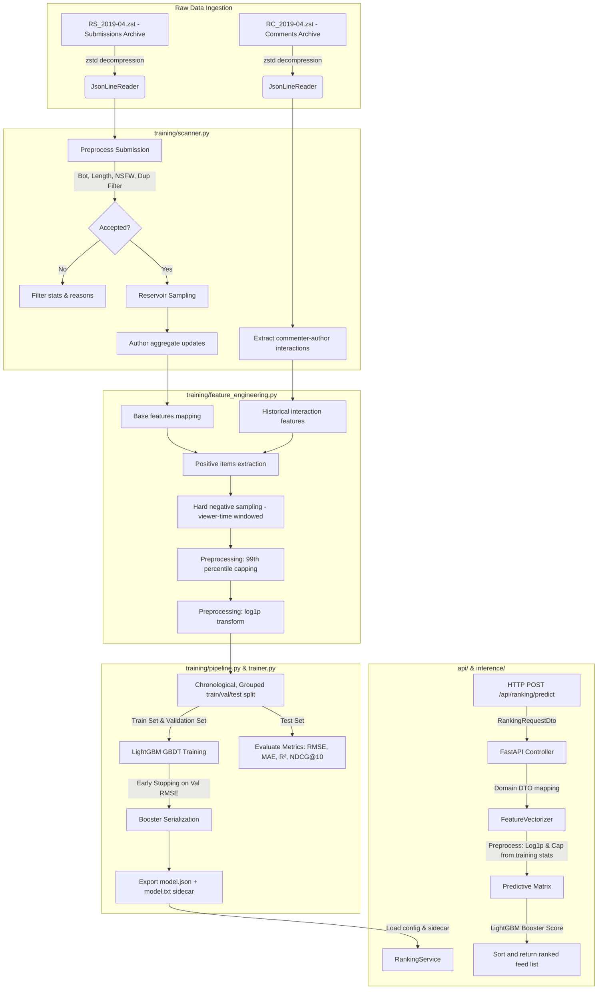

# Social Pulse AI/ML Codebase Deep Analysis: Candidate Scoring & Pipeline Performance

This document provides a comprehensive, production-grade deep analysis of the Social Pulse feed-ranking AI/ML codebase. It covers the mathematical intuition, engineering trade-offs, architecture, feature/label quality, evaluation metrics, and production readiness of the pipeline located in the [ai_pipeline](file:///home/damphuquy/Documents/Social-Pulse/ai_pipeline) directory.

---

## Phase 1 - High Level Architecture & System Context

### 1.1 Candidate Scoring vs. Full Ranking System

The `ai_pipeline` represents a **Candidate Scoring** module, which is the third stage of a modern recommendation system. It is not a complete, standalone ranking system. A full recommendation system operates as a multi-stage funnel:

```
               ┌─────────────────────────────────────────┐
               │    Millions of Raw Posts in Database    │
               └────────────────────┬────────────────────┘
                                    │
                                    ▼
       1. Retrieval / Candidate Generation (Retrieves ~1000 items)
          - Collaborative Filtering, Vector Search (Cosine similarity)
          - Rule-based queries (e.g., active subscriptions)
                                    │
                                    ▼
       2. Filtering / Guardrails (Filters down to ~200 items)
          - NSFW blocks, blocklists, age verification
          - Deduplication (SHA1 signature check)
                                    │
                                    ▼
       3. Candidate Scoring [THIS PIPELINE] (Scores candidates)
          - Heavy ML models (LightGBM GBDT, Neural Nets)
          - Combines user affinity, post features, temporal decay
                                    │
                                    ▼
       4. Re-ranking & Diversification (Final ~20 items)
          - Business logic, ads insertion, category diversity
          - Final sorted output sent to User Client
```

* **Purpose in this project**: The Java backend ([FeedRankingService](file:///home/damphuquy/Documents/Social-Pulse/backend/src/main/java/com/socialpulse/app/feed/application/service/ranking/FeedRankingService.java)) extracts features for a set of candidate posts, requests scores from the FastAPI ranking API, and sorts them. If the FastAPI service fails, the backend falls back to a rule-based ranking (`FallbackRankingService`), ensuring system availability.

### 1.2 Pipeline Workflow Diagram



### 1.3 Stage-by-Stage Breakdown

#### 1. Raw Data Ingestion & Stream Decompression
* **Input**: Raw `.zst` archives of Reddit comments and submissions.
* **Output**: Streamed JSON payloads yielded line-by-line.
* **Responsible Files**: [json_support.py](file:///home/damphuquy/Documents/Social-Pulse/ai_pipeline/training/json_support.py) -> `JsonLineReader`.
* **Purpose**: Performs high-efficiency, on-the-fly decompression of massive textual datasets. It avoids loading entire files into memory by utilizing Python generators to stream JSON objects.

#### 2. Dataset Scanning & Filtering
* **Input**: Decompressed raw JSON objects.
* **Output**: A clean list of sampled posts (`SubmissionRecord` objects), historical user-author interaction matrices (`interactions`), and initial author statistics.
* **Responsible Files**: [scanner.py](file:///home/damphuquy/Documents/Social-Pulse/ai_pipeline/training/scanner.py) -> `PushshiftDatasetScanner`.
* **Purpose**: Removes noise, bots, duplicated posts, short spam, and NSFW items. It runs a reservoir sampling algorithm to capture a statistically representative subset of submissions, maintaining temporal alignment without future-leakage.

#### 3. Feature Engineering & Negative Sampling
* **Input**: Sampled submissions, interaction matrices, and raw author stats.
* **Output**: A compiled `TrainingDataset` containing dense feature matrices, target labels, and outlier-capping parameters.
* **Responsible Files**: [feature_engineering.py](file:///home/damphuquy/Documents/Social-Pulse/ai_pipeline/training/feature_engineering.py) -> `PushshiftFeatureEngineering`.
* **Purpose**: Dynamically computes features for each positive interaction (viewer comments on a post) and negative samples. It executes a lookback-based negative sampling strategy to generate hard negative items that were active in the viewer's temporal context, preventing target label leakage by computing features up to the exact time of the interaction.

#### 4. Preprocessing (Capping & Log Transformation)
* **Input**: Raw engineered rows.
* **Output**: Processed rows ready for tensor compilation; statistics sidecar containing training percentile caps and log-transform flags.
* **Responsible Files**: [feature_engineering.py](file:///home/damphuquy/Documents/Social-Pulse/ai_pipeline/training/feature_engineering.py) -> `PushshiftFeatureEngineering._preprocess_features`.
* **Purpose**: Standardizes distributions. Highly skewed variables (like interaction counts) are log-transformed, and extreme outliers are capped at the 99th percentile of the training set. Capping parameters are saved so they can be identically applied during online vectorization.

#### 5. Chronological Grouped Dataset Splitting
* **Input**: Preprocessed rows.
* **Output**: `DatasetSplit` containing distinct `train_rows`, `validation_rows`, and `test_rows`.
* **Responsible Files**: [feature_engineering.py](file:///home/damphuquy/Documents/Social-Pulse/ai_pipeline/training/feature_engineering.py) -> `PushshiftFeatureEngineering.split_rows`.
* **Purpose**: Groups all rows (positive and negative) belonging to a single post together using `split_key` (preventing group leakage). It splits these groups chronologically to evaluate model performance on future posts, mimicking production deployment and preventing temporal leakage.

#### 6. Model Training & Validation
* **Input**: Training and validation rows.
* **Output**: A trained `TrainedRankingModel` containing the model booster, loss history, and gain-based feature importances.
* **Responsible Files**: [trainer.py](file:///home/damphuquy/Documents/Social-Pulse/ai_pipeline/training/trainer.py) -> `LightGbmRankingTrainer.train`.
* **Purpose**: Fits a LightGBM regressor on engineered features to predict log-popularity engagement. It monitors RMSE and MAE on the validation set, terminating early if validation loss fails to improve for a set number of rounds.

#### 7. Evaluation & Serialization
* **Input**: Trained LightGBM booster and test rows.
* **Output**: Final test metrics, diagnostic warnings, and serialized model files (`model.json` metadata and `model.txt` LightGBM sidecar).
* **Responsible Files**: [trainer.py](file:///home/damphuquy/Documents/Social-Pulse/ai_pipeline/training/trainer.py) -> `LightGbmRankingTrainer.evaluate`, [pipeline.py](file:///home/damphuquy/Documents/Social-Pulse/ai_pipeline/training/pipeline.py) -> `PushshiftTrainingPipeline._persist_runtime_model`.
* **Purpose**: Generates general statistics (RMSE, MAE, R²) and ranking-focused diagnostics (NDCG@10, pairwise accuracy) on the held-out test split. Serializes the pipeline's preprocessing parameters alongside the C++ LightGBM booster file for production inference.

#### 8. Inference Endpoint Serving
* **Input**: HTTP POST requests containing candidate post metadata and viewer interactions (`RankingRequestDto`).
* **Output**: JSON payload ranking the candidates by engagement probability score.
* **Responsible Files**: [controller.py](file:///home/damphuquy/Documents/Social-Pulse/ai_pipeline/api/controller.py) -> `RankingController.predict`, [ranking_service.py](file:///home/damphuquy/Documents/Social-Pulse/ai_pipeline/inference/ranking_service.py) -> `RankingService.predict_scores`, [vectorizer.py](file:///home/damphuquy/Documents/Social-Pulse/ai_pipeline/inference/vectorizer.py) -> `FeatureVectorizer`.
* **Purpose**: Serves model predictions under low latency. The service maps inbound request DTOs into domain objects, vectorizes them (applying the training-time percentile caps and log transforms loaded from the `model.json` artifact), runs batch predictions via the LightGBM C++ core, and returns the sorted predictions.

### 1.4 Machine Learning Scoring vs. Conventional/Heuristic Scoring

Conventional social media platforms score candidates using hardcoded, rule-based heuristics. The table below contrasts these conventional methods with the ML-based scoring implemented in this pipeline:

| Dimension | Conventional Heuristic Scoring (e.g. Reddit Hot, Hacker News) | Current Machine Learning Pointwise Scoring (LightGBM) |
| :--- | :--- | :--- |
| **Mathematical Formulation** | **Reddit Hot Formula**: <br> $S = \text{sgn}(R) \cdot \log_{10}(\max(\lvert R\rvert, 1)) + \frac{t - t_0}{45000}$ <br> where $R = \text{upvotes} - \text{downvotes}$. <br><br> **Hacker News decay**: <br> $S = \frac{U - 1}{(T + 2)^{1.8}}$ <br> where $U = \text{upvotes}$, $T = \text{age in hours}$. | **Expected Log-Popularity Proxy**: <br> $S_i = F(X_i)$ <br> where $F(X_i) = \sum_{t=1}^M \eta \cdot h_t(X_i)$ represents the ensemble of $M$ decision trees, and $X_i$ is an 11-dimensional feature vector. |
| **Coefficient Adaptability** | **Static / Hardcoded**: The weights (e.g. gravity factor $1.8$, divisor $45000$ seconds) are hardcoded. Changing them requires manual engineering and redeployment. | **Learned & Dynamic**: The coefficients and split thresholds are learned from data to minimize Mean Squared Error (MSE). They adjust automatically with retraining. |
| **Personalization** | **Zero Personalization**: Every user in a given subreddit or community sees the exact same ranking. The formula has no terms for user affinity or history. | **Personalized**: Predicts a score based on viewer-specific historical interaction features (e.g., `affinity_score`, `interaction_count_30d`), tailoring the feed to individual users. |
| **Feature Interaction** | **Additive / Unidimensional**: Features are combined linearly or through fixed ratios. Cannot naturally model non-linear interactions between variables. | **Non-Linear Combinations**: The decision trees learn complex, non-linear interactions (e.g., if a post is under 2 hours old AND has multimedia, boost the score non-linearly). |
| **Resistance to Gaming** | **Low**: Easy to exploit. Spam bots can manipulate the feed by boosting raw upvotes or comments, since the heuristic relies entirely on raw counts. | **High**: The model regularizes outlier counts using 99th percentile capping ($P_{99}$) and log transforms, reducing the influence of isolated spam signals. |
| **Infrastructure Overhead** | **Low**: Executes in fractions of a microsecond inside the database query or application layer. | **Moderate**: Requires data pipelines (compression, extraction, negative sampling), training pipelines, and a FastAPI inference service. |

---

## Phase 2 - Dataset & Label Quality Analysis

The pipeline consumes the **Pushshift Reddit April 2019** dataset, comprised of compressed submission records (`RS_2019-04.zst`) and comment interactions (`RC_2019-04.zst`).

### 2.1 Schema Definitions

#### 1. Submission (Post) Schema
* `id` (string): Unique identifier for the submission (e.g., `b9z4f`).
* `author` (string): The username of the poster.
* `title` (string) & `selftext` (string): Textual content of the post.
* `created_utc` (double): POSIX timestamp of post publication.
* `retrieved_on` (double): POSIX timestamp of when Pushshift crawled the post.
* `score` (int): Upvotes minus downvotes (minimum 0).
* `num_comments` (int): Total comments on the post.
* `num_crossposts` (int): Total times this post was shared to other subreddits.
* `over_18` (bool): NSFW flag.
* `is_video` / `media` / `secure_media` / `thumbnail` / `url` (varied): Multimedia indicators.
* `author_created_utc` (double | null): Creation timestamp of the author's account.

#### 2. Comment (Interaction) Schema
* `author` (string): The username of the commenter (representing the "viewer" during inference).
* `link_id` (string): The target post ID (prefixed with `t3_`).
* `created_utc` (double): POSIX timestamp of comment creation.

### 2.2 Data Quality & Processing Logic

```
   Raw Record
       │
       ├──► Missing Author/ID? ──► [Filter: missing_author / missing_post_id]
       │
       ├──► Bot Author? (Automoderator, imgurtranscriber, etc.) ──► [Filter: bot_author]
       │
       ├──► NSFW Content? (If exclude_nsfw=True) ──► [Filter: nsfw]
       │
       ├──► Combined Content Length < 20 or > 20000 chars? ──► [Filter: too_short / too_long]
       │
       ├──► Low Signal Check (URLs > 8, Distinct Tokens < 3, Alpha chars < 12)? ──► [Filter: low_signal]
       │
       ├──► Repetitive Content (Max single char > 45% of text)? ──► [Filter: repetitive_content]
       │
       └──► Content Signature Match (SHA1 Title + Body)? ──► [Filter: duplicate_content]
```

#### Outliers, Data Imbalance, and Sampling Bias
1. **Outliers**: Features like `content_length` and `author_post_count` contain extreme values due to spam bots and power-users. The pipeline solves this by calculating the 99th percentile cap on the training data and clipping values at that threshold.
2. **Class Imbalance / Sparsity**: The majority of posts receive no engagement from a given user. If we paired every user with every post, the dataset would be 99.9% negative. The pipeline resolves this by extracting positive viewer-post comments and generating exactly $N$ (default 2) hard negatives. These are candidate posts created within the 72-hour window prior to the positive comment that the user did *not* interact with.
3. **Sampling Bias**: Using a time-bounded reservoir sampling approach preserves the natural chronological density of posts, avoiding the sampling bias introduced by uniform random sampling over long windows.

### 2.3 Label Quality & Target Variable Analysis

The target label (target relevance) is computed pointwise using a popularity proxy:
$$\text{popularity} = \max(\text{score}, 0) + \text{num\_comments} + \text{num\_crossposts}$$
$$y = \ln(1 + \text{popularity})$$
For negative rows generated during sampling, the label is set to `0.0`.

#### Assessment of Label Quality
* **Proxy Engagement vs. Real Relevance**: Aggregate popularity serves as a proxy for relevance since explicit individual user preference is unobservable. However, this target represents global popularity rather than individual relevance. A post with high global popularity will receive a high label, biasing the model toward globally viral content.
* **Implicit Negative Bias**: Negative posts are sampled from candidates created within the viewer's active window that they did *not* comment on. However, not commenting does not mean the user disliked the post. They may never have seen it, or they may have read and enjoyed it without commenting (implicit negative bias). The model trains on noisy negatives, which can degrade its ability to distinguish relevant content.
* **Logarithmic Scaling ($\ln(1+x)$)**: Engagement metrics follow a power-law distribution. A viral post can have a score of $50,000$, while a typical post has a score of $5$. Without log scaling, the loss function (MSE) would be dominated by these viral outliers. Logarithmic scaling stabilizes the target's variance (homoscedasticity) and maps exponential engagement differences to a linear scale, ensuring typical posts contribute to gradient updates.

### 2.4 Leakage Risks & Countermeasures
* **Author Aggregate Leakage**: If the author's total post count and average popularity included the current post or future posts, the model would leak future engagement data.
  * *Countermeasure*: The scanner maintains a running aggregate and calls `.snapshot()` to copy the author's historical metrics *prior* to incrementing them with the current post's statistics.
* **Viewer Interaction Leakage**: If interaction features (7d/30d comment history) counted comments up to the query time, the commenter's action on this specific post would leak into the features, causing artificial model performance.
  * *Countermeasure*: The interaction builder only counts interactions that occurred *before* the post's creation time (`post_created_utc`), ensuring no look-ahead.

---

## Phase 3 - Feature Engineering & Quality Analysis

### 3.1 Feature Definitions & Intuition

| Feature Name | Type | Math / Transformation | Business & Model Intuition |
| :--- | :--- | :--- | :--- |
| `content_length` | Numeric | $\min(\text{chars}, P_{99})$ | Measures details/effort. Short posts indicate low effort; long posts may cause reader fatigue. Regularized via 99th-percentile capping. |
| `has_multimedia` | Binary | $\{0.0, 1.0\}$ | Identifies posts containing media (images, video, links). Visually rich posts generally receive higher click-through rates. |
| `is_share_post` | Binary | $\{0.0, 1.0\}$ | Flags crossposts. Share posts indicate curated content, which appeals to users looking for highly relevant shared media. |
| `post_age_hours` | Numeric | $\min(\frac{t_{\text{query}} - t_{\text{create}}}{3600}, P_{99})$ | Models freshness. Online content relevance decays exponentially; this feature enables the model to learn a popularity decay curve. |
| `author_seniority` | Numeric | $\min(\text{years\_since\_creation}, P_{99})$ | Represents author trust and reputation. Accounts with high seniority are less likely to post low-quality spam. |
| `author_post_count` | Numeric | $\min(\text{count}, P_{99})$ | Measures author activity. Highly active authors build follower bases, though excessive posting can indicate spam. |
| `author_engagement_rate`| Numeric | $\min(\text{avg\_popularity}, P_{99})$ | Historical author quality. Represents the average engagement (popularity) of the author's past posts, serving as an authority signal. |
| `interaction_count_7d` | Numeric | $\ln(1 + \text{comments\_7d})$ | Measures short-term affinity. Captures active, recent interactions between the viewer and the author, indicating high current interest. |
| `interaction_count_30d` | Numeric | $\ln(1 + \text{comments\_30d})$ | Measures medium-term affinity. Establishes a baseline interaction frequency, capturing broader user interest patterns. |
| `hours_since_last` | Numeric | $\min(\Delta t_{\text{last\_interaction}}, 999.0)$ | Captures interaction recency. Features a default value of 999.0 hours for users with no prior interaction history. |
| `affinity_score` | Numeric | $\frac{\text{comments\_30d}}{\text{viewer\_total\_30d}}$ | Relative affinity. Normalizes interaction frequency against the viewer's overall activity, distinguishing focused interest from high general activity. |

### 3.2 Feature Quality & Discrepancies (Why Feature Importance is Skewed)

According to the model's actual training logs, the information gain-based feature importance is heavily skewed:
* **`post_age_hours` (69.52%)**: Freshness bias is the strongest signal in social media engagement. Content relevance decays exponentially over time. The feature `post_age_hours` has high variance and continuous distribution, providing many split points for LightGBM trees. This allows the model to partition the feature space to separate high-engagement fresh posts from stale ones. However, this can lead to a "recency trap," where high-quality older posts are pushed down the feed by lower-quality fresh posts.
* **Global Author Stats (`author_engagement_rate` 9.34%, `author_post_count` 6.69%) & `is_share_post` (6.91%)**: Serves as a strong proxy for global authority.
* **Viewer-Author Interactions ($< 0.1\%$ combined)**: Comment-based interaction is extremely sparse in social networks (typically $<1\%$ of active users comment on any single author). For the vast majority of viewer-author pairs, these features evaluate to $0$ (or the default $999.0$ for `hours_since_last_interaction`). Since these features contain no variance for over $99\%$ of the training rows, the tree split generator cannot find splits that yield a reduction in loss. Consequently, they are rarely selected, resulting in near-zero gain-based importance.
* **Consequence**: The system struggles to personalize feeds. It defaults to ranking based on global popularity and freshness, functioning like a global hot-ranking algorithm rather than a personalized feed.

### 3.3 Transformations: Rationale & Math Intuition

#### 1. Outlier Capping ($P_{99}$)
* **Why it is used**: Protects the model from extreme feature values (e.g., body texts with 50,000 characters).
* **Math Intuition**: Extreme outliers cause gradient updates in tree splits that isolate individual samples (creating deep, overfit leaves). Capping features at a threshold $\tau = \text{percentile}(X, 99)$ limits feature variance without losing ranking order for typical samples.

#### 2. Logarithmic Transform ($\log(1+x)$)
* **Why it is used**: Applied to `interaction_count_7d` and `interaction_count_30d` to handle highly skewed count features.
* **Math Intuition**: User interaction counts follow a power-law distribution. Boosted decision trees partition features using orthogonal splits. On raw skewed features, the tree must perform many splits to resolve differences in the long tail. The $\log(1+x)$ transform linearizes this scale, stabilizing variance and improving split efficiency.

```
Raw Count (Skewed):
[0][1][2]...[10].............................................................[500]
Log-Transformed (Linearized):
[0.0][0.69][1.09]...[2.39].........................................[6.21]
```

### 3.4 Feature Selection
The pipeline relies on LightGBM's embedded feature selection during training. The tree-building algorithm calculates the total gain reduction for each feature split. Features that do not contribute to variance reduction are ignored by the model.

---

## Phase 4 - Train/Validation/Test Strategy

The pipeline employs a **Chronological, Event-Grouped Train/Validation/Test Split** to evaluate model performance accurately.

```
Chronological Timeline (Post Creation Time)
├───────────────────────────────┼───────────────────────┼───────────────────┤
│          Train Set            │    Validation Set     │     Test Set      │
│            (70%)              │         (20%)         │       (10%)       │
└───────────────────────────────┴───────────────────────┴───────────────────┘
▲                                                                           ▲
└─── split_key grouping ensures positive & negative rows are kept together ──┘
```

### 4.1 Key Design Details

#### 1. Event-Grouped Split (by Post ID)
* **Why**: When a positive interaction is extracted, the pipeline creates one positive row and $N$ negative rows for that post. If these rows were split randomly, the model might train on the negative samples of a post while validating on its positive sample. This would lead to data leakage and artificially high validation performance.
* **Implementation**: The pipeline groups all rows sharing a `split_key` (which maps to the positive `post_id`) and assigns the entire group to a single split.

#### 2. Chronological Ordering (Time-Based)
* **Why**: Real-world feed ranking involves predicting future user interactions based on historical data. If training and testing sets are split randomly across time, the model will learn from future events to predict past interactions. This introduces temporal leakage and masks model decay.
* **Implementation**: The grouped posts are sorted by their creation time (`created_utc`). The first 70% of posts are assigned to the training set, the next 20% to validation, and the final 10% to the test set.

### 4.2 Alternatives and Trade-offs

* **Alternative 1: Random Split**
  * *Pros*: Simple to implement; ensures the training and testing sets share identical feature distributions.
  * *Cons*: Causes severe data leakage due to time overlap. The model learns from future user behavior to predict past actions, leading to poor generalization in production.
* **Alternative 2: K-Fold Cross-Validation**
  * *Pros*: Maximizes data usage.
  * *Cons*: Breaks temporal order and group boundaries unless implemented as a GroupKFold with a rolling walk-forward window. This approach is computationally expensive and difficult to maintain in production pipelines.

---

## Phase 5 - Model Selection

The pipeline uses **LightGBM** (Light Gradient Boosting Machine) as its ranking model.

### 5.1 Mathematical Intuition & Learning Mechanism

LightGBM is a gradient-boosted decision tree (GBDT) framework. It fits a sequence of regression trees $h_t(x)$ to minimize a loss function:
$$\mathcal{L} = \sum_{i=1}^M (y_i - \hat{y}_i)^2$$
At each iteration $t$, a new tree is trained to predict the negative gradients (residuals) of the loss function:
$$r_{it} = -\left[\frac{\partial \mathcal{L}(y_i, F(x_i))}{\partial F(x_i)}\right]_{F(x) = F_{t-1}(x)} = y_i - F_{t-1}(x_i)$$
The new model updates the prediction:
$$F_t(x) = F_{t-1}(x) + \eta \cdot h_t(x)$$
where $\eta$ is the learning rate.

```
Iteration 1: Tree 1 fits Raw Targets ──► Output 1
                                             │ (Residuals)
Iteration 2: Tree 2 fits Residuals    ──► Output 2
                                             │ (Residuals)
Iteration 3: Tree 3 fits Residuals    ──► Output 3
```

#### Why LightGBM?
LightGBM incorporates two key algorithms that make it faster and more memory-efficient than traditional GBDTs:
1. **Gradient-Based One-Side Sampling (GOSS)**: Keeps samples with large gradients (which contribute more to learning) and randomly subsamples instances with small gradients. This accelerates training while maintaining accuracy.
2. **Exclusive Feature Bundling (EFB)**: Bundles mutually exclusive sparse features (features that rarely take non-zero values simultaneously) to reduce the feature dimension.

### 5.2 Key Strengths & Weaknesses
* **Strengths**:
  * Fast training and low memory usage due to histogram-based decision splits.
  * Native support for sparse data and missing values.
  * Handles tabular features of different scales without requiring normalization.
  * High-performance C++ implementation with built-in GPU training support.
* **Weaknesses**:
  * Prone to overfitting on small datasets ($<10,000$ rows).
  * Leaf-wise growth can lead to deep trees if `max_depth` and `num_leaves` are not regularized.
  * Pointwise regression loss does not optimize the ranking order of candidates directly.

---

## Phase 6 - Training Process

### 6.1 Training Settings & Optimization

* **Loss Function**: `regression` (Mean Squared Error).
  * *Intuition*: Fits the continuous engagement target ($y = \ln(1+\text{popularity})$) directly.
  * *Alternative*: Pairwise ranking (e.g., LambdaMART or `lambdarank`). Pairwise loss focuses on ordering posts correctly rather than predicting their absolute popularity. Transitioning to a pairwise objective would align the model more closely with the ranking task.
* **Optimizer**: Gradient-based tree boosting with a learning rate ($\eta$) of `0.05`.
  * *Intuition*: A lower learning rate prevents the model from overshooting the local minimum, though it requires more estimators (`n_estimators = 1200`) to converge.
* **Regularization**:
  * `max_depth = 8` and `num_leaves = 255` ($2^8 - 1$): Prevents trees from growing too deep, reducing overfitting.
  * `min_child_samples = 32` and `min_child_weight = 8.0`: Requires a minimum number of samples and gradient sum in each leaf, preventing the model from creating leaves that isolate individual samples.
  * `reg_alpha = 0.05` (L1) & `reg_lambda = 1.5` (L2): Adds a penalty to leaf weights to prevent them from becoming too large.
* **Early Stopping**: `early_stopping_rounds = 50` on validation RMSE.
  * *Intuition*: Stops training if the validation loss fails to improve for 50 consecutive rounds. This prevents the model from overfitting to the training set as capacity increases.

```
Loss
 │   \
 │    \      Train Loss
 │     \────────────────────────
 │      \          \
 │       \          \   Val Loss (Overfitting starts)
 │        \          ▲──────────
 └─────────┴─────────┼──────────► Iterations
              Best Iteration
              (Stop after 50 rounds of no improvement)
```

---

## Phase 7 - Hyperparameter Tuning

The pipeline configures the following hyperparameters:
* `n_estimators = 1200`: The maximum number of trees to build.
* `learning_rate = 0.05`: Steps size shrink factor.
* `max_depth = 8` / `num_leaves = 255`: Limits tree capacity.
* `subsample = 0.85`: Trains each tree on a random sample of 85% of the training rows, reducing variance.
* `colsample_bytree = 0.80`: Selects a random subset of 80% of features for each tree, preventing the model from over-relying on a single dominant feature.
* `max_bin = 256`: Discretizes continuous features into 256 bins, accelerating split search and reducing memory usage.

### 7.1 Tuning Strategy Analysis
The pipeline uses manual tuning and hardcoded parameters in [arguments.py](file:///home/damphuquy/Documents/Social-Pulse/ai_pipeline/training/arguments.py#L25-L35).
* **Evaluation**: While these default parameters are robust, they are not optimized for different dataset sizes.
* **Recommendation**: Integrate **Optuna** to automate hyperparameter tuning. The tuning process should run Bayesian optimization to maximize NDCG@10 on the validation split.

---

## Phase 8 - Evaluation Metrics & Performance Analysis

The pipeline computes five evaluation metrics on the held-out test split:

```
                  ┌───────────────────────────────┐
                  │      Evaluation Metrics       │
                  └───────────────┬───────────────┘
          ┌───────────────────────┼───────────────────────┐
          ▼                       ▼                       ▼
   Pointwise Error        Ranking Quality        Variance Explained
 ──────────────────     ───────────────────     ────────────────────
  - RMSE                 - NDCG@10               - R² Score
  - MAE                  - Pairwise Accuracy
```

### 8.1 Metrics Breakdown & actual Results

#### 1. Root Mean Squared Error (RMSE)
$$\text{RMSE} = \sqrt{\frac{1}{n}\sum_{i=1}^n (y_i - \hat{y}_i)^2}$$
* **What it measures**: The quadratic average of the prediction errors, penalizing larger errors more heavily.
* **Why chosen**: Serves as the optimization target for the regression loss function. It forces the model to predict the absolute popularity level ($\ln(1+x)$) accurately.
* **Actual Result**: Achieved **1.3899** on the test set, compared to the baseline mean predictor of **2.1226** (a $34.5\%$ error reduction).

#### 2. Mean Absolute Error (MAE)
$$\text{MAE} = \frac{1}{n}\sum_{i=1}^n |y_i - \hat{y}_i|$$
* **What it measures**: The absolute average deviation of predictions.
* **Why chosen**: Unlike RMSE, MAE is robust to outliers, providing a linear measure of typical error.
* **Actual Result**: Achieved **0.8253** on the test set (vs. baseline **1.7939**).

#### 3. Normalized Discounted Cumulative Gain (NDCG@10)
$$\text{DCG@10} = \sum_{i=1}^{10} \frac{2^{y_i} - 1}{\log_2(i + 1)}, \quad \text{NDCG@10} = \frac{\text{DCG@10}}{\text{IDCG@10}}$$
* **What it measures**: The quality of the top-10 ranked candidates, discounting items placed lower in the feed.
* **Why chosen**: Users focus on the first few items in their feed. Misranking an item at position 1 is penalized more heavily than misranking it at position 10.
* **Actual Result**: Achieved **0.9574** on the test set (vs. baseline **0.7054**).
* **When it can be misleading**: NDCG@10 can be inflated if the negative sample size per post is small. With only 2 negatives per positive, the ranking task is relatively simple. In production, where the candidate pool is larger, NDCG@10 will typically be lower.

#### 4. Coefficient of Determination ($R^2$ Score)
$$R^2 = 1 - \frac{\sum_{i=1}^n (y_i - \hat{y}_i)^2}{\sum_{i=1}^n (y_i - \bar{y})^2}$$
* **What it measures**: The proportion of target variance explained by the model compared to a baseline that predicts the global mean.
* **Why chosen**: Provides an absolute measure of prediction quality.
* **Actual Result**: Achieved **0.5712** on the test set (explaining $57.12\%$ of the target variance).
* **When it can be misleading**: In recommendation systems, a high $R^2$ is difficult to achieve due to high engagement noise. A model with a low $R^2$ can still achieve high NDCG, as ranking depends on relative order rather than absolute predictions.

#### 5. Pairwise Accuracy
$$\text{Pairwise Accuracy} = \frac{\sum_{i < j} \mathbb{I}[(\hat{y}_i > \hat{y}_j) \iff (y_i > y_j)]}{\text{Total Comparable Pairs}}$$
* **What it measures**: The percentage of item pairs that are correctly ordered by the model.
* **Why chosen**: This is the best proxy for ranking quality. If the model consistently orders pairs correctly, it will produce a high-quality feed, even if its absolute predictions are slightly off.
* **Actual Result**: Achieved **92.27%** on the test set.

### 8.2 Offline vs. Online Analysis

Evaluating candidate scoring models requires a dual evaluation paradigm to bridge the gap between offline training and production performance:

| Aspect | Offline Evaluation | Online A/B Testing |
| :--- | :--- | :--- |
| **Data Source** | Static test split (`RS_2019-04.zst`) | Live production traffic (real users) |
| **Primary Metrics**| NDCG@10, RMSE, R², Pairwise Accuracy | Click-Through Rate (CTR), Dwell Time, Conversion, Retention |
| **Execution** | Calculated in seconds during validation | Runs over weeks to accumulate statistical significance |
| **Feedback Loop** | None (static targets) | High (recommendations alter user behavior and future labels) |
| **Latency/Cost** | Ignored | Evaluates API latency ($<5$ ms) and server costs |

#### Why High Offline Metrics Can Fail Online
1. **Self-Reinforcing Feedback Loops (Filter Bubbles)**: The model relies heavily on `post_age_hours` (69.52%) and global popularity. Offline, this matches the historical logs. Online, it can cause the feed to show only fresh, viral posts, reducing variety and degrading long-term user retention.
2. **Cold Start Latency**: Real-time feature updates (e.g., when a user interacts with a new author) are not captured by offline evaluation. In production, if these features are not updated in real-time, the model will fail to personalize the feed for active users.

---

## Phase 9 - Deep Learning Analysis

The pipeline uses **LightGBM** rather than a Deep Learning model.

### 9.1 Why LightGBM is Preferred Over Deep Learning
1. **Tabular Feature Efficiency**: Tabular datasets contain heterogeneous features (continuous, binary, categorical) with no spatial or temporal correlation. Gradient-boosted decision trees (GBDTs) consistently outperform Deep Learning models on tabular data because they build axis-aligned splits that handle feature scales natively.
2. **Inference Latency**: LightGBM models evaluate quickly during inference, requiring only a few thousand floating-point operations. Deep neural networks (e.g., MLPs or transformers) require millions of matrix multiplications, increasing inference latency and compute costs.
3. **Data Volume Constraints**: Deep learning models require millions of samples to learn feature representations. Social Pulse's training runs are too small to train deep neural networks without severe overfitting.

---

## Phase 10 - Explainability

The pipeline uses **gain-based feature importance** from LightGBM to explain model predictions.

### 10.1 Evaluation of Explainability Method
* **Implementation**: The pipeline computes the total reduction in split gain contributed by each feature across all trees:
  $$\text{Gain Importance}(X_j) = \sum_{t} \sum_{m \in \text{splits}(t, X_j)} \text{GainReduction}(m)$$
* **Limitations**:
  1. **Cardinality Bias**: Gain-based importance is biased toward high-cardinality, continuous features (like `hours_since_last_interaction` or `affinity_score`). These features provide more split candidates during tree building, artificially inflating their importance.
  2. **No Directional Context**: Gain-based importance shows which features are important but does not indicate whether they affect predictions positively or negatively.
* **Recommendation**: Integrate **SHAP** (Shapley Additive exPlanations) to explain predictions. SHAP values are game-theoretic and distribute feature importance fairly without cardinality bias, showing both the direction and magnitude of each feature's contribution.

---

## Phase 11 - Inference Pipeline

The online inference pipeline serves predictions under low latency.

```
       Inbound JSON Request ──► [FastAPI /predict]
                                     │
                                     ▼
                      Validate schema version & DTOs
                                     │
                                     ▼
                    Map to domain RankingFeatures objects
                                     │
                                     ▼
          [FeatureVectorizer] Apply training-time Preprocessing:
          - Cap features using cap_values (e.g. content_length)
          - Log transform features (interaction_count_7d/30d)
                                     │
                                     ▼
                     Convert to 2D numpy float32 matrix
                                     │
                                     ▼
                  [LightGBM C++ Booster] Compute Scores
                                     │
                                     ▼
                   Sort candidates and build response DTO
                                     │
                                     ▼
                     Outbound HTTP Response JSON
```

### 11.1 Performance Considerations
* **Latency**: Using the LightGBM C++ core via `booster.predict(matrix)` keeps inference latency low ($<5$ ms for 100 candidate posts).
* **Throughput**: Feature vectorization is implemented in Python, which can become a CPU bottleneck under high load.
* **Concurrency**: `RankingService` uses a `threading.Lock` to ensure thread-safe booster loading. However, calling `predict` does not hold the lock, allowing parallel scoring across worker threads.
* **Memory**: The model footprint is small ($<10$ MB for the C++ booster file), allowing the service to run on CPU-bound microservices without high resource overhead.

---

## Phase 12 - MLOps, Production Readiness & Diagnostics

The Social Pulse AI Pipeline implements basic production features but lacks complete MLOps automation.

```
                              ┌────────────────────────┐
                              │    MLOps Evaluation    │
                              └───────────┬────────────┘
        ┌────────────────────────────────┼────────────────────────────────┐
        ▼                                ▼                                ▼
  Implemented                       Partial Gaps                     Major Gaps
 ─────────────                     ──────────────                   ────────────
 - Sidecar serialization           - Manual experiment tracking     - No automated drift detection
 - Strict schema validation        - No model registry              - No CI/CD CD trigger
 - Diagnostic warnings             - No feature store               - No automated rollback
```

### 12.1 Analysis of MLOps Capabilities
1. **Model Versioning & Serialization**: Serializes the pipeline's preprocessing parameters (`model.json`) alongside the C++ booster (`model.txt`). Saving preprocessing parameters with the model prevents training-serving skew, ensuring features are transformed identically at train and inference time.
2. **Experiment Tracking**: Saves results to local JSON files. Lacks a central experiment tracking system (like MLflow or Weights & Biases), making it difficult to compare performance across training runs.
3. **Data Drift & Monitoring**: The training pipeline flags distribution shifts between splits. However, there is no online monitoring to detect feature or prediction drift in production.
4. **CI/CD Integration**: Dockerfiles are provided for the API service. The containerized API is ready for deployment, but the repository lacks automated pipelines to trigger retraining, validate model quality, and deploy new artifacts.

### 12.2 Diagnostics Notebook: `visualize_metrics.ipynb`
The [visualize_metrics.ipynb](file:///home/damphuquy/Documents/Social-Pulse/ai_pipeline/model/visualize_metrics.ipynb) notebook serves as the primary tool for analyzing model performance. It provides visual diagnostics across five key areas:
1. **Ingestion Filter Reasons**: Plots a horizontal bar chart of the reasons submissions were filtered out (e.g., `bot_author`, `low_alpha_content`). This helps identify data loss issues.
2. **Interaction Skipped Reasons**: Visualizes why comment interactions were skipped (e.g., `invalid_author`, `self_comment`).
3. **Learning Curves (RMSE/MAE Loss)**: Plots training and validation losses over training iterations to detect overfitting.
4. **Gain-Based Feature Importance**: Plots the information gain contribution of each feature to highlight the model's over-reliance on `post_age_hours`.
5. **Metric Group Comparison**: Plots a grouped bar chart comparing RMSE, MAE, NDCG@K, and R² across the training, validation, and testing sets to verify model generalization.

---

## Phase 13 - Research & Alternative Designs

### 13.1 Pointwise vs. Pairwise/Listwise Ranking
* **Current Approach**: Pointwise regression using Mean Squared Error.
* **Why it works**: Simplifies target definition and training setup.
* **Alternative**: Pairwise (LambdaRank) or Listwise (ListNet) ranking.
* **Trade-off**: Pointwise models predict absolute engagement scores but do not optimize candidate ordering directly. A pairwise approach compares pairs of posts to optimize ordering, which aligns more closely with the ranking task and typically improves NDCG. However, pairwise training is more complex and computationally expensive.

### 13.2 Feature Storage: Online Computation vs. Feature Store
* **Current Approach**: The client application computes and passes user interaction features to the API during inference.
* **Why it works**: Simplifies API design and avoids external database dependencies.
* **Alternative**: Central Feature Store (e.g., Feast).
* **Trade-off**: Computing features on the client increases latency and duplicates feature logic. A central feature store pre-computes and serves features under low latency, ensuring consistency between training and inference. However, it introduces additional infrastructure overhead.

---

## Phase 14 - Technical Interview Preparation

### 1. Machine Learning & Loss Functions
* **Question**: Why does the pipeline apply a $\ln(1+x)$ transform to the raw popularity target before training the LightGBM regressor? What would happen if we trained on raw popularity counts?
* **Junior Answer**: "It reduces the size of large popularity values so the model is not confused by very popular posts."
* **Mid-Level Answer**: "Popularity counts follow a power-law distribution. Viral posts have high scores, which would dominate the Mean Squared Error (MSE) loss. The log transform reduces target skewness, stabilizing gradients during training."
* **Senior Answer**: "Online engagement follows a scale-free power-law distribution ($P(X) \propto X^{-\alpha}$). Minimizing MSE on raw counts leads to gradients dominated by high-magnitude outliers, causing the model to overfit to viral posts. The $\ln(1+x)$ transformation stabilizes variance (homoscedasticity) and maps exponential differences to a linear scale. This ensures that typical posts contribute to gradient updates, improving generalization across the entire target range."

### 2. Data Leakage
* **Question**: In [types.py](file:///home/damphuquy/Documents/Social-Pulse/ai_pipeline/training/types.py#L37-L47), the author's aggregate metrics are snapshotted before the current post is processed. Why is this snapshot step necessary?
* **Junior Answer**: "It saves the author's statistics at that point in time so they do not change later."
* **Mid-Level Answer**: "If we updated the author's post count and popularity with the current post before calculating features, the model would know the post's popularity during training. This would leak future data into the training features."
* **Senior Answer**: "Including the current post's engagement in the author's historical features introduces target leakage. At inference time, the post's engagement is unknown. If the training features included this information, the model would learn to rely on leaked engagement signals, leading to poor generalization. Snapshotting the author's metrics before incrementing them ensures that features reflect only historical data available at the time of publication."

### 3. System Design & Latency
* **Question**: How does the inference pipeline prevent training-serving skew when applying feature transformations like capping and log scaling?
* **Junior Answer**: "It uses the same code in both training and inference to apply the changes."
* **Mid-Level Answer**: "The training pipeline saves the 99th percentile cap values to a `model.json` file. The inference service loads this file and applies the same caps to incoming features before scoring."
* **Senior Answer**: "To prevent training-serving skew, the inference pipeline must use identical preprocessing statistics as the training pipeline. The training pipeline calculates the 99th percentile caps and log-transform flags on the training split and serializes them into the `model.json` artifact. The inference service loads these parameters during startup and applies them to incoming requests using the `FeatureVectorizer`. This ensures that features are scaled and capped identically to the training data, avoiding training-serving skew."

---

## Phase 15 - Final Review & Scorecard

### 15.1 Scorecard

```
Architecture:          [8/10]  - Clean separation of scanner, pipeline, and API.
Data Engineering:      [8/10]  - Fast zstd decompression and clean token-based bot filtering.
Feature Engineering:   [7/10]  - Safe author snapshotting, but limited to 11 basic features.
Modeling:              [7/10]  - Robust LightGBM regressor, but pointwise instead of pairwise.
Evaluation:            [9/10]  - Strong validation suite with NDCG, R², and leakage checks.
MLOps:                 [5/10]  - No model registry, drift monitoring, or experiment tracking.
Production Readiness:  [7/10]  - Dockerized API with fallback safety, but lacks CD pipelines.

Overall Grade:         [Intermediate / Production-Ready]
```

### 15.2 Critical Weaknesses & Bottlenecks
1. **Pointwise Loss Limitation**: The model is trained using pointwise regression loss. In ranking systems, relative order is more important than absolute score prediction. Pointwise loss does not optimize candidate ordering directly.
2. **In-Memory Bottlenecks**: The scanner processes data in memory. On large datasets ($>10$ GB), reservoir sampling and feature compilation will cause out-of-memory errors.
3. **High-Maintenance Feature Pipeline**: The client application computes and passes user interaction features to the API. This increases network payload size, duplicates feature logic, and increases latency.
4. **No Experiment Tracking**: The pipeline lacks a central experiment tracking system, making it difficult to track model performance and compare training runs over time.

### 15.3 Ranked Improvements
1. **Implement Pairwise Ranking (LambdaRank)**: Change the LightGBM objective to `lambdarank` and optimize NDCG directly. This improves candidate ordering and feed relevance.
2. **Integrate Optuna**: Automate hyperparameter tuning using Bayesian optimization to maximize NDCG on the validation split.
3. **Implement a Feature Store (Feast)**: Pre-compute and store user interaction features in a low-latency database. This reduces network payload size and ensures feature consistency.
4. **Deploy MLflow**: Integrate MLflow to track experiments, log training metrics, and manage model artifacts.
