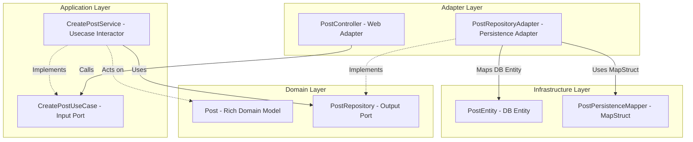
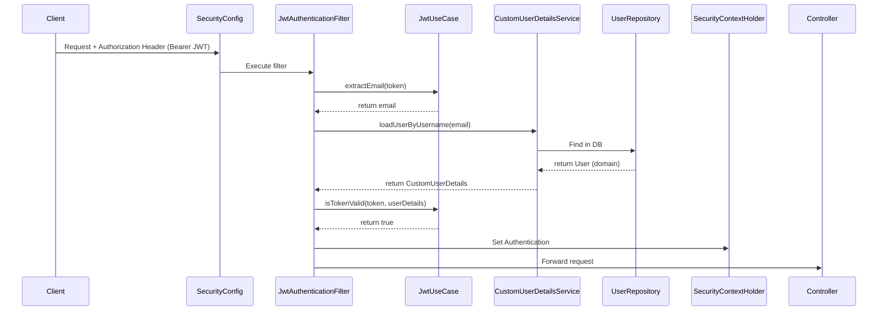

# Phân tích & Đúc kết Kinh nghiệm Kiến trúc Backend - Social-Pulse

Tài liệu này được biên soạn dưới góc nhìn của một **Code Architect** và **Senior Backend Engineer**, nhằm mục đích rà soát, phân tích và hệ thống hóa các kỹ thuật thiết kế, lập trình nâng cao đã được áp dụng trong codebase backend của dự án **Social-Pulse**. Đây là cẩm nang học tập giá trị giúp bạn đúc kết kinh nghiệm thiết kế hệ thống lớn, hiệu năng cao và có khả năng mở rộng tốt.

---

## 1. Kiến trúc & Tổ chức thư mục (Architecture & Folder Structure)

Dự án áp dụng mô hình kiến trúc **Screaming Architecture (Kiến trúc "gầm thét")** kết hợp với cấu trúc **Hexagonal Architecture (Ports & Adapters)** và được tổ chức theo tính năng nghiệp vụ (**Package-by-Feature**).

### 1.1. Cách tổ chức chi tiết
Thay vì gom nhóm lớp theo dạng kỹ thuật (như một thư mục chứa toàn bộ controllers, một thư mục chứa toàn bộ services), dự án chia nhỏ thành từng thư mục đại diện cho các miền nghiệp vụ (Domain): `post`, `user`, `feed`, `chat`, `auth`, `notification`, `follow`...

Bên trong mỗi miền nghiệp vụ, kiến trúc Hexagonal phân tách rõ ràng thành 4 lớp độc lập:
1. **`domain` (Lõi nghiệp vụ)**:
   - Chứa thực thể nghiệp vụ thuần túy như [Post.java](file:///home/damphuquy/Documents/Social-Pulse/backend/src/main/java/com/socialpulse/app/post/domain/model/Post.java). Các đối tượng này không mang annotation JPA/Hibernate hay bất cứ thư viện framework nào.
   - Định nghĩa các interfaces giao tiếp nghiệp vụ (Domain Ports) như [PostRepository.java](file:///home/damphuquy/Documents/Social-Pulse/backend/src/main/java/com/socialpulse/app/post/domain/repository/PostRepository.java).
2. **`application` (Tầng điều phối luồng)**:
   - Định nghĩa các Use Case interfaces như [CreatePostUseCase.java](file:///home/damphuquy/Documents/Social-Pulse/backend/src/main/java/com/socialpulse/app/post/application/usecase/CreatePostUseCase.java).
   - Thực thi nghiệp vụ bằng các lớp Service như [CreatePostService.java](file:///home/damphuquy/Documents/Social-Pulse/backend/src/main/java/com/socialpulse/app/post/application/service/CreatePostService.java). Các service này chỉ biết giao tiếp với interfaces trừu tượng của tầng Domain.
3. **`adapter` (Cổng kết nối thế giới bên ngoài)**:
   - `web`: Nhận dữ liệu HTTP REST như [PostController.java](file:///home/damphuquy/Documents/Social-Pulse/backend/src/main/java/com/socialpulse/app/post/adapter/web/PostController.java).
   - `persistence`: Thực thi các repository interfaces của tầng domain thông qua việc kết nối database thực tế như [PostRepositoryAdapter.java](file:///home/damphuquy/Documents/Social-Pulse/backend/src/main/java/com/socialpulse/app/post/adapter/persistence/PostRepositoryAdapter.java).
4. **`infrastructure` (Tầng hạ tầng kỹ thuật)**:
   - Chứa thực thể database mang annotation JPA như [PostEntity.java](file:///home/damphuquy/Documents/Social-Pulse/backend/src/main/java/com/socialpulse/app/post/infrastructure/persistence/entity/PostEntity.java).
   - Triển khai các JPA interfaces trung gian, MapStruct mapper chuyển đổi Model-Entity, và các lớp cấu hình Spring Bean tường minh như [PostConfig.java](file:///home/damphuquy/Documents/Social-Pulse/backend/src/main/java/com/socialpulse/app/post/infrastructure/config/PostConfig.java).



### 1.2. Lý do lựa chọn phương pháp xử lý
Các hệ thống mạng xã hội lớn luôn có sự thay đổi liên tục về công nghệ lưu trữ dữ liệu (Database) và cách thức tối ưu hóa cache để chịu tải. 
* **Tách biệt tuyệt đối Domain (Ports & Adapters)** giúp doanh nghiệp bảo vệ logic nghiệp vụ cốt lõi không bị ảnh hưởng khi các quyết định hạ tầng (Infrastructure) thay đổi.
* **Package-by-Feature** được chọn thay vì Package-by-Layer truyền thống bởi vì nó tăng tính bao đóng. Khi phát triển một tính năng mới (ví dụ như `bookmark`), lập trình viên chỉ cần thao tác trong một gói thư mục duy nhất mà không cần tìm kiếm file rải rác ở khắp các tầng ứng dụng.

### 1.3. Đánh giá Trade-offs (Đánh đổi)
* **Ưu điểm vượt trội**:
  - **Độc lập Framework**: Có thể nâng cấp Spring, chuyển sang framework khác (Micronaut, Quarkus) hoặc thay đổi công nghệ lưu trữ (Postgres -> MongoDB) cực kỳ an toàn mà không phải viết lại logic nghiệp vụ.
  - **Độc lập Kiểm thử (Unit Testing)**: Vì các thành phần kết nối với nhau qua interfaces và POJOs thuần túy, việc viết Unit Test cho tầng nghiệp vụ vô cùng nhanh chóng, có thể mock mọi IO port mà không cần khởi chạy Spring Container chậm chạp.
  - **Tính bao đóng nghiệp vụ (Screaming)**: Cấu trúc package hiển thị rõ ràng những tính năng cốt lõi của mạng xã hội, giúp thành viên mới tham gia dự án dễ dàng định vị mã nguồn.
* **Đánh đổi (Bất lợi)**:
  - **Boilerplate lớn (Tốn thời gian gõ code)**: Phải duy trì song song hai loại Model (`Post` và `PostEntity`) cùng các Mapper trung gian. Code có nhiều interface và lớp bọc (Adapter) tạo ra cảm giác "over-engineering" đối với các nghiệp vụ chỉ CRUD đơn giản.
  - **Độ phức tạp trong quản lý cấu hình**: Việc khai báo Spring bean thủ công tại các lớp `@Configuration` cục bộ thay vì quét tự động đòi hỏi lập trình viên phải cấu hình bằng tay tỉ mỉ cho từng cấu trúc liên kết.

---

## 2. Kỹ thuật Cơ bản & Thiết kế (Design Principles)

### 2.1. Rich Domain Model vs Anemic Domain Model
Dự án ảnh hưởng bởi triết lý thiết kế hướng miền (DDD) thông qua **Rich Domain Model**.
* **Lý do lựa chọn**: Lớp [Post.java](file:///home/damphuquy/Documents/Social-Pulse/backend/src/main/java/com/socialpulse/app/post/domain/model/Post.java) tự bảo vệ trạng thái của chính nó. Các thay đổi thuộc tính bắt buộc phải đi qua các hàm hành vi: `changePrivacy(Privacy)`, `update(...)`. Logic đếm và tính toán điểm hot (`updateHotScore()`) được đóng gói ngay tại đối tượng để đảm bảo trạng thái của Post luôn nhất quán (Invariant Enforcement).
* **Đánh đổi (Trade-offs)**: 
  - *Thuận lợi:* Logic nghiệp vụ tập trung tại một nơi duy nhất (chính Domain Model), loại bỏ hoàn toàn hiện tượng phình to vô hạn của các Service và rò rỉ đóng gói nghiệp vụ.
  - *Bất lợi:* Không thể sử dụng trực tiếp các tính năng lưu trữ tự động của ORM (như tự động lưu quan hệ cascade của Hibernate). Dữ liệu bắt buộc phải đi qua MapStruct mapper để chuyển đổi thành `PostEntity` trước khi lưu vào PostgreSQL, tạo ra chi phí tính toán chuyển dịch bộ nhớ (mapping overhead).

### 2.2. Áp dụng các nguyên lý SOLID
* **Single Responsibility Principle (SRP)**: Phân rã tối đa các Use Cases. Thay vì gộp chung mọi phương thức vào một lớp `PostService` khổng lồ, dự án chia nhỏ thành [CreatePostService.java](file:///home/damphuquy/Documents/Social-Pulse/backend/src/main/java/com/socialpulse/app/post/application/service/CreatePostService.java), [ReactPostService.java](file:///home/damphuquy/Documents/Social-Pulse/backend/src/main/java/com/socialpulse/app/post/application/service/ReactPostService.java), [ViewPostService.java](file:///home/damphuquy/Documents/Social-Pulse/backend/src/main/java/com/socialpulse/app/post/application/service/ViewPostService.java)... Mỗi class chỉ chịu trách nhiệm duy nhất cho một tác vụ nghiệp vụ.
* **Dependency Inversion Principle (DIP)**: Tầng ứng dụng cấp cao (`CreatePostService`) không hề biết đến tầng lưu trữ dữ liệu cụ thể (`JpaPostRepository`). Cả hai thành phần này cùng phụ thuộc vào một abstractions nằm ở tầng Domain (`PostRepository`).
* **Open/Closed Principle (OCP)**: Hệ thống feed ranking được thiết kế dạng plugin. Lớp [FeedRankingService.java](file:///home/damphuquy/Documents/Social-Pulse/backend/src/main/java/com/socialpulse/app/feed/application/service/ranking/FeedRankingService.java) gọi các interface UseCases xếp hạng. Khi cần tích hợp giải pháp xếp hạng mới, chỉ cần triển khai một implementation mới mà không cần chỉnh sửa luồng điều phối lõi.

### 2.3. Dependency Injection & Explicit Configuration
Dự án hạn chế lạm dụng việc khai báo `@Service` hay `@Component` quét tự động bừa bãi. Thay vào đó:
- Sử dụng cấu hình tiêm phụ thuộc thông qua Java Config độc lập như [PostConfig.java](file:///home/damphuquy/Documents/Social-Pulse/backend/src/main/java/com/socialpulse/app/post/infrastructure/config/PostConfig.java).
- **Lý do & Trade-off**: Việc khai báo Bean thủ công giúp kiểm soát vòng đời ứng dụng chặt chẽ, dễ dàng mock dependencies khi viết Unit test độc lập. Đánh đổi lại, thời gian cấu hình hệ thống ban đầu sẽ lâu hơn so với việc để Spring Boot tự động dò quét component `@Autowired`.

---

## 3. Kỹ thuật Nâng cao & Tối ưu (Advanced Techniques)

### 3.1. Xử lý dữ liệu & Tối ưu hóa truy vấn (CQRS Pattern)
Hệ thống Social-Pulse áp dụng kiến trúc tách biệt luồng Đọc/Ghi dữ liệu (CQRS-like) ở mức độ truy cập cơ sở dữ liệu:
* **Giao dịch Ghi (Write Path)**:
  Sử dụng JPA/Hibernate thông qua đối tượng [PostEntity.java](file:///home/damphuquy/Documents/Social-Pulse/backend/src/main/java/com/socialpulse/app/post/infrastructure/persistence/entity/PostEntity.java).
  - Tận dụng thế mạnh của Hibernate trong quản lý vòng đời thực thể, tự động đồng bộ hóa trạng thái (Dirty checking), thiết lập chỉ mục index (`idx_hot_score`, `idx_post_user`), quản lý quan hệ phức tạp `@ElementCollection` cho danh sách topic slugs và kích hoạt các sự kiện vòng đời `@PrePersist`, `@PreUpdate` để quản lý audit log.
* **Giao dịch Đọc (Read Path)**:
  Đối với nghiệp vụ hiển thị bảng tin (Feed) yêu cầu hiệu năng đọc cực cao và kết hợp nhiều bảng, hệ thống bypass hoàn toàn JPA Hibernate để loại bỏ overhead quản lý trạng thái entity (Cache L1/L2 tracking).
  - Lớp [FeedRepositoryAdapter.java](file:///home/damphuquy/Documents/Social-Pulse/backend/src/main/java/com/socialpulse/app/feed/adapter/persistence/FeedRepositoryAdapter.java) sử dụng trực tiếp Spring `JdbcTemplate` thực thi SQL thô (Native Query) với lệnh `LIMIT/OFFSET` và liên kết JOIN tường minh.
* **Lý do lựa chọn**:
  - Giao dịch Ghi cần tính nhất quán mạnh mẽ (ACID), tính toàn vẹn dữ liệu và các quan hệ thực thể chặt chẽ nên JPA/Hibernate là sự lựa chọn tối ưu.
  - Giao dịch Đọc (đặc biệt là Feed) đòi hỏi tốc độ phản hồi tính bằng mili-giây. Việc nạp dữ liệu qua JDBC thô giúp đạt hiệu năng tối đa, kiểm soát được kế hoạch thực thi (Query Execution Plan) của PostgreSQL và tránh lỗi N+1 Select.
* **Đánh đổi (Trade-offs)**:
  - *Thuận lợi:* Tăng tốc độ đọc Feed gấp nhiều lần, loại bỏ hoàn toàn rủi ro rò rỉ bộ nhớ từ Entity Lifecycle Cache của Hibernate khi xử lý hàng trăm bản ghi.
  - *Bất lợi:* Nhà phát triển phải tự viết câu lệnh SQL thô bằng tay và tự cấu hình ánh xạ thủ công (`RowMapper`), tăng rủi ro lỗi cú pháp SQL khi viết code và mất đi tính năng chuyển dịch phương ngữ SQL tự động của JPA.

### 3.2. Quản lý giao dịch và phối hợp tác vụ (Transaction Synchronization)
Để tránh các vấn đề không nhất quán dữ liệu giữa Hệ quản trị CSDL quan hệ (PostgreSQL) và các dịch vụ phi quan hệ / truyền thông điệp thời gian thực (Redis cache, SSE broadcast), dự án sử dụng cơ chế đăng ký đồng bộ giao dịch Spring:
```java
TransactionSynchronizationManager.registerSynchronization(new TransactionSynchronization() {
    @Override
    public void afterCommit() {
        // Tác vụ ghi Redis hoặc phát SSE thời gian thực chỉ chạy khi giao dịch DB thành công
        sseEmitterRegistry.broadcast("post_stats", data);
    }
});
```
* **Lý do lựa chọn**: Ngăn chặn rò rỉ trạng thái không nhất quán (Stale/Dirty cache). Nếu xảy ra lỗi rollback trong database PostgreSQL, tác vụ ngoài luồng (như cập nhật cache Redis ảo hoặc phát SSE báo tin giả đến các client khác) sẽ không bao giờ được kích hoạt, đảm bảo tính nhất quán dữ liệu tối đa.
* **Đánh đổi (Trade-offs)**: Phức tạp hóa mã nguồn nghiệp vụ do phải bao bọc trong các lớp nặc danh (Anonymous inner classes). Các tác vụ chạy trong `afterCommit` nếu xảy ra lỗi độc lập (ví dụ mất kết nối Redis) sẽ không thể rollback được PostgreSQL (vì giao dịch DB đã commit xong), hệ thống phải chấp nhận mô hình nhất quán cuối cùng (Eventual Consistency) và tự xử lý bù (compensation) nếu cần.

### 3.3. Write-Back (Write-behind) Caching
Với các hoạt động cập nhật lượt xem, bình luận, chia sẻ bài viết có tần suất cực lớn trên mạng xã hội:
- **Lý do lựa chọn**: Khi có hàng ngàn người tương tác đồng thời, việc ghi trực tiếp xuống PostgreSQL tạo ra hàng ngàn truy vấn update gây nghẽn hàng (Row lock) và quá tải I/O đĩa cứng. Ghi nhận delta vào Redis thông qua các lệnh nguyên tử (Atomic operations) giúp chịu tải cực kỳ cao.
- **Ghi chậm về DB**: Một scheduler chạy ngầm [SyncSchedule.java](file:///home/damphuquy/Documents/Social-Pulse/backend/src/main/java/com/socialpulse/app/common/schedule/SyncSchedule.java) định kỳ 10 giây thu thập toàn bộ các key delta trong Redis, sử dụng `getAndSet` nguyên tử để vừa đọc dữ liệu cũ vừa reset bộ đếm về "0", sau đó thực thi một lệnh cập nhật gộp (bulk update) duy nhất xuống database.
- **Đánh đổi (Trade-offs)**:
  - *Thuận lợi:* Giảm tải ghi xuống PostgreSQL tới 90-95%, tăng băng thông xử lý (Throughput) của hệ thống lên gấp nhiều lần.
  - *Bất lợi:* Chấp nhận **độ trễ dữ liệu (Stale Data)** trong PostgreSQL tối đa là 10 giây (dữ liệu hiển thị tức thời lấy từ Redis, nhưng dữ liệu thực tế dưới PostgreSQL sẽ bị chậm). Đồng thời, nếu server sập đột ngột trước chu kỳ đồng bộ, các tương tác trong 10 giây đó trên Redis có thể bị mất nếu không bật chế độ bền vững (AOF persistence) cho Redis.

### 3.4. Concurrency & Luồng Real-time bất đồng bộ
* **Đồng bộ SSE (SseEmitterRegistry)**:
  Sử dụng cấu trúc dữ liệu an toàn đa luồng `ConcurrentHashMap` phối hợp cùng `CopyOnWriteArrayList` để lưu trữ các kết nối client SSE hoạt động.
  - *Lý do chọn:* SSE đăng ký và hủy liên tục từ các luồng khác nhau. Sử dụng các cấu trúc Thread-safe giúp loại bỏ hoàn toàn lỗi tranh chấp tài nguyên (Race Condition) và rò rỉ bộ nhớ (Memory Leak).
  - *Trade-off:* `CopyOnWriteArrayList` có chi phí ghi (write) rất cao do phải nhân bản mảng mỗi khi có client mới kết nối. Tuy nhiên, trong mô hình SSE nơi hoạt động Đọc/Duyệt gửi tin diễn ra liên tục còn ghi (đăng ký mới) diễn ra ít hơn, đây là sự đánh đổi hoàn toàn xứng đáng.
* **Bất đồng bộ hóa phát sóng (Async Broadcasting)**:
  Tách biệt luồng phát SSE thời gian thực ra khỏi luồng xử lý HTTP request chính thông qua một thread pool cố định (`sseExecutor = Executors.newFixedThreadPool(10)`).
  - *Lý do chọn:* Tránh chặn luồng servlet. Việc gửi dữ liệu đến hàng ngàn client SSE được offload sang luồng nền, giải phóng ngay luồng xử lý API của client tạo bài viết.
  - *Trade-off:* Khó theo dõi lỗi và quản lý tài nguyên Thread. Cần triển khai phương thức hủy tài nguyên `@PreDestroy` chuẩn chỉ để tránh rò rỉ luồng khi Spring context tắt.

---

## 3.5. Cơ chế Xác thực nâng cao (Authentication)

Hệ thống sử dụng cơ chế xác thực phi trạng thái (**Stateless Authentication**) dựa trên **JSON Web Token (JWT)**, được tích hợp chặt chẽ vào Spring Security Filter Chain thông qua lớp [SecurityConfig.java](file:///home/damphuquy/Documents/Social-Pulse/backend/src/main/java/com/socialpulse/app/security/config/SecurityConfig.java).



### 3.5.1. Triển khai kỹ thuật chi tiết

1. **Lớp lọc JWT Custom**: Lớp [JwtAuthenticationFilter.java](file:///home/damphuquy/Documents/Social-Pulse/backend/src/main/java/com/socialpulse/app/security/jwt/JwtAuthenticationFilter.java) kế thừa từ `OncePerRequestFilter`. Trong mỗi HTTP request:
   ```java
   @Override
   protected void doFilterInternal(HttpServletRequest request, HttpServletResponse response, FilterChain filterChain) 
           throws ServletException, IOException {
       final String jwt = resolveToken(request);
       if (jwt == null || jwt.isBlank()) {
           filterChain.doFilter(request, response);
           return;
       }
       try {
           final String email = jwtUseCase.extractEmail(jwt);
           if (email != null && SecurityContextHolder.getContext().getAuthentication() == null) {
               UserDetails userDetails = userDetailsService.loadUserByUsername(email);
               if (jwtUseCase.isTokenValid(jwt, userDetails)) {
                   UsernamePasswordAuthenticationToken authToken = new UsernamePasswordAuthenticationToken(
                           userDetails, null, userDetails.getAuthorities()
                   );
                   authToken.setDetails(new WebAuthenticationDetailsSource().buildDetails(request));
                   SecurityContextHolder.getContext().setAuthentication(authToken);
               }
           }
       } catch (Exception e) {
           log.warn("[JWT Filter] Token validation failed: {}", e.getMessage());
       }
       filterChain.doFilter(request, response);
   }
   ```
2. **Stateless Session Management**: Cấu hình Spring Security tắt hẳn HTTP Session:
   ```java
   http
       .csrf(AbstractHttpConfigurer::disable)
       .sessionManagement(session -> session.sessionCreationPolicy(SessionCreationPolicy.STATELESS))
       .addFilterBefore(jwtAuthenticationFilter, UsernamePasswordAuthenticationFilter.class);
   ```

### 3.5.2. Lý do lựa chọn
* Kiến trúc Stateless được chọn vì đây là tiêu chuẩn của các Web/Mobile App hiện đại. Nó cho phép ứng dụng mở rộng ngang (Horizontal Scaling) vô hạn mà không cần lo lắng về việc chia sẻ session state giữa các server node phía sau Load Balancer.

### 3.5.3. Đánh giá Trade-offs
* **Thuận lợi**: Máy chủ backend không tiêu thụ RAM để lưu trữ trạng thái người dùng (Session). Client hoàn toàn tự quản lý token (trong localStorage/cookies).
* **Bất lợi**: Việc thu hồi (revoke) một token JWT đang còn hạn một cách tức thời là cực kỳ khó khăn do bản chất phân tán của JWT. Để giải quyết triệt để, hệ thống sẽ cần phải xây dựng một giải pháp danh sách đen (Blacklist) lưu trữ trên Redis, điều này gián tiếp làm tăng độ phức tạp và chi phí truy cập cache cho mỗi request.

---

## 3.6. Cơ chế Phân quyền (Role-Based Access Control - RBAC)

Social-Pulse không áp dụng kiểm tra quyền trực tiếp dựa trên Vai trò (Role-based check như `hasRole('ADMIN')`) mà chuyển đổi sang **Phân quyền dựa trên Hạt Quyền (Authority/Permission-based check)**.

### 3.6.1. Triển khai kỹ thuật chi tiết

1. **Mối quan hệ Quyền hạn dạng Hạt Mịn (Fine-grained Authorization)**:
   - Hệ thống định nghĩa danh sách các quyền hạn cụ thể trong [AppPermission.java](file:///home/damphuquy/Documents/Social-Pulse/backend/src/main/java/com/socialpulse/app/security/permission/AppPermission.java) (ví dụ: `post:create`, `post:delete`, `comment:create`).
   - Lớp [RolePermissions.java](file:///home/damphuquy/Documents/Social-Pulse/backend/src/main/java/com/socialpulse/app/security/permission/RolePermissions.java) ánh xạ quyền hạn tĩnh vào từng Vai trò:
     ```java
     protected static final Set<AppPermission> USER = EnumSet.of(
             POST_READ, POST_CREATE, POST_UPDATE, POST_DELETE, POST_REACT,
             COMMENT_READ, COMMENT_CREATE, COMMENT_UPDATE, COMMENT_DELETE, COMMENT_REACT,
             USER_CREATE, USER_READ, USER_UPDATE, USER_DELETE
     );
     ```
2. **Cầu nối Spring Security (`CustomUserDetails`)**:
   - Khi tải thông tin chi tiết người dùng, hệ thống chuyển hóa quyền của Role thành `SimpleGrantedAuthority`:
     ```java
     this.authorities = user.getRoles().stream()
             .flatMap(role -> role.getPermissions().stream())
             .map(permission -> new SimpleGrantedAuthority(permission.getName()))
             .collect(Collectors.toUnmodifiableSet());
     ```
3. **Type-safe Meta-Annotations**:
   - Sử dụng các meta-annotation khai báo trong [RequiresPermission.java](file:///home/damphuquy/Documents/Social-Pulse/backend/src/main/java/com/socialpulse/app/security/permission/RequiresPermission.java) thay thế cho SpEL string thô:
     ```java
     @Target({ElementType.METHOD, ElementType.TYPE})
     @Retention(RetentionPolicy.RUNTIME)
     @PreAuthorize("hasAuthority('post:create')")
     public @interface PostCreate {}
     ```

### 3.6.2. Lý do lựa chọn
* **Tính linh hoạt**: Nếu trong tương lai cần gán thêm quyền `post:manage` cho một nhóm vai trò mới (ví dụ: `MODERATOR`), lập trình viên chỉ cần cập nhật lớp ánh xạ `RolePermissions.java`. Toàn bộ các controller kiểm tra quyền thông qua `@RequiresPermission` sẽ tự động nhận diện mà không cần phải thay đổi một dòng code kiểm tra phân quyền nào.

### 3.6.3. Đánh giá Trade-offs
* **Thuận lợi**: Code controller cực kỳ sạch và type-safe. Bản đồ quyền được đặt tại Code làm "Single Source of Truth", dễ dàng theo dõi lịch sử thay đổi quyền thông qua Git.
* **Bất lợi**: Việc gán quyền được quy định trong mã nguồn. Nếu muốn thay đổi phân quyền động (chẳng hạn như admin muốn tạo một role mới và gán các quyền tùy biến ngay trên giao diện Web mà không cần build lại server), hệ thống tĩnh này sẽ không đáp ứng được mà phải chuyển sang lưu bảng ánh xạ động trong DB, tăng tải truy vấn SQL phân quyền cho mỗi request.

---

## 3.7. Bảo mật và Giao tiếp thời gian thực với WebSockets (STOMP)

Tính năng nhắn tin tức thời (Chat) yêu cầu duy trì các kết nối song song kéo dài (Persistent Connection). Hệ thống sử dụng **WebSocket** phối hợp cùng giao thức phụ **STOMP (Simple Text Oriented Messaging Protocol)**.

### 3.7.1. Triển khai kỹ thuật & Bảo mật WebSockets chi tiết

1. **Xác thực JWT trên CONNECT**:
   - Lớp [WebSocketAuthInterceptor.java](file:///home/damphuquy/Documents/Social-Pulse/backend/src/main/java/com/socialpulse/app/common/websocket/WebSocketAuthInterceptor.java) chặn khung truyền `CONNECT` đầu tiên:
     ```java
     @Override
     public Message<?> preSend(Message<?> message, MessageChannel channel) {
         StompHeaderAccessor accessor = MessageHeaderAccessor.getAccessor(message, StompHeaderAccessor.class);
         if (accessor != null && accessor.getCommand() == StompCommand.CONNECT) {
             String token = resolveToken(accessor);
             String email = jwtUseCase.extractEmail(token);
             UserDetails userDetails = userDetailsService.loadUserByUsername(email);
             if (jwtUseCase.isTokenValid(token, userDetails)) {
                 accessor.setUser(new UsernamePasswordAuthenticationToken(userDetails, null, userDetails.getAuthorities()));
             }
         }
         return message;
     }
     ```
2. **Ủy quyền đích gửi/đăng ký (Destination-level Security)**:
   - Lớp [WebSocketSecurityConfig.java](file:///home/damphuquy/Documents/Social-Pulse/backend/src/main/java/com/socialpulse/app/chat/infrastructure/config/WebSocketSecurityConfig.java) thiết lập bộ chặn `WebSocketSecurityInterceptor` để chặn toàn bộ khung truyền `SUBSCRIBE` và `SEND`:
     ```java
     if (command == StompCommand.SUBSCRIBE) {
         String dest = accessor.getDestination();
         if (dest != null && dest.startsWith("/topic/chat.")) {
             Principal user = accessor.getUser();
             if (user == null) {
                 throw new MessageDeliveryException("Access denied: Authentication required");
             }
             // Logic bổ sung đối chiếu user có thuộc conversationId trích xuất từ dest
         }
     }
     ```
3. **Delivery Delay cho Reconnection**:
   - Khi nhận sự kiện kết nối lại thành công, [ReconnectionService.java](file:///home/damphuquy/Documents/Social-Pulse/backend/src/main/java/com/socialpulse/app/chat/infrastructure/websocket/ReconnectionService.java) trì hoãn 500ms bằng thread pool trước khi đẩy dữ liệu offline về cho client:
     ```java
     public void scheduleReconnectionDelivery(Long userId, String username) {
         scheduler.schedule(() -> {
             deliverUnreadCounts(userId, username);
             deliverPendingStatusUpdates(userId, username);
         }, 500, TimeUnit.MILLISECONDS);
     }
     ```
4. **Offline Queueing bằng Redis List**:
   - Các thông báo trong lúc người dùng offline được lưu vào Redis `chat:pending-status:{userId}`. Lệnh `leftPop` của Redis được thực thi tuần tự kéo dữ liệu thô ra đẩy về client ngay khi tái kết nối.

### 3.7.2. Lý do lựa chọn
* **STOMP** được chọn thay vì sử dụng WebSocket thô vì nó cung cấp cấu trúc thông điệp (headers, body), cơ chế định tuyến (Broker `/topic`, `/queue`, `/app`) và quản lý đăng ký kênh (subscription model) chuẩn hóa, giảm thiểu tối đa mã nguồn điều phối logic kết nối phải tự viết trên Java và JS.

### 3.7.3. Đánh giá Trade-offs
* **Thuận lợi**: Bảo mật chặt chẽ ở mức hạt kênh kết nối (STOMP channel subscription). Tiết kiệm băng thông tối đa so với cơ chế HTTP Polling liên tục. Đảm bảo tin nhắn được phân phát tin cậy nhờ hàng đợi offline.
* **Bất lợi**:
  - WebSocket Stateful Connection yêu cầu giữ các kết nối TCP mở liên tục trên Server. Điều này đòi hỏi lượng bộ nhớ (RAM) lớn trên máy chủ Tomcat và cấu hình tăng thời gian timeout kết nối.
  - Khi mở rộng quy mô hệ thống sang nhiều server chạy song song (Multi-node backend), tin nhắn gửi từ client kết nối với Node A sẽ không thể chuyển trực tiếp đến client đang kết nối với Node B. Hệ thống sẽ bắt buộc phải tích hợp thêm giải pháp Message Broker trung gian như RabbitMQ hay Redis Pub/Sub làm trung chuyển kết nối (External Broker), làm tăng độ phức tạp hạ tầng mạng.

---

## 3.8. Lớp Validation đầu vào (Validation Layer)

Dự án thiết lập ranh giới bảo vệ dữ liệu cực kỳ nghiêm ngặt ngay tại lớp DTO (Data Transfer Object) đầu vào để ngăn chặn dữ liệu bẩn xâm nhập sâu vào các dịch vụ nghiệp vụ.

### 3.8.1. Triển khai kỹ thuật
1. **Jakarta Validation Constraints**: Sử dụng các annotation ràng buộc chuẩn JSR-380 trong [PostCreationRequest.java](file:///home/damphuquy/Documents/Social-Pulse/backend/src/main/java/com/socialpulse/app/post/application/dto/request/PostCreationRequest.java):
   ```java
   public class PostCreationRequest {
       @NotBlank(message = "Content must not be blank")
       @Size(max = 5000, message = "Content must not exceed 5000 characters")
       private String content;

       @NotEmpty(message = "At least one topic must be selected")
       @Size(max = 5, message = "A post can have at most 5 topics")
       private List<@NotBlank @Size(max = 80) String> topicSlugs;

       @NotNull(message = "Privacy setting must not be null")
       private Privacy privacy;
   }
   ```
2. **Kích hoạt tại Controller**: Sử dụng `@Valid` trước `@RequestBody` trong các REST endpoint của [PostController.java](file:///home/damphuquy/Documents/Social-Pulse/backend/src/main/java/com/socialpulse/app/post/adapter/web/PostController.java) để kích hoạt cơ chế validation tự động trước khi gọi UseCase.

### 3.8.2. Lý do lựa chọn & Trade-offs
* **Lý do chọn**: Tận dụng tối đa chuẩn nghiệp vụ mở rộng và declarative validation (khai báo thay vì lập trình). Tránh viết hàng tá khối mã `if-else` kiểm tra dữ liệu thủ công trong các lớp dịch vụ Service.
* **Trade-off**: Phình to dung lượng các lớp DTO, tuy nhiên đem lại sự sạch sẽ tuyệt đối cho code xử lý nghiệp vụ chính của Service (Domain-layer data cleanliness).

---

## 3.9. Xử lý lỗi tập trung (Global Exception Handling)

Toàn bộ các ngoại lệ (Exceptions) trong hệ thống đều được đánh chặn và cấu trúc hóa phản hồi thống nhất trước khi trả lại cho client.

### 3.9.1. Triển khai kỹ thuật
1. **RestControllerAdvice**: Lớp [GlobalExceptionHandler.java](file:///home/damphuquy/Documents/Social-Pulse/backend/src/main/java/com/socialpulse/app/common/exception/GlobalExceptionHandler.java) đại diện cho bộ xử lý lỗi trung tâm.
2. **Đối xử biệt lập với từng lỗi**:
   - `AppException` (lỗi nghiệp vụ do ứng dụng chủ động ném ra): Trích xuất mã lỗi `AppCode` và thông điệp dịch thuật tương ứng trả về client.
   - `MethodArgumentNotValidException` (lỗi validation DTO thất bại): Tự động trích xuất thông điệp default message đầu tiên của các trường không hợp lệ để trả về HTTP 400 Bad Request.
   - `DataIntegrityViolationException` (lỗi vi phạm ràng buộc dữ liệu DB): Dịch chuyển chuỗi lỗi SQL Postgres thô thành mã nghiệp vụ sạch sẽ (ví dụ: chuyển đổi lỗi trùng Unique Key thành thông điệp `USER_ALREADY_EXISTS`), ngăn ngừa việc lộ cấu trúc bảng CSDL (Database Schema leaks).
   - `Exception` (catch-all): Các lỗi hệ thống không kiểm soát được sẽ được ghi nhật ký log thô ở máy chủ, nhưng chỉ trả về tin nhắn chung chung "Internal Server Error" (HTTP 500) để đảm bảo bảo mật.

### 3.9.2. Lý do lựa chọn & Trade-offs
* **Lý do chọn**: Đảm bảo tất cả các API trả về cấu trúc lỗi JSON đồng nhất dạng `{ "status": 400, "message": "...", "timestamp": "..." }`, giúp client dễ dàng bắt lỗi và hiển thị thông báo.
* **Trade-off**: Phải duy trì cập nhật đối soát mã lỗi thủ công và phân tích chuỗi log database vi phạm ràng buộc bằng regex hoặc so sánh chuỗi, đôi khi gặp khó khăn khi DB đổi engine hoặc cấu trúc lỗi của database driver thay đổi.

---

## 3.10. Khả năng quan sát & Giám sát (Observability)

Giám sát tài nguyên hệ thống chạy thực tế bằng các kỹ thuật tích hợp:
1. **Spring Boot Actuator**:
   - Tích hợp dependency `spring-boot-starter-actuator` để cung cấp siêu dữ liệu vận hành.
   - Lớp cấu hình [application-prod.yaml](file:///home/damphuquy/Documents/Social-Pulse/backend/src/main/resources/application-prod.yaml) giới hạn chế độ hiển thị REST chỉ để lộ duy nhất endpoint `/actuator/health` phục vụ cho Kubernetes Liveness/Readiness probes và Load Balancer checks.
2. **Nhật ký SLF4J / Logback**:
   - Các cảnh báo nghiệp vụ và lỗi hệ thống được ghi nhận có phân cấp rõ ràng (INFO, WARN, ERROR) giúp việc quản lý vết (tracing) khi debug hiệu quả.

---

## 3.11. Tính tự phục hồi & Khả năng chịu lỗi (Resilience)

Mạng xã hội Social-Pulse phải duy trì tính sẵn sàng cao, không thể hiển thị màn hình lỗi trắng cho người dùng khi một dịch vụ tùy chọn bên ngoài gặp sự cố.
1. **AI Fallback Mechanism (Xếp hạng dự phòng)**:
   - Trong [FeedRankingService.java](file:///home/damphuquy/Documents/Social-Pulse/backend/src/main/java/com/socialpulse/app/feed/application/service/ranking/FeedRankingService.java), luồng lấy tin gọi dịch vụ học máy AI bên ngoài.
   - Nếu dịch vụ AI bị ngoại lệ, trả về rỗng, hoặc dữ liệu trả về bị lệch schema version, hệ thống tự động bắt lỗi (catch), ghi log cảnh báo và hạ cấp hoạt động xuống thuật toán cổ điển (Hot Score + Recency) trong `FallbackRankingService.java`. UI của người dùng vẫn hoạt động bình thường, chỉ chuyển đổi từ "Feed AI gợi ý" thành "Feed bài viết hot".
2. **Quản lý hủy Thread Pool an toàn**:
   - Các ExecutorService trong [SseEmitterRegistry.java](file:///home/damphuquy/Documents/Social-Pulse/backend/src/main/java/com/socialpulse/app/realtime/application/service/SseEmitterRegistry.java) được cài đặt cơ chế hủy luồng nền an toàn tại `@PreDestroy`, tránh treo luồng máy chủ hoặc rò rỉ tài nguyên CPU khi ứng dụng restart.

---

## 4. Điểm sáng & Đề xuất cải thiện (Đã nghiệm thu)

### 🌟 Điểm sáng thiết kế lớn của hệ thống
1. **Kiến trúc phân lớp Hexagonal chuẩn mực**: Giữ tầng domain nghiệp vụ sạch hoàn toàn.
2. **Giải pháp CQRS cơ bản**: Sử dụng linh hoạt JPA cho Write và `JdbcTemplate` cho Read giúp tăng tốc xử lý Feed.
3. **Mô hình phối hợp giao dịch (Transaction Sync)**: Ý thức rất tốt trong việc tránh rò rỉ tác vụ ngoại biên khi rollback giao dịch cơ sở dữ liệu.
4. **WebSocket Custom Security Interceptor**: Giải pháp bảo mật phân quyền WebSocket gọn gàng, hiệu quả cao.

---

### 🛠️ Các cải tiến đã được refactor thành công (Sản xuất hoàn hảo)

#### 1. Sửa lỗi trùng lặp tính toán delta trong `SyncSchedule`
* *Trước đây:* Logic cập nhật DB được gọi ngay trong vòng lặp duyệt key của scheduler ngầm và map tạm tích lũy không được xóa sạch, dẫn đến việc cộng dồn sai số lượt share trong database quan hệ PostgreSQL khi có nhiều cập nhật đồng thời.
* *Đã sửa:* Đã di chuyển toàn bộ logic ghi đĩa cập nhật DB và dọn dẹp Redis ra bên ngoài vòng lặp `for`. Hệ thống hiện tại chỉ thực thi một lệnh bulk update duy nhất sau khi đã gom đủ thông tin tất cả delta, khắc phục triệt để lỗi sai số và giảm đáng kể số lượng transaction mở xuống DB.

#### 2. Kích hoạt Async và Scheduling trung tâm
* *Trước đây:* Thiếu annotation cấu hình `@EnableAsync` và `@EnableScheduling` tại tầng khởi chạy ứng dụng [Application.java](file:///home/damphuquy/Documents/Social-Pulse/backend/src/main/java/com/socialpulse/app/Application.java), dẫn đến việc gửi email đăng ký chạy đồng bộ gây tắc nghẽn luồng xử lý chính và scheduler đồng bộ share count không bao giờ chạy.
* *Đã sửa:* Đã bổ sung cấu hình kích hoạt đầy đủ trên lớp chạy chính của Spring Boot. Các tác vụ email và scheduler hiện tại chạy ẩn hoàn toàn bất đồng bộ đúng theo đặc tả thiết kế.

#### 3. Đồng bộ hóa tác vụ SSE tại ReactPostService
* *Trước đây:* Việc broadcast thống kê lượt bày tỏ cảm xúc (`post_stats`) được gọi trực tiếp trong hàm `@Transactional` của [ReactPostService.java](file:///home/damphuquy/Documents/Social-Pulse/backend/src/main/java/com/socialpulse/app/post/application/service/ReactPostService.java), gây rủi ro phát thông tin ảo lên giao diện khi DB bị rollback.
* *Đã sửa:* Đã bao bọc logic broadcast SSE vào cấu trúc `afterCommit()` của Spring Transaction Synchronization, đảm bảo tính nhất quán tuyệt đối về hiển thị dữ liệu cho client.

#### 4. Khắc phục nghẽn luồng xử lý trong SseEmitterRegistry
* *Trước đây:* Phương thức `broadcast` gửi SSE lặp tuần tự đồng bộ qua danh sách khách hàng kết nối hoạt động trực tiếp trên luồng HTTP Servlet chính, gây nghẽn nghiêm trọng khi có nhiều người dùng.
* *Đã sửa:* Bổ sung và triển khai một `ExecutorService` (Fixed Thread Pool 10 threads) độc lập để đẩy toàn bộ tiến trình ghi socket SSE vào luồng nền chạy độc lập, giải phóng ngay lập tức HTTP request threads xử lý API cho clients.

---

### 🚀 Đề xuất cải tiến hệ thống trong tương lai

1. **Tối ưu hóa hiệu năng SQL lấy bài viết ngẫu nhiên**:
   - *Hiện trạng:* Phương thức lấy bài viết ngẫu nhiên trong [FeedRepositoryAdapter.java](file:///home/damphuquy/Documents/Social-Pulse/backend/src/main/java/com/socialpulse/app/feed/adapter/persistence/FeedRepositoryAdapter.java#L100-L112) đang sử dụng lệnh `ORDER BY RANDOM() LIMIT ?`. Việc này buộc CSDL PostgreSQL phải quét và sắp xếp ngẫu nhiên toàn bộ bảng `posts`, làm sụt giảm nghiêm trọng tốc độ khi số lượng bài đăng đạt quy mô hàng triệu.
   - *Khuyến nghị cải tiến:* Thay thế bằng giải pháp lấy mẫu ngẫu nhiên nhẹ nhàng hơn sử dụng từ khóa `TABLESAMPLE SYSTEM (1)` của PostgreSQL để chỉ quét ngẫu nhiên khoảng 1% dữ liệu trước khi chọn lọc, hoặc thực hiện tính toán danh sách IDs ngẫu nhiên trước trên tầng Java rồi truy vấn bằng toán tử `WHERE id IN (...)`.
2. **Mở rộng cơ sở dữ liệu (Database Read Replica)**:
   - Khi hệ thống đạt quy mô truy cập lớn hơn, có thể nâng cấp mô hình CQRS hiện tại bằng cách phân tách hẳn database PostgreSQL: luồng ghi (JPA) trỏ trực tiếp vào DB Master chính, còn luồng đọc (JdbcTemplate/Feed) trỏ vào các DB Replicas (Read-Only) để chia sẻ tải đọc.
