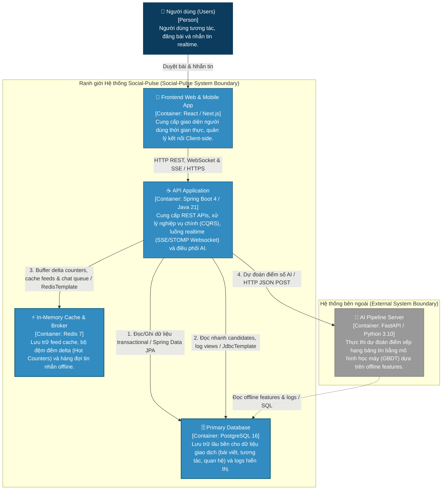
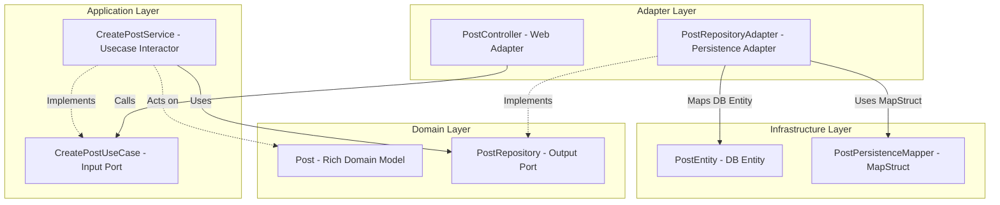
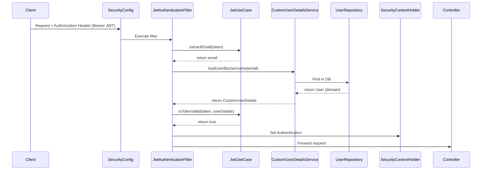
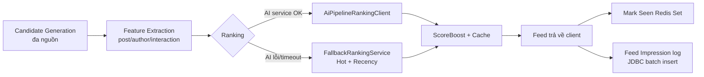
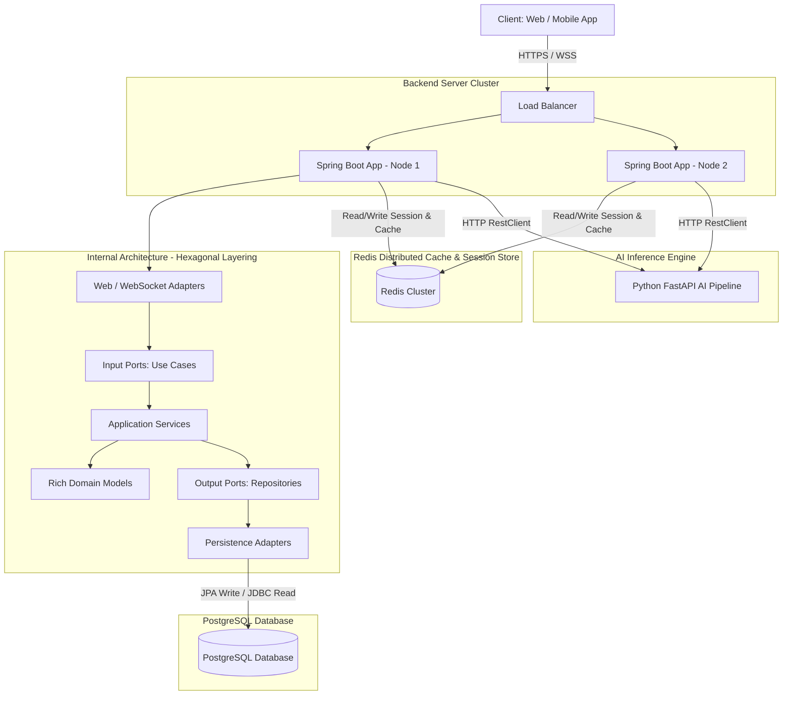
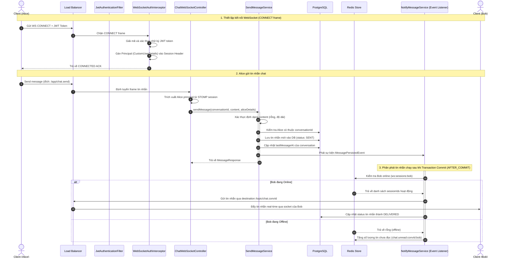

# Phân tích & Đúc kết Kinh nghiệm Kiến trúc Backend - Social-Pulse

Tài liệu này được biên soạn dưới góc nhìn của một **Code Architect** và **Senior Backend Engineer**, nhằm mục đích rà soát, phân tích và hệ thống hóa các kỹ thuật thiết kế, lập trình nâng cao đã được áp dụng trong codebase backend của dự án **Social-Pulse**. Đây là cẩm nang học tập giá trị giúp bạn đúc kết kinh nghiệm thiết kế hệ thống lớn, hiệu năng cao và có khả năng mở rộng tốt.

---

## 0. Thiết kế Hệ thống được áp dụng (System Design Patterns)

### 0.0. Sơ đồ Kiến trúc Hệ thống (System Design Diagram)

Dưới đây là sơ đồ tổng quan thể hiện sự phối hợp giữa Java Backend, Redis Cache, PostgreSQL Database, SSE/WebSockets và AI Pipeline Server:



Để xây dựng một mạng xã hội hiện đại chịu tải cao và tích hợp AI như Social-Pulse, hệ thống đã áp dụng các mẫu thiết kế hệ thống (System Design Patterns) kinh điển sau đây:

### 0.1. Phân tách Đọc và Ghi dữ liệu (CQRS Pattern)
* **Khái niệm**: Phân tách các luồng thao tác làm thay đổi trạng thái dữ liệu (Commands - Write) khỏi luồng lấy dữ liệu hiển thị (Queries - Read).
* **Ứng dụng trong Social-Pulse**:
  - **Write Path**: Giao dịch ghi bài viết, bình luận, tương tác yêu cầu tính nhất quán ACID mạnh mẽ, do đó sử dụng Spring Data JPA kết hợp Hibernate để kiểm soát ràng buộc thực thể chặt chẽ.
  - **Read Path**: Bảng tin (Feed) yêu cầu tốc độ hiển thị cực nhanh (dưới 100ms) và cần gom nhóm, kết hợp dữ liệu từ nhiều bảng (Posts, Follows, Blocks). Hệ thống bypass hoàn toàn JPA/Hibernate để loại bỏ các chi phí quản lý cache vòng đời entity, sử dụng Spring `JdbcTemplate` thực thi SQL Native để tăng tối đa tốc độ đọc. Xem chi tiết tại [FeedRepositoryAdapter.java](file:///home/damphuquy/Documents/Social-Pulse/backend/src/main/java/com/socialpulse/app/feed/adapter/persistence/FeedRepositoryAdapter.java).

### 0.2. Mẫu Đệm và Đồng bộ chậm (Write-Back Caching / Hot Counters Pattern)
* **Khái niệm**: Khi một dữ liệu (như số lượt xem, upvote, chia sẻ bài viết) có tần suất cập nhật cực kỳ lớn, việc ghi trực tiếp xuống PostgreSQL sẽ gây nghẽn hàng (Row-lock contention) và quá tải I/O.
* **Ứng dụng trong Social-Pulse**:
  - Tương tác của người dùng không ghi thẳng vào database mà chỉ tăng một giá trị đệm (delta) trên Redis (lưu tạm thời).
  - Một tiến trình chạy ngầm ([SyncSchedule.java](file:///home/damphuquy/Documents/Social-Pulse/backend/src/main/java/com/socialpulse/app/common/schedule/SyncSchedule.java)) định kỳ chạy mỗi 10 giây để thu thập tất cả các delta trên Redis, gom thành một lệnh cập nhật hàng loạt (Bulk Update) rồi ghi xuống PostgreSQL một lần duy nhất. Kỹ thuật này giảm tải ghi xuống database tới 95%.

### 0.3. Cơ chế Chịu lỗi và Tự phục hồi (Resilience & Fallback Pattern)
* **Khái niệm**: Trong kiến trúc tích hợp hệ thống bên ngoài (FastAPI AI server), lỗi kết nối hoặc độ trễ phản hồi từ hệ thống ngoài không được phép làm sập luồng nghiệp vụ chính của người dùng.
* **Ứng dụng trong Social-Pulse**:
  - **Timeout Control**: Client kết nối FastAPI AI được cấu hình giới hạn thời gian chờ cực ngắn (Connect timeout 2s, Read timeout 5s) tại [AiPipelineRankingClient.java](file:///home/damphuquy/Documents/Social-Pulse/backend/src/main/java/com/socialpulse/app/feed/infrastructure/config/AiPipelineRankingClient.java) để giải phóng luồng xử lý chính nếu AI server bị nghẽn.
  - **AI Fail-safe Fallback**: Nếu AI client ném ra ngoại lệ hoặc kết quả trả về không khớp định dạng dữ liệu (Schema validation thất bại), hệ thống xếp hạng bảng tin [FeedRankingService.java](file:///home/damphuquy/Documents/Social-Pulse/backend/src/main/java/com/socialpulse/app/feed/application/service/ranking/FeedRankingService.java) sẽ tự động kích hoạt bộ xếp hạng dự phòng Rule-based (dựa trên Hot Score cổ điển) để tiếp tục phục vụ người dùng.

### 0.4. Kết nối thời gian thực đa luồng (Real-time Message Streaming Pattern)
* **Khái niệm**: Hệ thống đẩy thông tin bất đồng bộ từ máy chủ về trình duyệt để mang lại trải nghiệm tương tác tức thì mà không lạm dụng cơ chế HTTP Polling liên tục gây hao tổn tài nguyên.
* **Ứng dụng trong Social-Pulse**:
  - **Server-Sent Events (SSE)**: Đẩy tín hiệu làm mới bảng tin ("feed_refresh") từ server về client thông qua [SseEmitterRegistry.java](file:///home/damphuquy/Documents/Social-Pulse/backend/src/main/java/com/socialpulse/app/realtime/application/service/SseEmitterRegistry.java), sử dụng thread pool riêng biệt nhằm tránh chiếm dụng luồng HTTP Servlet chính.
  - **STOMP over WebSocket**: Quản lý tin nhắn chat hai chiều bảo mật ở mức hạt kênh (Destination-level security) thông qua [WebSocketAuthInterceptor.java](file:///home/damphuquy/Documents/Social-Pulse/backend/src/main/java/com/socialpulse/app/common/websocket/WebSocketAuthInterceptor.java), đi kèm bộ đệm lưu trữ tin nhắn tạm thời trên Redis (Offline Queueing) phòng khi người dùng ngắt kết nối đột ngột.

---

## 1. Kiến trúc & Tổ chức thư mục (Architecture & Folder Structure)

Dự án áp dụng mô hình kiến trúc **Screaming Architecture (Kiến trúc "gầm thét")** kết hợp với cấu trúc **Hexagonal Architecture (Ports & Adapters)** và được tổ chức theo tính năng nghiệp vụ (**Package-by-Feature**).

### 1.1. Cách tổ chức chi tiết
Thay vì gom nhóm lớp theo dạng kỹ thuật (như một thư mục chứa toàn bộ controllers, một thư mục chứa toàn bộ services), dự án chia nhỏ thành từng thư mục đại diện cho các miền nghiệp vụ (Domain): `post`, `user`, `feed`, `chat`, `auth`, `notification`, `follow`...

Bên trong mỗi miền nghiệp vụ, kiến trúc Hexagonal phân tách rõ ràng thành 4 lớp độc lập:
1. **`domain` (Lõi nghiệp vụ)**:
   - Chứa thực thể nghiệp vụ thuần túy như [Post.java](file:///home/damphuquy/Documents/Social-Pulse/backend/src/main/java/com/socialpulse/app/post/domain/model/Post.java). Các đối tượng này không mang annotation JPA/Hibernate hay bất cứ thư viện framework nào.
   - Định nghĩa các interfaces giao tiếp nghiệp vụ (Domain Ports) như [PostRepository.java](file:///home/damphuquy/Documents/Social-Pulse/backend/src/main/java/com/socialpulse/app/post/domain/repository/PostRepository.java).
2. **`application` (Tầng điều phối luồng)**:
   - Định nghĩa các Use Case interfaces như [CreatePostUseCase.java](file:///home/damphuquy/Documents/Social-Pulse/backend/src/main/java/com/socialpulse/app/post/application/usecase/CreatePostUseCase.java).
   - Thực thi nghiệp vụ bằng các lớp Service như [CreatePostService.java](file:///home/damphuquy/Documents/Social-Pulse/backend/src/main/java/com/socialpulse/app/post/application/service/CreatePostService.java). Các service này chỉ biết giao tiếp với interfaces trừu tượng của tầng Domain.
3. **`adapter` (Cổng kết nối thế giới bên ngoài)**:
   - `web`: Nhận dữ liệu HTTP REST như [PostController.java](file:///home/damphuquy/Documents/Social-Pulse/backend/src/main/java/com/socialpulse/app/post/adapter/web/PostController.java).
   - `persistence`: Thực thi các repository interfaces của tầng domain thông qua việc kết nối database thực tế như [PostRepositoryAdapter.java](file:///home/damphuquy/Documents/Social-Pulse/backend/src/main/java/com/socialpulse/app/post/adapter/persistence/PostRepositoryAdapter.java).
4. **`infrastructure` (Tầng hạ tầng kỹ thuật)**:
   - Chứa thực thể database mang annotation JPA như [PostEntity.java](file:///home/damphuquy/Documents/Social-Pulse/backend/src/main/java/com/socialpulse/app/post/infrastructure/persistence/entity/PostEntity.java).
   - Triển khai các JPA interfaces trung gian, MapStruct mapper chuyển đổi Model-Entity, và các lớp cấu hình Spring Bean tường minh như [PostConfig.java](file:///home/damphuquy/Documents/Social-Pulse/backend/src/main/java/com/socialpulse/app/post/infrastructure/config/PostConfig.java).



### 1.2. Lý do lựa chọn phương pháp xử lý
Các hệ thống mạng xã hội lớn luôn có sự thay đổi liên tục về công nghệ lưu trữ dữ liệu (Database) và cách thức tối ưu hóa cache để chịu tải. 
* **Tách biệt tuyệt đối Domain (Ports & Adapters)** giúp doanh nghiệp bảo vệ logic nghiệp vụ cốt lõi không bị ảnh hưởng khi các quyết định hạ tầng (Infrastructure) thay đổi.
* **Package-by-Feature** được chọn thay vì Package-by-Layer truyền thống bởi vì nó tăng tính bao đóng. Khi phát triển một tính năng mới (ví dụ như `bookmark`), lập trình viên chỉ cần thao tác trong một gói thư mục duy nhất mà không cần tìm kiếm file rải rác ở khắp các tầng ứng dụng.

### 1.3. Đánh giá Trade-offs (Đánh đổi)
* **Ưu điểm vượt trội**:
  - **Độc lập Framework**: Có thể nâng cấp Spring, chuyển sang framework khác (Micronaut, Quarkus) hoặc thay đổi công nghệ lưu trữ (Postgres -> MongoDB) cực kỳ an toàn mà không phải viết lại logic nghiệp vụ.
  - **Độc lập Kiểm thử (Unit Testing)**: Vì các thành phần kết nối với nhau qua interfaces và POJOs thuần túy, việc viết Unit Test cho tầng nghiệp vụ vô cùng nhanh chóng, có thể mock mọi IO port mà không cần khởi chạy Spring Container chậm chạp.
  - **Tính bao đóng nghiệp vụ (Screaming)**: Cấu trúc package hiển thị rõ ràng những tính năng cốt lõi của mạng xã hội, giúp thành viên mới tham gia dự án dễ dàng định vị mã nguồn.
* **Đánh đổi (Bất lợi)**:
  - **Boilerplate lớn (Tốn thời gian gõ code)**: Phải duy trì song song hai loại Model (`Post` và `PostEntity`) cùng các Mapper trung gian. Code có nhiều interface và lớp bọc (Adapter) tạo ra cảm giác "over-engineering" đối với các nghiệp vụ chỉ CRUD đơn giản.
  - **Độ phức tạp trong quản lý cấu hình**: Việc khai báo Spring bean thủ công tại các lớp `@Configuration` cục bộ thay vì quét tự động đòi hỏi lập trình viên phải cấu hình bằng tay tỉ mỉ cho từng cấu trúc liên kết.

---

## 2. Kỹ thuật Cơ bản & Thiết kế (Design Principles)

### 2.1. Rich Domain Model vs Anemic Domain Model
Dự án ảnh hưởng bởi triết lý thiết kế hướng miền (DDD) thông qua **Rich Domain Model**.
* **Lý do lựa chọn**: Lớp [Post.java](file:///home/damphuquy/Documents/Social-Pulse/backend/src/main/java/com/socialpulse/app/post/domain/model/Post.java) tự bảo vệ trạng thái của chính nó. Các thay đổi thuộc tính bắt buộc phải đi qua các hàm hành vi: `changePrivacy(Privacy)`, `update(...)`. Logic đếm và tính toán điểm hot (`updateHotScore()`) được đóng gói ngay tại đối tượng để đảm bảo trạng thái của Post luôn nhất quán (Invariant Enforcement).
* **Đánh đổi (Trade-offs)**: 
  - *Thuận lợi:* Logic nghiệp vụ tập trung tại một nơi duy nhất (chính Domain Model), loại bỏ hoàn toàn hiện tượng phình to vô hạn của các Service và rò rỉ đóng gói nghiệp vụ.
  - *Bất lợi:* Không thể sử dụng trực tiếp các tính năng lưu trữ tự động của ORM (như tự động lưu quan hệ cascade của Hibernate). Dữ liệu bắt buộc phải đi qua MapStruct mapper để chuyển đổi thành `PostEntity` trước khi lưu vào PostgreSQL, tạo ra chi phí tính toán chuyển dịch bộ nhớ (mapping overhead).

### 2.2. Áp dụng các nguyên lý SOLID
* **Single Responsibility Principle (SRP)**: Phân rã tối đa các Use Cases. Thay vì gộp chung mọi phương thức vào một lớp `PostService` khổng lồ, dự án chia nhỏ thành [CreatePostService.java](file:///home/damphuquy/Documents/Social-Pulse/backend/src/main/java/com/socialpulse/app/post/application/service/CreatePostService.java), [ReactPostService.java](file:///home/damphuquy/Documents/Social-Pulse/backend/src/main/java/com/socialpulse/app/post/application/service/ReactPostService.java), [ViewPostService.java](file:///home/damphuquy/Documents/Social-Pulse/backend/src/main/java/com/socialpulse/app/post/application/service/ViewPostService.java)... Mỗi class chỉ chịu trách nhiệm duy nhất cho một tác vụ nghiệp vụ.
* **Dependency Inversion Principle (DIP)**: Tầng ứng dụng cấp cao (`CreatePostService`) không hề biết đến tầng lưu trữ dữ liệu cụ thể (`JpaPostRepository`). Cả hai thành phần này cùng phụ thuộc vào một abstractions nằm ở tầng Domain (`PostRepository`).
* **Open/Closed Principle (OCP)**: Hệ thống feed ranking được thiết kế dạng plugin. Lớp [FeedRankingService.java](file:///home/damphuquy/Documents/Social-Pulse/backend/src/main/java/com/socialpulse/app/feed/application/service/ranking/FeedRankingService.java) gọi các interface UseCases xếp hạng. Khi cần tích hợp giải pháp xếp hạng mới, chỉ cần triển khai một implementation mới mà không cần chỉnh sửa luồng điều phối lõi.

### 2.3. Dependency Injection & Explicit Configuration
Dự án hạn chế lạm dụng việc khai báo `@Service` hay `@Component` quét tự động bừa bãi. Thay vào đó:
- Sử dụng cấu hình tiêm phụ thuộc thông qua Java Config độc lập như [PostConfig.java](file:///home/damphuquy/Documents/Social-Pulse/backend/src/main/java/com/socialpulse/app/post/infrastructure/config/PostConfig.java).
- **Lý do & Trade-off**: Việc khai báo Bean thủ công giúp kiểm soát vòng đời ứng dụng chặt chẽ, dễ dàng mock dependencies khi viết Unit test độc lập. Đánh đổi lại, thời gian cấu hình hệ thống ban đầu sẽ lâu hơn so với việc để Spring Boot tự động dò quét component `@Autowired`.

### 2.4. Tech Stack & Cấu hình build (pom.xml)
Bức tranh công nghệ giúp định vị nhanh năng lực hệ thống (xem [pom.xml](file:///home/damphuquy/Documents/Social-Pulse/backend/pom.xml)):

| Hạng mục | Lựa chọn | Vai trò |
|---|---|---|
| Nền tảng | **Spring Boot 4.0.6 / Java 21** | Web MVC, DI, vòng đời ứng dụng. Java 21 cho phép dùng record, pattern matching, `Math.clamp`... |
| Lưu trữ | **PostgreSQL + Spring Data JPA**, **Flyway** | RDBMS giao dịch + quản lý phiên bản schema |
| Cache / Realtime store | **Redis (Spring Data Redis)** | Cache, đếm delta, hàng đợi offline, registry phiên WS |
| Bảo mật | **Spring Security + JJWT 0.12.6** | Filter chain, mã hóa, JWT HS256 |
| Realtime | **spring-boot-starter-websocket (STOMP)** | Chat 2 chiều |
| Mapping | **MapStruct 1.6.3 + Lombok** | Sinh mã mapper lúc biên dịch |
| Media | **Cloudinary 2.3.2** | Lưu trữ ảnh/video ngoài |
| Tài liệu API | **springdoc-openapi 3.0.2** | Swagger UI / OpenAPI |
| Kiểm thử | **JUnit + Mockito + jqwik 1.9.2 + H2** | Unit, slice, property-based test |

* **Điểm đáng chú ý về build**: `maven-compiler-plugin` cấu hình `annotationProcessorPaths` theo đúng thứ tự **Lombok → lombok-mapstruct-binding → mapstruct-processor**. Thứ tự này bắt buộc để MapStruct "nhìn thấy" được getter/setter mà Lombok sinh ra. Đây là một cạm bẫy cấu hình kinh điển khi kết hợp hai annotation processor.

### 2.5. Quản lý phiên bản Schema với Flyway (Database Migration)
Toàn bộ schema được quản lý bằng các migration đánh số tuần tự trong [db/migration](file:///home/damphuquy/Documents/Social-Pulse/backend/src/main/resources/db/migration) (`V1__init.sql`, `V2__seed.sql`, ... `V26__feed_impressions.sql`).

* **Khái niệm cốt lõi**: Mỗi file migration là **bất biến (immutable)** và **forward-only**. Khi ứng dụng khởi động, Flyway so sánh bảng `flyway_schema_history` với các file trên classpath và chỉ áp dụng những migration mới (theo thứ tự version). Schema do đó luôn **tái lập được (reproducible)** trên mọi môi trường.
* **Tổ chức trong dự án**: Tách bạch migration cấu trúc (`V1__init`) với migration seed dữ liệu (`V2__seed`, `V3/V4__seed_feed_data`), giúp dễ đọc và dễ tách dữ liệu mẫu khỏi schema lõi.
* **Trade-off**: An toàn và có lịch sử rõ ràng, phối hợp tốt với `PermissionSyncService` (chạy sau khi schema sẵn sàng). Đánh đổi: **không được sửa migration đã chạy** — mọi thay đổi phải là một file version mới, đôi khi sinh ra nhiều file vá nhỏ.

### 2.6. Hợp đồng API: Response Envelope & Phân trang
* **Envelope thống nhất**: Mọi phản hồi REST được bọc trong [ApiResponse&lt;T&gt;](file:///home/damphuquy/Documents/Social-Pulse/backend/src/main/java/com/socialpulse/app/common/dto/response/ApiResponse.java) gồm `{ code, message, data }`, giúp client xử lý đồng nhất cả luồng thành công lẫn lỗi (kết hợp với `GlobalExceptionHandler` ở mục 3.9).
* **Hai chiến lược phân trang cùng tồn tại** — một bài học quan trọng về việc chọn đúng công cụ:
  - **Offset-based** qua [PageResponse&lt;T&gt;](file:///home/damphuquy/Documents/Social-Pulse/backend/src/main/java/com/socialpulse/app/common/dto/response/PageResponse.java) (`items, page, size, totalElements, totalPages, hasNext`) dùng cho danh sách thông thường. *Ưu*: nhảy trang tùy ý, biết tổng số trang. *Nhược*: `OFFSET` lớn chậm dần, dễ lệch/trùng bản ghi khi dữ liệu chèn vào giữa lúc duyệt.
  - **Cursor-based (keyset)** trong [GetMessageHistoryService.java](file:///home/damphuquy/Documents/Social-Pulse/backend/src/main/java/com/socialpulse/app/chat/application/service/GetMessageHistoryService.java) cho lịch sử chat: dùng `Instant` của tin nhắn làm con trỏ, truy vấn `size + 1` bản ghi để biết `hasMore`, lấy timestamp tin cũ nhất làm `nextCursor`. *Ưu*: hiệu năng ổn định, không lệch khi có tin mới. *Nhược*: chỉ duyệt tuần tự, không nhảy trang được. Kích thước trang được kẹp an toàn (`Math.clamp(size, 1, 50)`, mặc định 20).

### 2.7. Cấu hình theo Môi trường (Spring Profiles)
Hệ thống tách cấu hình theo profile: [application-dev.yaml](file:///home/damphuquy/Documents/Social-Pulse/backend/src/main/resources/application-dev.yaml) và [application-prod.yaml](file:///home/damphuquy/Documents/Social-Pulse/backend/src/main/resources/application-prod.yaml).
* **Hành vi thay đổi theo runtime**: Code có thể đọc `Environment.getActiveProfiles()` để đổi hành vi. Ví dụ rõ nhất ở [OtpService.java](file:///home/damphuquy/Documents/Social-Pulse/backend/src/main/java/com/socialpulse/app/auth/application/service/otp/OtpService.java): ở profile `dev`/`local`, mã OTP `123456` được bypass và OTP được log ra để tiện kiểm thử.
* **Trade-off & cảnh báo bảo mật**: Rất tiện cho phát triển, nhưng phải tuyệt đối đảm bảo profile production **không** kích hoạt các lối tắt này — đây là loại lỗi cấu hình dễ gây lỗ hổng nghiêm trọng nếu bị bật nhầm.

### 2.8. Băm mật khẩu & dữ liệu nhạy cảm (BCrypt)
* [AppPasswordEncoder.java](file:///home/damphuquy/Documents/Social-Pulse/backend/src/main/java/com/socialpulse/app/security/encoder/AppPasswordEncoder.java) bọc `BCryptPasswordEncoder` của Spring Security. Điểm thú vị: nó được tái sử dụng để **băm cả mã OTP** chứ không chỉ mật khẩu (`OtpService` gọi `passwordEncoder.encode`/`matches`).
* **Khái niệm**: BCrypt là hàm băm **có salt ngẫu nhiên nhúng sẵn** và **work-factor** (chi phí tính toán) điều chỉnh được, khiến tấn công brute-force/rainbow-table tốn kém. Cùng một đầu vào sẽ cho hash khác nhau (do salt), nên phải so sánh bằng `matches()` chứ không so chuỗi.
* **Trade-off**: Chậm có chủ đích (đó là tính năng bảo mật, không phải nhược điểm) — cần cân nhắc work-factor để cân bằng giữa an toàn và độ trễ đăng nhập.

### 2.9. Ánh xạ hai tầng với MapStruct (Two-layer Mapping)
Hệ quả trực tiếp của kiến trúc Hexagonal là dữ liệu phải đi qua **hai ranh giới ánh xạ**, mỗi ranh giới có một loại mapper riêng:
1. **Persistence Mapper** (`*PersistenceMapper`): chuyển đổi **Domain Model ↔ JPA Entity** (vd: `PostPersistenceMapper`), nằm ở tầng `infrastructure`.
2. **Application/DTO Mapper** (`*Mapper` trong `application/dto/mapper`): chuyển đổi **Domain Model ↔ DTO request/response** (vd: `PostMapper`, `CommentMapper`).

* **Lý do chọn MapStruct**: Sinh mã ánh xạ **lúc biên dịch (compile-time)** thay vì dùng reflection lúc chạy → nhanh, an toàn kiểu, và lỗi thiếu trường được phát hiện ngay khi build.
* **Trade-off**: Đánh đổi đúng như mục 2.1 đã nêu — chi phí boilerplate và "mapping overhead", nhưng đổi lại sự cô lập tuyệt đối giữa domain thuần và chi tiết hạ tầng/giao tiếp.

---

## 3. Kỹ thuật Nâng cao & Tối ưu (Advanced Techniques)

### 3.1. Xử lý dữ liệu & Tối ưu hóa truy vấn (CQRS Pattern)
Hệ thống Social-Pulse áp dụng kiến trúc tách biệt luồng Đọc/Ghi dữ liệu (CQRS-like) ở mức độ truy cập cơ sở dữ liệu:
* **Giao dịch Ghi (Write Path)**:
  Sử dụng JPA/Hibernate thông qua đối tượng [PostEntity.java](file:///home/damphuquy/Documents/Social-Pulse/backend/src/main/java/com/socialpulse/app/post/infrastructure/persistence/entity/PostEntity.java).
  - Tận dụng thế mạnh của Hibernate trong quản lý vòng đời thực thể, tự động đồng bộ hóa trạng thái (Dirty checking), thiết lập chỉ mục index (`idx_hot_score`, `idx_post_user`), quản lý quan hệ phức tạp `@ElementCollection` cho danh sách topic slugs và kích hoạt các sự kiện vòng đời `@PrePersist`, `@PreUpdate` để quản lý audit log.
* **Giao dịch Đọc (Read Path)**:
  Đối với nghiệp vụ hiển thị bảng tin (Feed) yêu cầu hiệu năng đọc cực cao và kết hợp nhiều bảng, hệ thống bypass hoàn toàn JPA Hibernate để loại bỏ overhead quản lý trạng thái entity (Cache L1/L2 tracking).
  - Lớp [FeedRepositoryAdapter.java](file:///home/damphuquy/Documents/Social-Pulse/backend/src/main/java/com/socialpulse/app/feed/adapter/persistence/FeedRepositoryAdapter.java) sử dụng trực tiếp Spring `JdbcTemplate` thực thi SQL thô (Native Query) với lệnh `LIMIT/OFFSET` và liên kết JOIN tường minh.
* **Các kỹ thuật truy vấn tối ưu áp dụng trong Database**:
  Để đảm bảo khả năng chịu tải và giảm thiểu tối đa độ trễ (latency), hệ thống triển khai 3 kỹ thuật truy vấn chuyên sâu sau:
  
  1. **Cập nhật lô hiệu năng cao với `JdbcTemplate` (Bulk Batch Updates)**:
     - *Vấn đề*: Log lượt hiển thị bảng tin (Impressions) có tần suất ghi cực lớn (nhiều bài viết trên một lượt tải trang). Ghi từng dòng riêng lẻ bằng JPA sẽ tạo ra $N$ kết nối mạng và Overhead giao dịch, gây nghẽn PostgreSQL.
     - *Giải pháp*: Lớp [FeedImpressionRepositoryAdapter.java](file:///home/damphuquy/Documents/Social-Pulse/backend/src/main/java/com/socialpulse/app/feed/adapter/persistence/FeedImpressionRepositoryAdapter.java) triển khai phương thức `saveAll` sử dụng `jdbcTemplate.batchUpdate()` và `BatchPreparedStatementSetter`. Cơ chế này gom tất cả các bản ghi vào một gói tin mạng duy nhất để ghi xuống PostgreSQL. Khi cấu hình JDBC URL với `rewriteBatchedInserts=true`, driver sẽ chuyển đổi batch insert thành câu lệnh multi-value (`INSERT INTO ... VALUES (?,?,...), (?,?,...)`), giúp tốc độ ghi tăng gấp 10-20 lần.
     
  2. **Gom nhóm truy vấn & Tính toán trên DB (Batch & Aggregate JPQL)**:
     - *Vấn đề*: Lỗi truy vấn N+1 khi hiển thị Feed kèm theo thông tin tổng số bài đăng hoặc độ nổi tiếng trung bình của từng tác giả.
     - *Giải pháp*: [JpaPostRepository.java](file:///home/damphuquy/Documents/Social-Pulse/backend/src/main/java/com/socialpulse/app/post/infrastructure/persistence/repository/JpaPostRepository.java) sử dụng các truy vấn JPQL custom như `countByUserIds` và `averagePopularityByUserIds` sử dụng mệnh đề `IN :userIds` kết hợp với `GROUP BY`. Việc tính toán các hàm tổng hợp như `COUNT` hoặc `AVG(COALESCE(p.upvoteCount, 0) + ...)` được thực thi trực tiếp trên PostgreSQL tận dụng các index sẵn có, thay vì tải hàng ngàn thực thể thô lên RAM (Java Heap) để tính toán thủ công.
     
  3. **Chỉ mục nâng cao (Advanced Indexing Strategy)**:
     - *Chỉ mục một phần (Partial Index)*: [V1__init.sql](file:///home/damphuquy/Documents/Social-Pulse/backend/src/main/resources/db/migration/V1__init.sql) định nghĩa index `idx_msg_unread` trên `messages(conversation_id, status, sender_id) WHERE status != 'READ'`. Do tin nhắn chưa đọc chỉ chiếm một phần rất nhỏ ($<5\%$) trong bảng messages, việc loại trừ các tin nhắn đã đọc giúp kích thước index cực kỳ nhỏ, nằm gọn trong RAM (Buffer Pool), đẩy nhanh tốc độ quét và giảm overhead cập nhật index khi tin nhắn mới được đọc.
     - *Chỉ mục tổ hợp phục vụ phân trang (Composite Index)*: Index `idx_feed_impressions_viewer_created` trên `(viewer_id, created_at DESC)` và `idx_user_interactions_viewer_created` trên `(viewer_id, created_at DESC)`. Giúp PostgreSQL thực thi đồng thời bộ lọc (filter theo user) và sắp xếp (sort theo thời gian giảm dần) trong một lần quét chỉ mục duy nhất mà không cần thực hiện thao tác sắp xếp ghi đĩa tạm (Filesort/External Sort).
* **Lý do lựa chọn**:
  - Giao dịch Ghi cần tính nhất quán mạnh mẽ (ACID), tính toàn vẹn dữ liệu và các quan hệ thực thể chặt chẽ nên JPA/Hibernate là sự lựa chọn tối ưu.
  - Giao dịch Đọc (đặc biệt là Feed) đòi hỏi tốc độ phản hồi tính bằng mili-giây. Việc nạp dữ liệu qua JDBC thô giúp đạt hiệu năng tối đa, kiểm soát được kế hoạch thực thi (Query Execution Plan) của PostgreSQL và tránh lỗi N+1 Select.
* **Đánh đổi (Trade-offs)**:
  - *Thuận lợi:* Tăng tốc độ đọc Feed gấp nhiều lần, loại bỏ hoàn toàn rủi ro rò rỉ bộ nhớ từ Entity Lifecycle Cache của Hibernate khi xử lý hàng trăm bản ghi.
  - *Bất lợi:* Nhà phát triển phải tự viết câu lệnh SQL thô bằng tay và tự cấu hình ánh xạ thủ công (`RowMapper`), tăng rủi ro lỗi cú pháp SQL khi viết code và mất đi tính năng chuyển dịch phương ngữ SQL tự động của JPA.

### 3.2. Quản lý giao dịch và phối hợp tác vụ (Transaction Synchronization)
Để tránh các vấn đề không nhất quán dữ liệu giữa Hệ quản trị CSDL quan hệ (PostgreSQL) và các dịch vụ phi quan hệ / truyền thông điệp thời gian thực (Redis cache, SSE broadcast), dự án sử dụng cơ chế đăng ký đồng bộ giao dịch Spring:
```java
TransactionSynchronizationManager.registerSynchronization(new TransactionSynchronization() {
    @Override
    public void afterCommit() {
        // Tác vụ ghi Redis hoặc phát SSE thời gian thực chỉ chạy khi giao dịch DB thành công
        sseEmitterRegistry.broadcast("post_stats", data);
    }
});
```
* **Lý do lựa chọn**: Ngăn chặn rò rỉ trạng thái không nhất quán (Stale/Dirty cache). Nếu xảy ra lỗi rollback trong database PostgreSQL, tác vụ ngoài luồng (như cập nhật cache Redis ảo hoặc phát SSE báo tin giả đến các client khác) sẽ không bao giờ được kích hoạt, đảm bảo tính nhất quán dữ liệu tối đa.
* **Đánh đổi (Trade-offs)**: Phức tạp hóa mã nguồn nghiệp vụ do phải bao bọc trong các lớp nặc danh (Anonymous inner classes). Các tác vụ chạy trong `afterCommit` nếu xảy ra lỗi độc lập (ví dụ mất kết nối Redis) sẽ không thể rollback được PostgreSQL (vì giao dịch DB đã commit xong), hệ thống phải chấp nhận mô hình nhất quán cuối cùng (Eventual Consistency) và tự xử lý bù (compensation) nếu cần.

### 3.3. Write-Back (Write-behind) Caching
Với các hoạt động cập nhật lượt xem, bình luận, chia sẻ bài viết có tần suất cực lớn trên mạng xã hội:
- **Lý do lựa chọn**: Khi có hàng ngàn người tương tác đồng thời, việc ghi trực tiếp xuống PostgreSQL tạo ra hàng ngàn truy vấn update gây nghẽn hàng (Row lock) và quá tải I/O đĩa cứng. Ghi nhận delta vào Redis thông qua các lệnh nguyên tử (Atomic operations) giúp chịu tải cực kỳ cao.
- **Ghi chậm về DB**: Một scheduler chạy ngầm [SyncSchedule.java](file:///home/damphuquy/Documents/Social-Pulse/backend/src/main/java/com/socialpulse/app/common/schedule/SyncSchedule.java) định kỳ 10 giây thu thập toàn bộ các key delta trong Redis, sử dụng `getAndSet` nguyên tử để vừa đọc dữ liệu cũ vừa reset bộ đếm về "0", sau đó thực thi một lệnh cập nhật gộp (bulk update) duy nhất xuống database.
- **Đánh đổi (Trade-offs)**:
  - *Thuận lợi:* Giảm tải ghi xuống PostgreSQL tới 90-95%, tăng băng thông xử lý (Throughput) của hệ thống lên gấp nhiều lần.
  - *Bất lợi:* Chấp nhận **độ trễ dữ liệu (Stale Data)** trong PostgreSQL tối đa là 10 giây (dữ liệu hiển thị tức thời lấy từ Redis, nhưng dữ liệu thực tế dưới PostgreSQL sẽ bị chậm). Đồng thời, nếu server sập đột ngột trước chu kỳ đồng bộ, các tương tác trong 10 giây đó trên Redis có thể bị mất nếu không bật chế độ bền vững (AOF persistence) cho Redis.

### 3.4. Concurrency & Luồng Real-time bất đồng bộ
* **Đồng bộ SSE (SseEmitterRegistry)**:
  Sử dụng cấu trúc dữ liệu an toàn đa luồng `ConcurrentHashMap` phối hợp cùng `CopyOnWriteArrayList` để lưu trữ các kết nối client SSE hoạt động.
  - *Lý do chọn:* SSE đăng ký và hủy liên tục từ các luồng khác nhau. Sử dụng các cấu trúc Thread-safe giúp loại bỏ hoàn toàn lỗi tranh chấp tài nguyên (Race Condition) và rò rỉ bộ nhớ (Memory Leak).
  - *Trade-off:* `CopyOnWriteArrayList` có chi phí ghi (write) rất cao do phải nhân bản mảng mỗi khi có client mới kết nối. Tuy nhiên, trong mô hình SSE nơi hoạt động Đọc/Duyệt gửi tin diễn ra liên tục còn ghi (đăng ký mới) diễn ra ít hơn, đây là sự đánh đổi hoàn toàn xứng đáng.
* **Bất đồng bộ hóa phát sóng (Async Broadcasting)**:
  Tách biệt luồng phát SSE thời gian thực ra khỏi luồng xử lý HTTP request chính thông qua một thread pool cố định (`sseExecutor = Executors.newFixedThreadPool(10)`).
  - *Lý do chọn:* Tránh chặn luồng servlet. Việc gửi dữ liệu đến hàng ngàn client SSE được offload sang luồng nền, giải phóng ngay luồng xử lý API của client tạo bài viết.
  - *Trade-off:* Khó theo dõi lỗi và quản lý tài nguyên Thread. Cần triển khai phương thức hủy tài nguyên `@PreDestroy` chuẩn chỉ để tránh rò rỉ luồng khi Spring context tắt.

---

## 3.5. Cơ chế Xác thực nâng cao (Authentication)

Hệ thống sử dụng cơ chế xác thực phi trạng thái (**Stateless Authentication**) dựa trên **JSON Web Token (JWT)**, được tích hợp chặt chẽ vào Spring Security Filter Chain thông qua lớp [SecurityConfig.java](file:///home/damphuquy/Documents/Social-Pulse/backend/src/main/java/com/socialpulse/app/security/config/SecurityConfig.java).



### 3.5.1. Triển khai kỹ thuật chi tiết

1. **Lớp lọc JWT Custom**: Lớp [JwtAuthenticationFilter.java](file:///home/damphuquy/Documents/Social-Pulse/backend/src/main/java/com/socialpulse/app/security/jwt/JwtAuthenticationFilter.java) kế thừa từ `OncePerRequestFilter`. Trong mỗi HTTP request:
   ```java
   @Override
   protected void doFilterInternal(HttpServletRequest request, HttpServletResponse response, FilterChain filterChain) 
           throws ServletException, IOException {
       final String jwt = resolveToken(request);
       if (jwt == null || jwt.isBlank()) {
           filterChain.doFilter(request, response);
           return;
       }
       try {
           final String email = jwtUseCase.extractEmail(jwt);
           if (email != null && SecurityContextHolder.getContext().getAuthentication() == null) {
               UserDetails userDetails = userDetailsService.loadUserByUsername(email);
               if (jwtUseCase.isTokenValid(jwt, userDetails)) {
                   UsernamePasswordAuthenticationToken authToken = new UsernamePasswordAuthenticationToken(
                           userDetails, null, userDetails.getAuthorities()
                   );
                   authToken.setDetails(new WebAuthenticationDetailsSource().buildDetails(request));
                   SecurityContextHolder.getContext().setAuthentication(authToken);
               }
           }
       } catch (Exception e) {
           log.warn("[JWT Filter] Token validation failed: {}", e.getMessage());
       }
       filterChain.doFilter(request, response);
   }
   ```
2. **Stateless Session Management**: Cấu hình Spring Security tắt hẳn HTTP Session:
   ```java
   http
       .csrf(AbstractHttpConfigurer::disable)
       .sessionManagement(session -> session.sessionCreationPolicy(SessionCreationPolicy.STATELESS))
       .addFilterBefore(jwtAuthenticationFilter, UsernamePasswordAuthenticationFilter.class);
   ```

### 3.5.2. Lý do lựa chọn
* Kiến trúc Stateless được chọn vì đây là tiêu chuẩn của các Web/Mobile App hiện đại. Nó cho phép ứng dụng mở rộng ngang (Horizontal Scaling) vô hạn mà không cần lo lắng về việc chia sẻ session state giữa các server node phía sau Load Balancer.

### 3.5.3. Đánh giá Trade-offs
* **Thuận lợi**: Máy chủ backend không tiêu thụ RAM để lưu trữ trạng thái người dùng (Session). Client hoàn toàn tự quản lý token (trong localStorage/cookies).
* **Bất lợi**: Việc thu hồi (revoke) tức thời một **Access Token** đang còn hạn là cực kỳ khó khăn do bản chất phi trạng thái của JWT (server không tra cứu DB cho mỗi request). Dự án giảm thiểu rủi ro này bằng cách giữ **Access Token có vòng đời ngắn** (xem `JwtProperties.expirationMs`) và đặt toàn bộ khả năng thu hồi vào **Refresh Token có trạng thái** (stateful) — được trình bày ở mục 3.5.4 ngay dưới đây. Đây là sự đánh đổi kinh điển: chấp nhận một "cửa sổ rủi ro" ngắn bằng tuổi thọ Access Token để đổi lấy hiệu năng xác thực không-chạm-DB.

### 3.5.4. Refresh Token Rotation & Reuse Detection (Cơ chế xoay vòng & phát hiện đánh cắp)

Đây là phần bù đắp cho điểm yếu "không revoke được" của JWT thuần. Thay vì dùng Access Token dài hạn, hệ thống phát hành cặp **Access Token (ngắn hạn, stateless)** + **Refresh Token (dài hạn, stateful)** và áp dụng kỹ thuật **Rotation** (xoay vòng) kèm **Reuse Detection** (phát hiện tái sử dụng) trong [RefreshTokenService.java](file:///home/damphuquy/Documents/Social-Pulse/backend/src/main/java/com/socialpulse/app/auth/application/service/jwt/RefreshTokenService.java).

#### Triển khai kỹ thuật chi tiết

1. **Refresh Token là chuỗi ngẫu nhiên (opaque), KHÔNG phải JWT, và lưu dưới dạng băm**:
   - Token được sinh bằng `SecureRandom` 64 byte (mã hóa Base64 URL-safe), sau đó **chỉ lưu bản băm SHA-256** xuống DB (giống cách lưu mật khẩu). Bản thô chỉ tồn tại phía client.
     ```java
     private String generateToken() {
         byte[] randomBytes = new byte[REFRESH_TOKEN_NUM_BYTES]; // 64 bytes
         secureRandom.nextBytes(randomBytes);
         return Base64.getUrlEncoder().withoutPadding().encodeToString(randomBytes);
     }
     // Khi lưu / tra cứu: hashToken(raw) = SHA-256 hex
     ```
   - **Lý do**: Nếu DB bị lộ, kẻ tấn công vẫn không có token thật để dùng (one-way hash). Đây là điểm khác biệt quan trọng so với việc tin tưởng chữ ký của một Refresh Token dạng JWT.
2. **Rotation — mỗi lần refresh sinh token mới, vô hiệu token cũ**:
   - `rotateTokens()` tra cứu bản ghi theo hash, nếu hợp lệ thì cấp một Refresh Token mới và đánh dấu token cũ là đã thu hồi, liên kết bằng trường `replacedByToken`.
3. **Reuse Detection — phát hiện token bị đánh cắp**:
   - Nếu một Refresh Token **đã bị revoke** mà vẫn được dùng lại, hệ thống coi đây là dấu hiệu token đã bị đánh cắp và phát lại (replay). Phản ứng là **thu hồi toàn bộ token đang hoạt động của user đó** rồi ném lỗi:
     ```java
     if (tokenRecord.isRevoked()) {
         refreshTokenRevocationUseCase.revokeAllActiveTokensForUser(tokenRecord.getUserId(), now);
         throw new AppException(AuthCode.REFRESH_TOKEN_REUSE_DETECTED);
     }
     ```
   - Thao tác thu hồi hàng loạt trong [RefreshTokenRevocationService.java](file:///home/damphuquy/Documents/Social-Pulse/backend/src/main/java/com/socialpulse/app/auth/application/service/jwt/RefreshTokenRevocationService.java) chạy với `@Transactional(propagation = Propagation.REQUIRES_NEW)` để đảm bảo hành động bảo mật được commit độc lập, không bị cuốn theo rollback của giao dịch gọi nó.

> Ghi chú kỹ thuật: `JwtService` có sẵn cả hàm `generateRefreshToken()` sinh Refresh Token kiểu JWT (payload gọn `type=refresh`), nhưng **cơ chế đang được thực thi để xoay vòng là loại opaque token + băm SHA-256 ở trên** — vì nó cho phép revoke có trạng thái, điều mà JWT thuần không làm được.

#### Đánh giá Trade-offs
* **Thuận lợi**: Có khả năng đăng xuất từ xa/thu hồi thật sự; tự động phát hiện và phản ứng khi token bị đánh cắp; giảm thiệt hại khi DB rò rỉ nhờ băm token.
* **Bất lợi**: Mỗi lần refresh đều phát sinh ghi DB (mất tính thuần stateless ở tầng refresh); Reuse Detection có thể "đăng xuất toàn bộ thiết bị" của người dùng hợp lệ trong tình huống đua (race) hiếm gặp khi client refresh song song — đây là sự đánh đổi nghiêng về an toàn.

---

## 3.6. Cơ chế Phân quyền (Role-Based Access Control - RBAC)

Social-Pulse không áp dụng kiểm tra quyền trực tiếp dựa trên Vai trò (Role-based check như `hasRole('ADMIN')`) mà chuyển đổi sang **Phân quyền dựa trên Hạt Quyền (Authority/Permission-based check)**.

### 3.6.1. Triển khai kỹ thuật chi tiết

1. **Mối quan hệ Quyền hạn dạng Hạt Mịn (Fine-grained Authorization)**:
   - Hệ thống định nghĩa danh sách các quyền hạn cụ thể trong [AppPermission.java](file:///home/damphuquy/Documents/Social-Pulse/backend/src/main/java/com/socialpulse/app/security/permission/AppPermission.java) (ví dụ: `post:create`, `post:delete`, `comment:create`).
   - Lớp [RolePermissions.java](file:///home/damphuquy/Documents/Social-Pulse/backend/src/main/java/com/socialpulse/app/security/permission/RolePermissions.java) ánh xạ quyền hạn tĩnh vào từng Vai trò:
     ```java
     protected static final Set<AppPermission> USER = EnumSet.of(
             POST_READ, POST_CREATE, POST_UPDATE, POST_DELETE, POST_REACT,
             COMMENT_READ, COMMENT_CREATE, COMMENT_UPDATE, COMMENT_DELETE, COMMENT_REACT,
             USER_CREATE, USER_READ, USER_UPDATE, USER_DELETE
     );
     ```
2. **Cầu nối Spring Security (`CustomUserDetails`)**:
   - Khi tải thông tin chi tiết người dùng, hệ thống chuyển hóa quyền của Role thành `SimpleGrantedAuthority`:
     ```java
     this.authorities = user.getRoles().stream()
             .flatMap(role -> role.getPermissions().stream())
             .map(permission -> new SimpleGrantedAuthority(permission.getName()))
             .collect(Collectors.toUnmodifiableSet());
     ```
3. **Type-safe Meta-Annotations**:
   - Sử dụng các meta-annotation khai báo trong [RequiresPermission.java](file:///home/damphuquy/Documents/Social-Pulse/backend/src/main/java/com/socialpulse/app/security/permission/RequiresPermission.java) thay thế cho SpEL string thô:
     ```java
     @Target({ElementType.METHOD, ElementType.TYPE})
     @Retention(RetentionPolicy.RUNTIME)
     @PreAuthorize("hasAuthority('post:create')")
     public @interface PostCreate {}
     ```

### 3.6.2. Lý do lựa chọn
* **Tính linh hoạt**: Nếu trong tương lai cần gán thêm quyền `post:manage` cho một nhóm vai trò mới (ví dụ: `MODERATOR`), lập trình viên chỉ cần cập nhật lớp ánh xạ `RolePermissions.java`. Toàn bộ các controller kiểm tra quyền thông qua `@RequiresPermission` sẽ tự động nhận diện mà không cần phải thay đổi một dòng code kiểm tra phân quyền nào.

### 3.6.3. Đánh giá Trade-offs
* **Thuận lợi**: Code controller cực kỳ sạch và type-safe. Bản đồ quyền được đặt tại Code làm "Single Source of Truth", dễ dàng theo dõi lịch sử thay đổi quyền thông qua Git.
* **Bất lợi**: Việc gán quyền được quy định trong mã nguồn. Nếu muốn thay đổi phân quyền động (chẳng hạn như admin muốn tạo một role mới và gán các quyền tùy biến ngay trên giao diện Web mà không cần build lại server), hệ thống tĩnh này sẽ không đáp ứng được mà phải chuyển sang lưu bảng ánh xạ động trong DB, tăng tải truy vấn SQL phân quyền cho mỗi request.

### 3.6.4. Đồng bộ quyền tĩnh xuống DB lúc khởi động (PermissionSyncService)

Một sắc thái quan trọng dễ bị bỏ sót: tuy bản đồ quyền là **tĩnh trong code**, nhưng quyền vẫn **tồn tại dưới dạng bản ghi trong DB** để có thể tham chiếu khóa ngoại (role ↔ permission). Lớp [PermissionSyncService.java](file:///home/damphuquy/Documents/Social-Pulse/backend/src/main/java/com/socialpulse/app/security/permission/PermissionSyncService.java) đóng vai trò cầu nối, đồng bộ enum `AppPermission` xuống DB mỗi lần khởi động.

* **Triển khai**: Lớp này implement `ApplicationRunner` (chạy một lần sau khi context sẵn sàng, **sau khi Flyway tạo schema**). Logic gồm hai bước idempotent:
  1. `syncPermissions()`: với mỗi giá trị enum, dùng `computeIfAbsent` để chỉ chèn permission còn thiếu (upsert an toàn khi chạy lại nhiều lần).
  2. `syncRolePermissions()`: với mỗi role, **thêm các quyền mới khai báo** và **gỡ bỏ các quyền đã bị xóa khỏi enum** (`removeIf`), đảm bảo trạng thái DB luôn khớp tuyệt đối với `RolePermissions.BY_ROLE` — biến code thành "Single Source of Truth".
* **Lý do & Trade-off**: Giúp lập trình viên chỉ cần sửa enum, không cần viết migration SQL thủ công cho quyền. Đánh đổi: việc thay đổi quyền vẫn yêu cầu **redeploy** (không động được lúc runtime), và logic đồng bộ chạy lúc boot làm tăng nhẹ thời gian khởi động.

---

## 3.7. Bảo mật và Giao tiếp thời gian thực với WebSockets (STOMP)

Tính năng nhắn tin tức thời (Chat) yêu cầu duy trì các kết nối song song kéo dài (Persistent Connection). Hệ thống sử dụng **WebSocket** phối hợp cùng giao thức phụ **STOMP (Simple Text Oriented Messaging Protocol)**.

### 3.7.1. Triển khai kỹ thuật & Bảo mật WebSockets chi tiết

1. **Xác thực JWT trên CONNECT**:
   - Lớp [WebSocketAuthInterceptor.java](file:///home/damphuquy/Documents/Social-Pulse/backend/src/main/java/com/socialpulse/app/common/websocket/WebSocketAuthInterceptor.java) chặn khung truyền `CONNECT` đầu tiên:
     ```java
     @Override
     public Message<?> preSend(Message<?> message, MessageChannel channel) {
         StompHeaderAccessor accessor = MessageHeaderAccessor.getAccessor(message, StompHeaderAccessor.class);
         if (accessor != null && accessor.getCommand() == StompCommand.CONNECT) {
             String token = resolveToken(accessor);
             String email = jwtUseCase.extractEmail(token);
             UserDetails userDetails = userDetailsService.loadUserByUsername(email);
             if (jwtUseCase.isTokenValid(token, userDetails)) {
                 accessor.setUser(new UsernamePasswordAuthenticationToken(userDetails, null, userDetails.getAuthorities()));
             }
         }
         return message;
     }
     ```
2. **Ủy quyền đích gửi/đăng ký (Destination-level Security)**:
   - Lớp [WebSocketSecurityConfig.java](file:///home/damphuquy/Documents/Social-Pulse/backend/src/main/java/com/socialpulse/app/chat/infrastructure/config/WebSocketSecurityConfig.java) thiết lập bộ chặn `WebSocketSecurityInterceptor` để chặn toàn bộ khung truyền `SUBSCRIBE` và `SEND`:
     ```java
     if (command == StompCommand.SUBSCRIBE) {
         String dest = accessor.getDestination();
         if (dest != null && dest.startsWith("/topic/chat.")) {
             Principal user = accessor.getUser();
             if (user == null) {
                 throw new MessageDeliveryException("Access denied: Authentication required");
             }
             // Logic bổ sung đối chiếu user có thuộc conversationId trích xuất từ dest
         }
     }
     ```
3. **Delivery Delay cho Reconnection**:
   - Khi nhận sự kiện kết nối lại thành công, [ReconnectionService.java](file:///home/damphuquy/Documents/Social-Pulse/backend/src/main/java/com/socialpulse/app/chat/infrastructure/websocket/ReconnectionService.java) trì hoãn 500ms bằng thread pool trước khi đẩy dữ liệu offline về cho client:
     ```java
     public void scheduleReconnectionDelivery(Long userId, String username) {
         scheduler.schedule(() -> {
             deliverUnreadCounts(userId, username);
             deliverPendingStatusUpdates(userId, username);
         }, 500, TimeUnit.MILLISECONDS);
     }
     ```
4. **Offline Queueing bằng Redis List**:
   - Các thông báo trong lúc người dùng offline được lưu vào Redis `chat:pending-status:{userId}`. Lệnh `leftPop` của Redis được thực thi tuần tự kéo dữ liệu thô ra đẩy về client ngay khi tái kết nối.

### 3.7.2. Lý do lựa chọn
* **STOMP** được chọn thay vì sử dụng WebSocket thô vì nó cung cấp cấu trúc thông điệp (headers, body), cơ chế định tuyến (Broker `/topic`, `/queue`, `/app`) và quản lý đăng ký kênh (subscription model) chuẩn hóa, giảm thiểu tối đa mã nguồn điều phối logic kết nối phải tự viết trên Java và JS.

### 3.7.3. Đánh giá Trade-offs
* **Thuận lợi**: Bảo mật chặt chẽ ở mức hạt kênh kết nối (STOMP channel subscription). Tiết kiệm băng thông tối đa so với cơ chế HTTP Polling liên tục. Đảm bảo tin nhắn được phân phát tin cậy nhờ hàng đợi offline.
* **Bất lợi**:
  - WebSocket Stateful Connection yêu cầu giữ các kết nối TCP mở liên tục trên Server. Điều này đòi hỏi lượng bộ nhớ (RAM) lớn trên máy chủ Tomcat và cấu hình tăng thời gian timeout kết nối.
  - Khi mở rộng quy mô hệ thống sang nhiều server chạy song song (Multi-node backend), tin nhắn gửi từ client kết nối với Node A sẽ không thể chuyển trực tiếp đến client đang kết nối với Node B. Hệ thống sẽ bắt buộc phải tích hợp thêm giải pháp Message Broker trung gian như RabbitMQ hay Redis Pub/Sub làm trung chuyển kết nối (External Broker), làm tăng độ phức tạp hạ tầng mạng.

---

## 3.8. Lớp Validation đầu vào (Validation Layer)

Dự án thiết lập ranh giới bảo vệ dữ liệu cực kỳ nghiêm ngặt ngay tại lớp DTO (Data Transfer Object) đầu vào để ngăn chặn dữ liệu bẩn xâm nhập sâu vào các dịch vụ nghiệp vụ.

### 3.8.1. Triển khai kỹ thuật
1. **Jakarta Validation Constraints**: Sử dụng các annotation ràng buộc chuẩn JSR-380 trong [PostCreationRequest.java](file:///home/damphuquy/Documents/Social-Pulse/backend/src/main/java/com/socialpulse/app/post/application/dto/request/PostCreationRequest.java):
   ```java
   public class PostCreationRequest {
       @NotBlank(message = "Content must not be blank")
       @Size(max = 5000, message = "Content must not exceed 5000 characters")
       private String content;

       @NotEmpty(message = "At least one topic must be selected")
       @Size(max = 5, message = "A post can have at most 5 topics")
       private List<@NotBlank @Size(max = 80) String> topicSlugs;

       @NotNull(message = "Privacy setting must not be null")
       private Privacy privacy;
   }
   ```
2. **Kích hoạt tại Controller**: Sử dụng `@Valid` trước `@RequestBody` trong các REST endpoint của [PostController.java](file:///home/damphuquy/Documents/Social-Pulse/backend/src/main/java/com/socialpulse/app/post/adapter/web/PostController.java) để kích hoạt cơ chế validation tự động trước khi gọi UseCase.

### 3.8.2. Lý do lựa chọn & Trade-offs
* **Lý do chọn**: Tận dụng tối đa chuẩn nghiệp vụ mở rộng và declarative validation (khai báo thay vì lập trình). Tránh viết hàng tá khối mã `if-else` kiểm tra dữ liệu thủ công trong các lớp dịch vụ Service.
* **Trade-off**: Phình to dung lượng các lớp DTO, tuy nhiên đem lại sự sạch sẽ tuyệt đối cho code xử lý nghiệp vụ chính của Service (Domain-layer data cleanliness).

---

## 3.9. Xử lý lỗi tập trung (Global Exception Handling)

Toàn bộ các ngoại lệ (Exceptions) trong hệ thống đều được đánh chặn và cấu trúc hóa phản hồi thống nhất trước khi trả lại cho client.

### 3.9.1. Triển khai kỹ thuật
1. **RestControllerAdvice**: Lớp [GlobalExceptionHandler.java](file:///home/damphuquy/Documents/Social-Pulse/backend/src/main/java/com/socialpulse/app/common/exception/GlobalExceptionHandler.java) đại diện cho bộ xử lý lỗi trung tâm.
2. **Đối xử biệt lập với từng lỗi**:
   - `AppException` (lỗi nghiệp vụ do ứng dụng chủ động ném ra): Trích xuất mã lỗi `AppCode` và thông điệp dịch thuật tương ứng trả về client.
   - `MethodArgumentNotValidException` (lỗi validation DTO thất bại): Tự động trích xuất thông điệp default message đầu tiên của các trường không hợp lệ để trả về HTTP 400 Bad Request.
   - `DataIntegrityViolationException` (lỗi vi phạm ràng buộc dữ liệu DB): Dịch chuyển chuỗi lỗi SQL Postgres thô thành mã nghiệp vụ sạch sẽ (ví dụ: chuyển đổi lỗi trùng Unique Key thành thông điệp `USER_ALREADY_EXISTS`), ngăn ngừa việc lộ cấu trúc bảng CSDL (Database Schema leaks).
   - `Exception` (catch-all): Các lỗi hệ thống không kiểm soát được sẽ được ghi nhật ký log thô ở máy chủ, nhưng chỉ trả về tin nhắn chung chung "Internal Server Error" (HTTP 500) để đảm bảo bảo mật.

### 3.9.2. Lý do lựa chọn & Trade-offs
* **Lý do chọn**: Đảm bảo tất cả các API trả về cấu trúc lỗi JSON đồng nhất dạng `{ "status": 400, "message": "...", "timestamp": "..." }`, giúp client dễ dàng bắt lỗi và hiển thị thông báo.
* **Trade-off**: Phải duy trì cập nhật đối soát mã lỗi thủ công và phân tích chuỗi log database vi phạm ràng buộc bằng regex hoặc so sánh chuỗi, đôi khi gặp khó khăn khi DB đổi engine hoặc cấu trúc lỗi của database driver thay đổi.

---

## 3.10. Khả năng quan sát & Giám sát (Observability)

Giám sát tài nguyên hệ thống chạy thực tế bằng các kỹ thuật tích hợp:
1. **Spring Boot Actuator**:
   - Tích hợp dependency `spring-boot-starter-actuator` để cung cấp siêu dữ liệu vận hành.
   - Lớp cấu hình [application-prod.yaml](file:///home/damphuquy/Documents/Social-Pulse/backend/src/main/resources/application-prod.yaml) giới hạn chế độ hiển thị REST chỉ để lộ duy nhất endpoint `/actuator/health` phục vụ cho Kubernetes Liveness/Readiness probes và Load Balancer checks.
2. **Nhật ký SLF4J / Logback**:
   - Các cảnh báo nghiệp vụ và lỗi hệ thống được ghi nhận có phân cấp rõ ràng (INFO, WARN, ERROR) giúp việc quản lý vết (tracing) khi debug hiệu quả.

---

## 3.11. Tính tự phục hồi & Khả năng chịu lỗi (Resilience)

Mạng xã hội Social-Pulse phải duy trì tính sẵn sàng cao, không thể hiển thị màn hình lỗi trắng cho người dùng khi một dịch vụ tùy chọn bên ngoài gặp sự cố.
1. **AI Fallback Mechanism (Xếp hạng dự phòng)**:
   - Trong [FeedRankingService.java](file:///home/damphuquy/Documents/Social-Pulse/backend/src/main/java/com/socialpulse/app/feed/application/service/ranking/FeedRankingService.java), luồng lấy tin gọi dịch vụ học máy AI bên ngoài.
   - Nếu dịch vụ AI bị ngoại lệ, trả về rỗng, hoặc dữ liệu trả về bị lệch schema version, hệ thống tự động bắt lỗi (catch), ghi log cảnh báo và hạ cấp hoạt động xuống thuật toán cổ điển (Hot Score + Recency) trong `FallbackRankingService.java`. UI của người dùng vẫn hoạt động bình thường, chỉ chuyển đổi từ "Feed AI gợi ý" thành "Feed bài viết hot".
2. **Quản lý hủy Thread Pool an toàn**:
   - Các ExecutorService trong [SseEmitterRegistry.java](file:///home/damphuquy/Documents/Social-Pulse/backend/src/main/java/com/socialpulse/app/realtime/application/service/SseEmitterRegistry.java) được cài đặt cơ chế hủy luồng nền an toàn tại `@PreDestroy`, tránh treo luồng máy chủ hoặc rò rỉ tài nguyên CPU khi ứng dụng restart.

---

## 3.12. Hệ thống Gợi ý Feed 2 tầng (Two-Stage Recommender Pipeline)

Đây là thành phần kỹ thuật **phức tạp và đáng học nhất** của hệ thống. Module `feed` không đơn thuần là "truy vấn bài viết bằng JdbcTemplate" (như mục 3.1 mô tả ở góc độ CQRS) mà là một **pipeline gợi ý cấp production** mô phỏng kiến trúc của các mạng xã hội lớn: tách thành tầng **Retrieval (lấy ứng viên)** và tầng **Ranking (xếp hạng)**, do [GetFeedService.java](file:///home/damphuquy/Documents/Social-Pulse/backend/src/main/java/com/socialpulse/app/feed/application/service/GetFeedService.java) điều phối.



### 3.12.1. Tầng 1 — Sinh ứng viên (Candidate Generation)
[CandidateSelectionService.java](file:///home/damphuquy/Documents/Social-Pulse/backend/src/main/java/com/socialpulse/app/feed/application/service/candidate/CandidateSelectionService.java) gom ứng viên từ **nhiều nguồn** để cân bằng giữa độ liên quan và khám phá:
* **Đa nguồn (multi-source retrieval)**: `RECENT` (200 bài mới), `FOLLOWING` (100 bài từ người đang theo dõi), `POPULAR` (100 bài hot), `RANDOM` (100 bài ngẫu nhiên để khám phá). Mỗi ứng viên được gắn nhãn `Source` để phục vụ phân tích về sau.
* **Khử trùng & lọc**: dùng `Set<Long> seenIds` để loại bài trùng giữa các nguồn; loại bài đã xem bằng cách nạp lịch sử từ Redis Set `user:seen:{userId}`; và **lọc quan hệ chặn hai chiều** (cả người mình chặn lẫn người chặn mình) qua `BlockRepository`.
* **Cơ chế mở rộng cửa sổ thời gian**: nếu trong 7 ngày (`LOOKBACK_DAYS`) thu được ít hơn `MIN_CANDIDATES = 20` ứng viên, hệ thống tự nới ra 30 ngày (`EXTENDED_LOOKBACK_DAYS`). Đây là một dạng **graceful degradation** cho người dùng mới hoặc mạng lưới thưa.

### 3.12.2. Tầng trung gian — Trích xuất đặc trưng (Feature Extraction)
[FeatureExtractionService.java](file:///home/damphuquy/Documents/Social-Pulse/backend/src/main/java/com/socialpulse/app/feed/application/service/extraction/FeatureExtractionService.java) biến mỗi ứng viên thô thành một vector đặc trưng `RankingFeatures` (gồm `postFeatures`, `authorFeatures`, `interactionFeatures`), thông qua các extractor chuyên biệt (`PostFeatureExtractor`, `AuthorFeatureExtractor`, `InteractionFeatureExtractor`).
* **Chống N+1 bằng truy vấn gộp (batch)**: Thay vì truy vấn DB cho từng ứng viên, service nạp trước toàn bộ dữ liệu cần thiết theo lô — `userRepository.findByIds(authorIds)`, `postRepository.countByUserIds(...)`, `averagePopularityByUserIds(...)`, và một map tổng hợp tương tác `findAggregatesByViewerAndAuthors(...)` — rồi tra cứu trong bộ nhớ. Đây là kỹ thuật quan trọng để giữ độ trễ thấp khi xử lý hàng trăm ứng viên.
* **Feature Schema Versioning**: đặc trưng mang `featureSchemaVersion` để model AI và backend thống nhất "ngôn ngữ"; khi schema lệch, tầng ranking sẽ rớt về fallback (xem 3.11). Đây là cách phòng chống **training-serving skew**.

### 3.12.3. Tầng 2 — Xếp hạng (Ranking) với suy giảm có kiểm soát
* **Gọi model qua HTTP có giới hạn thời gian**: [AiPipelineRankingClient.java](file:///home/damphuquy/Documents/Social-Pulse/backend/src/main/java/com/socialpulse/app/feed/infrastructure/config/AiPipelineRankingClient.java) dùng `RestClient` với **connect timeout 2s, read timeout 5s**. Mọi ngoại lệ đều được nuốt (catch) và trả về danh sách rỗng — biến lỗi hạ tầng AI thành tín hiệu để [FeedRankingService.java](file:///home/damphuquy/Documents/Social-Pulse/backend/src/main/java/com/socialpulse/app/feed/application/service/ranking/FeedRankingService.java) chuyển sang `FallbackRankingService` (Hot Score + Recency). `ScoreBoostService` tinh chỉnh điểm cuối.
* **Trade-off**: Timeout ngắn bảo vệ trải nghiệm người dùng (feed không bao giờ "treo" vì AI chậm), nhưng đánh đổi là có thể bỏ lỡ kết quả AI khi dịch vụ chỉ chậm tạm thời.

### 3.12.4. Hậu xử lý — Cache, Seen-set và Impression Logging
* **Cache feed**: [FeedCacheService.java](file:///home/damphuquy/Documents/Social-Pulse/backend/src/main/java/com/socialpulse/app/feed/application/service/cache/FeedCacheService.java) lưu feed đã xếp hạng dưới dạng JSON vào Redis (`user:feed:{id}`, TTL 10 phút) và **chủ động invalidate khi tải trang đầu (page 0)** để làm mới.
* **Đánh dấu đã xem**: `markSeen()` đẩy `postId` vào Redis Set `user:seen:{id}` (TTL 7 ngày) để vòng sinh ứng viên kế tiếp không lặp lại bài cũ.
* **Ghi nhận hiển thị (Impression)**: [FeedImpressionRepositoryAdapter.java](file:///home/damphuquy/Documents/Social-Pulse/backend/src/main/java/com/socialpulse/app/feed/adapter/persistence/FeedImpressionRepositoryAdapter.java) dùng **JDBC `batchUpdate`** ghi lại từng lượt hiển thị (rank, page, `ai_score`, `candidate_source`, `ranking_provider`, `feature_schema_version`, `feed_context`) vào bảng `feed_impressions` (migration `V26`). Đây chính là **nguồn dữ liệu nhãn để huấn luyện lại model** và để đối soát tỉ lệ AI vs FALLBACK trong vận hành.
* **Trade-off tổng thể**: Pipeline này mạnh và có khả năng cải tiến bằng dữ liệu, nhưng phức tạp — nhiều tầng, phụ thuộc Redis + dịch vụ AI + DB, đòi hỏi giám sát kỹ. Phần `findRandomPosts` hiện vẫn dùng `ORDER BY RANDOM()` (xem đề xuất cải tiến ở cuối tài liệu).

---

## 3.13. Kiến trúc hướng sự kiện trong tiến trình (Spring Application Events)

Ngoài cơ chế `TransactionSynchronizationManager` thủ công (mục 3.2), hệ thống còn dùng một pattern tách rời **thanh lịch và khai báo (declarative)** hơn cho luồng chat: **Domain Events** qua `ApplicationEventPublisher`.

### 3.13.1. Luồng triển khai
1. **Phát sự kiện sau khi ghi**: [SendMessageService.java](file:///home/damphuquy/Documents/Social-Pulse/backend/src/main/java/com/socialpulse/app/chat/application/service/SendMessageService.java) sau khi lưu tin nhắn sẽ phát một sự kiện miền:
   ```java
   applicationEventPublisher.publishEvent(new MessagePersistedEvent(savedMessage, recipientId));
   ```
2. **Lắng nghe sau khi commit**: [NotifyMessageService.java](file:///home/damphuquy/Documents/Social-Pulse/backend/src/main/java/com/socialpulse/app/chat/application/service/NotifyMessageService.java) xử lý việc giao tin real-time bằng `@TransactionalEventListener(phase = AFTER_COMMIT)`:
   ```java
   @TransactionalEventListener(phase = TransactionPhase.AFTER_COMMIT)
   public void onMessagePersisted(MessagePersistedEvent event) {
       if (sessionManager.isUserOnline(recipientId)) {
           messagingTemplate.convertAndSend("/topic/chat." + conversationId, payload);
           messageRepository.updateStatus(message.getId(), MessageStatus.DELIVERED);
       } else {
           incrementUnreadCount(conversationId, recipientId); // Redis: chat:unread:{conv}:{recipient}
       }
   }
   ```

### 3.13.2. So sánh hai cách tiếp cận (bài học thiết kế)
| Tiêu chí | `TransactionSynchronizationManager` (mục 3.2) | `@TransactionalEventListener` (mục này) |
|---|---|---|
| Cách viết | Lập trình thủ công, lớp nặc danh ngay trong service | Khai báo, tách hẳn listener thành lớp riêng |
| Độ rối của service gốc | Cao (logic phụ trộn vào logic chính) | Thấp (service chỉ "phát" rồi quên) |
| Khả năng tách rời | Thấp | Cao — nhiều listener có thể cùng nghe một sự kiện |
| Khi nào nên dùng | Cần điều khiển chi tiết từng pha giao dịch tại chỗ | Tách bạch tác dụng phụ (notify, cache, real-time) khỏi nghiệp vụ lõi |

* **Điểm chung quan trọng**: cả hai đều đảm bảo tác vụ ngoại biên (gửi STOMP, ghi Redis) **chỉ chạy sau khi giao dịch DB commit thành công** (`AFTER_COMMIT`), tránh phát thông tin "ảo" khi rollback — đây là mô hình nhất quán cuối cùng (eventual consistency) có kiểm soát.
* **Trade-off của event**: dễ mở rộng nhưng luồng điều khiển trở nên "ngầm" (implicit), khó lần theo khi debug nếu không nắm rõ ai đang lắng nghe sự kiện nào.

> Lưu ý: lớp [WebSocketEventListener.java](file:///home/damphuquy/Documents/Social-Pulse/backend/src/main/java/com/socialpulse/app/common/websocket/WebSocketEventListener.java) cũng dùng `@EventListener` để bắt sự kiện hạ tầng của Spring (`SessionConnect`/`SessionDisconnect`) phục vụ quản lý phiên ở mục 3.16.

---

## 3.14. Luồng OTP & Xác minh Email (One-Time Password)

[OtpService.java](file:///home/damphuquy/Documents/Social-Pulse/backend/src/main/java/com/socialpulse/app/auth/application/service/otp/OtpService.java) hiện thực một quy trình OTP hoàn chỉnh, an toàn cho đăng ký và đặt lại mật khẩu.

* **Sinh & lưu trữ an toàn**: mã 6 chữ số sinh bằng `SecureRandom`, **được băm (BCrypt) trước khi lưu** vào Redis với TTL 300 giây — bản thô chỉ tồn tại trong email gửi đi.
* **Chống dò quét (brute-force)**: giới hạn `OTP_MAX_ATTEMPTS = 5`; mỗi lần nhập sai tăng `attemptCount`, vượt ngưỡng thì khóa với mã lỗi `OTP_TOO_MANY_ATTEMPTS`. OTP hết hạn hoặc xác minh xong đều bị xóa khỏi store.
* **Gửi email bất đồng bộ**: nội dung HTML được gửi qua `EmailPort` (cổng trừu tượng, hiện thực bởi `EmailAdapter` dùng Spring Mail), chạy ẩn nhờ `@EnableAsync` để không chặn luồng phản hồi đăng ký.
* **Trade-off**: Lưu OTP trên Redis cho tốc độ và tự hết hạn (TTL), nhưng nếu Redis mất dữ liệu (không bật bền vững) thì OTP đang chờ sẽ mất — chấp nhận được vì người dùng chỉ cần yêu cầu gửi lại.

---

## 3.15. Bản đồ sử dụng Redis (Redis Usage Map)

Redis trong dự án không chỉ là cache; nó là một **kho trạng thái đa năng (multi-purpose state store)**. [RedisConfig.java](file:///home/damphuquy/Documents/Social-Pulse/backend/src/main/java/com/socialpulse/app/common/config/RedisConfig.java) khai báo `StringRedisTemplate` cùng một `ObjectMapper` (có `JavaTimeModule`, không ghi ngày dạng timestamp) để tuần tự hóa nhất quán.

| Key pattern | Cấu trúc | Mục đích | TTL |
|---|---|---|---|
| `post:*` delta counters | String (atomic incr) | Write-back đếm view/share/comment (mục 3.3) | đến chu kỳ sync |
| `user:seen:{userId}` | Set | Khử trùng bài đã xem trong feed | 7 ngày |
| `user:feed:{userId}` | String (JSON) | Cache feed đã xếp hạng | 10 phút |
| `chat:unread:{conv}:{recipient}` | String (incr) | Đếm tin chưa đọc khi offline | đến khi đọc |
| `chat:pending-status:{userId}` | List | Hàng đợi cập nhật trạng thái offline | đến khi giao |
| OTP store theo email | String (đã băm) | Mã OTP tạm thời | 300 giây |
| `ws:sessions:{userId}` / `ws:session:{sessionId}` | Set / String | Registry phiên WebSocket (mục 3.16) | theo vòng đời phiên |

* **Bài học**: chọn đúng **cấu trúc dữ liệu Redis** theo ngữ nghĩa — Set cho khử trùng/đếm phiên, String+incr cho bộ đếm nguyên tử, List cho hàng đợi FIFO, String+TTL cho dữ liệu tự hết hạn.
* **Trade-off**: Redis tăng tốc và giảm tải DB mạnh, nhưng đưa thêm một điểm phụ thuộc trạng thái; cần cân nhắc bền vững (AOF/RDB) cho dữ liệu không thể tái tạo (như OTP, hàng đợi offline).

---

## 3.16. Quản lý & Giới hạn phiên WebSocket (Session Management)

Bổ sung cho mục 3.7 (vốn tập trung vào xác thực và bảo mật kênh), [WebSocketSessionManager.java](file:///home/damphuquy/Documents/Social-Pulse/backend/src/main/java/com/socialpulse/app/common/websocket/WebSocketSessionManager.java) quản lý vòng đời phiên trên Redis.

* **Lưu phiên trên Redis (hỗ trợ scale ngang)**: dùng hai key — `ws:sessions:{userId}` (Set các sessionId) và `ws:session:{sessionId}` (ánh xạ ngược về userId). Vì trạng thái nằm ở Redis chứ không phải bộ nhớ cục bộ của một node, hệ thống có nền tảng để chạy **nhiều node backend** (dù vẫn cần broker ngoài để chuyển tin giữa node — xem trade-off mục 3.7).
* **Giới hạn phiên & trình diện (presence)**: chặn quá `MAX_SESSIONS_PER_USER = 5` (ném `MaxWebSocketSessionsException`), cung cấp `isUserOnline()` — chính hàm mà `NotifyMessageService` (mục 3.13) dùng để quyết định giao tin real-time hay đẩy vào hàng đợi offline.
* **Vòng đời**: [WebSocketEventListener.java](file:///home/damphuquy/Documents/Social-Pulse/backend/src/main/java/com/socialpulse/app/common/websocket/WebSocketEventListener.java) đăng ký/gỡ phiên khi nhận sự kiện connect/disconnect của Spring.
* **Trade-off**: giới hạn phiên chống lạm dụng tài nguyên nhưng cần thông báo lỗi rõ ràng cho client khi vượt ngưỡng; lưu trên Redis thêm một round-trip mạng cho mỗi lần kiểm tra trạng thái online.

---

## 3.17. Lưu trữ Media ngoài với Cloudinary

[CloudinaryService.java](file:///home/damphuquy/Documents/Social-Pulse/backend/src/main/java/com/socialpulse/app/common/cloudinary/service/CloudinaryService.java) tách việc lưu trữ tệp nhị phân (ảnh/video) ra khỏi RDBMS.
* **Kiểm soát đầu vào**: chặn tệp rỗng, giới hạn **50MB**, và **whitelist content-type** (`image/jpeg|png|gif|webp|avif`, `video/mp4|quicktime|webm`). Upload với `resource_type = "auto"`, chỉ trả về `secure_url` (HTTPS); lỗi được quy về `AppException(SystemCode.UPLOAD_FAILED)` để không lộ chi tiết hạ tầng.
* **Khái niệm**: DB quan hệ không phù hợp để chứa blob lớn (phình bảng, chậm backup). Mô hình chuẩn là lưu **đối tượng nhị phân ở object storage chuyên dụng** và chỉ giữ **URL** trong DB.
* **Trade-off**: giảm tải DB và tận dụng CDN/biến đổi ảnh của Cloudinary, đổi lại phụ thuộc nhà cung cấp bên thứ ba và cần xử lý khi dịch vụ này gặp sự cố.

---

## 3.18. Tìm kiếm & Phân tích nội dung (Search & Content Analysis)

* **Trích xuất nội dung bằng regex**: [ContentAnalysisService.java](file:///home/damphuquy/Documents/Social-Pulse/backend/src/main/java/com/socialpulse/app/feed/application/service/ContentAnalysisService.java) tách hashtag (`#\w+`), mention (`@\w+`), URL và keyword từ nội dung bài viết — dữ liệu đầu vào cho tìm kiếm, trending và một phần đặc trưng feed.
* **Tìm kiếm & lịch sử**: module `discovery` cung cấp `SearchPostsService`, `SearchUsersService`, lưu/lấy `SearchHistory`, và `GetPostsByHashtag/Mention`.
* **Trending hashtag — và một trade-off đáng lưu ý**: [GetTrendingHashtagsService.java](file:///home/damphuquy/Documents/Social-Pulse/backend/src/main/java/com/socialpulse/app/discovery/application/service/GetTrendingHashtagsService.java) hiện **tính trending bằng cách quét bài viết gần đây từ DB rồi gom nhóm trong bộ nhớ** mỗi lần gọi (không dùng cấu trúc đếm sẵn). Cách này đơn giản, luôn chính xác theo thời điểm, nhưng **không mở rộng tốt** khi lượng bài lớn. Hướng cải tiến điển hình: dùng **Redis Sorted Set (ZSET)** cập nhật điểm tăng dần khi đăng bài, hoặc bảng tổng hợp định kỳ.

---

## 3.19. Bình luận phân cấp (Comment Threading — Adjacency List)

[CommentEntity.java](file:///home/damphuquy/Documents/Social-Pulse/backend/src/main/java/com/socialpulse/app/comment/infrastructure/persistence/entity/CommentEntity.java) mô hình hóa cây bình luận bằng **danh sách kề (adjacency list)** — kỹ thuật lưu cấu trúc cây trong bảng quan hệ.
* **Tự tham chiếu**: `@ManyToOne parentComment` (khóa ngoại `parent_id`, null nếu là bình luận gốc) + `@OneToMany(mappedBy="parentComment") replies`. Có **index `idx_comment_parent`** để tăng tốc nạp các phản hồi theo cha.
* **Soft delete & trạng thái**: dùng cờ `deleted`/`edited` thay vì xóa cứng — giữ được cấu trúc nhánh (xóa cha không làm mất con) và lịch sử chỉnh sửa. Đếm `upvoteCount`/`downVoteCount` ngay trên entity.
* **Trade-off**: adjacency list đơn giản và ghi rẻ, nhưng đọc cây sâu cần truy vấn lặp/đệ quy nhiều cấp (rủi ro N+1). Với phản hồi nhiều cấp ở quy mô lớn, các mô hình thay thế là **path enumeration** hoặc **closure table**. Dự án giảm thiểu bằng cách tải phản hồi theo cấp (`GetCommentRepliesService`) thay vì nạp toàn bộ cây một lần.

---

## 3.20. Thông báo bất đồng bộ (Notification)

Module `notification` tách việc tạo thông báo ra khỏi luồng nghiệp vụ chính.
* **Lệnh tạo tập trung**: [NotificationCommandService.java](file:///home/damphuquy/Documents/Social-Pulse/backend/src/main/java/com/socialpulse/app/notification/application/service/NotificationCommandService.java) là điểm vào để các nghiệp vụ khác (follow, react, comment...) phát sinh thông báo, kèm `NotificationType`/`NotificationResourceType`.
* **Truy vấn phía đọc**: `GetNotificationsService`, `GetUnreadNotificationCountService`, đánh dấu đã đọc theo từng cái hoặc tất cả (`MarkAllNotificationsReadService`).
* **Trade-off**: tách thông báo giúp nghiệp vụ chính nhẹ và dễ mở rộng kênh (in-app, email, push) về sau; đổi lại là thêm một miền dữ liệu cần đồng bộ và dọn dẹp (thông báo cũ).

---

## 4. Chiến lược Kiểm thử (Testing Strategy)

Tài liệu trước đây khẳng định kiến trúc giúp "unit test dễ dàng" nhưng chưa mô tả cách kiểm thử thực tế. Dự án có **25 lớp test** (`src/test`) áp dụng nhiều tầng kiểm thử.

### 4.1. Unit test với Mockito
Nhờ Dependency Inversion (mục 2.2), các service tầng `application` được test cô lập bằng cách **mock toàn bộ port** (repository, use case khác) — không cần khởi chạy Spring Container. Ví dụ: `CreateReportServiceTest`, `FollowUserServiceTest`, `DeleteCommentServiceTest`, `AuthenticationServiceTest`. Đây là loại test nhanh, chạy thường xuyên.

### 4.2. Property-Based Testing với jqwik (kỹ thuật nâng cao)
Dự án dùng **jqwik 1.9.2** — một framework **kiểm thử dựa trên thuộc tính (property-based)**. Khác với test ví dụ (example-based) chỉ kiểm vài input cố định, jqwik **tự sinh hàng loạt input ngẫu nhiên** và kiểm tra một *thuộc tính bất biến* luôn đúng; khi tìm thấy phản ví dụ, nó **thu nhỏ (shrink)** về input nhỏ nhất gây lỗi.
* **Ứng dụng phù hợp**: kiểm các invariant của logic thuần như trích đặc trưng feed (`FeatureExtractionServiceTest`, `PostFeatureExtractorTest`, `FeedRankingServiceTest`), ánh xạ (`PostMapperTest`), hay bản đồ quyền (`RolePermissionsTest`).
* **Trade-off**: phát hiện được các ca biên mà con người khó nghĩ ra, nhưng yêu cầu diễn đạt bài toán dưới dạng "thuộc tính" (khó hơn viết ví dụ) và thời gian chạy lâu hơn do sinh nhiều mẫu.

### 4.3. Slice test & test hạ tầng
`pom.xml` khai báo các starter test chuyên biệt, cho phép kiểm thử từng "lát cắt":
* **Persistence**: `spring-boot-starter-data-jpa-test` + **H2** + `flyway-test` — kiểm repository/migration trên DB in-memory, chạy thật migration Flyway.
* **Security**: `spring-boot-starter-security-test` — kiểm phân quyền `@RequiresPermission`.
* **Web**: `spring-boot-starter-webmvc-test` — kiểm controller ở tầng MVC.
* **Realtime**: `spring-boot-starter-websocket-test` cùng `WebSocketAuthInterceptorTest`, `WebSocketSessionManagerTest`, `WebSocketEventListenerTest`, `ReconnectionServiceTest` — kiểm bảo mật và quản lý phiên WebSocket.
* **Trade-off**: H2 nhanh và tiện cho CI nhưng phương ngữ SQL khác PostgreSQL (rủi ro với native query của feed) — cần bổ sung test tích hợp trên Postgres thật cho các truy vấn thô quan trọng.

---

## 5. Điểm sáng & Đề xuất cải thiện (Đã nghiệm thu)

### 🌟 Điểm sáng thiết kế lớn của hệ thống
1. **Kiến trúc phân lớp Hexagonal chuẩn mực**: Giữ tầng domain nghiệp vụ sạch hoàn toàn.
2. **Giải pháp CQRS cơ bản**: Sử dụng linh hoạt JPA cho Write và `JdbcTemplate` cho Read giúp tăng tốc xử lý Feed.
3. **Mô hình phối hợp giao dịch (Transaction Sync)**: Ý thức rất tốt trong việc tránh rò rỉ tác vụ ngoại biên khi rollback giao dịch cơ sở dữ liệu.
4. **WebSocket Custom Security Interceptor**: Giải pháp bảo mật phân quyền WebSocket gọn gàng, hiệu quả cao.

---

### 🛠️ Các cải tiến đã được refactor thành công (Sản xuất hoàn hảo)

#### 1. Sửa lỗi trùng lặp tính toán delta trong `SyncSchedule`
* *Trước đây:* Logic cập nhật DB được gọi ngay trong vòng lặp duyệt key của scheduler ngầm và map tạm tích lũy không được xóa sạch, dẫn đến việc cộng dồn sai số lượt share trong database quan hệ PostgreSQL khi có nhiều cập nhật đồng thời.
* *Đã sửa:* Đã di chuyển toàn bộ logic ghi đĩa cập nhật DB và dọn dẹp Redis ra bên ngoài vòng lặp `for`. Hệ thống hiện tại chỉ thực thi một lệnh bulk update duy nhất sau khi đã gom đủ thông tin tất cả delta, khắc phục triệt để lỗi sai số và giảm đáng kể số lượng transaction mở xuống DB.

#### 2. Kích hoạt Async và Scheduling trung tâm
* *Trước đây:* Thiếu annotation cấu hình `@EnableAsync` và `@EnableScheduling` tại tầng khởi chạy ứng dụng [Application.java](file:///home/damphuquy/Documents/Social-Pulse/backend/src/main/java/com/socialpulse/app/Application.java), dẫn đến việc gửi email đăng ký chạy đồng bộ gây tắc nghẽn luồng xử lý chính và scheduler đồng bộ share count không bao giờ chạy.
* *Đã sửa:* Đã bổ sung cấu hình kích hoạt đầy đủ trên lớp chạy chính của Spring Boot. Các tác vụ email và scheduler hiện tại chạy ẩn hoàn toàn bất đồng bộ đúng theo đặc tả thiết kế.

#### 3. Đồng bộ hóa tác vụ SSE tại ReactPostService
* *Trước đây:* Việc broadcast thống kê lượt bày tỏ cảm xúc (`post_stats`) được gọi trực tiếp trong hàm `@Transactional` của [ReactPostService.java](file:///home/damphuquy/Documents/Social-Pulse/backend/src/main/java/com/socialpulse/app/post/application/service/ReactPostService.java), gây rủi ro phát thông tin ảo lên giao diện khi DB bị rollback.
* *Đã sửa:* Đã bao bọc logic broadcast SSE vào cấu trúc `afterCommit()` của Spring Transaction Synchronization, đảm bảo tính nhất quán tuyệt đối về hiển thị dữ liệu cho client.

#### 4. Khắc phục nghẽn luồng xử lý trong SseEmitterRegistry
* *Trước đây:* Phương thức `broadcast` gửi SSE lặp tuần tự đồng bộ qua danh sách khách hàng kết nối hoạt động trực tiếp trên luồng HTTP Servlet chính, gây nghẽn nghiêm trọng khi có nhiều người dùng.
* *Đã sửa:* Bổ sung và triển khai một `ExecutorService` (Fixed Thread Pool 10 threads) độc lập để đẩy toàn bộ tiến trình ghi socket SSE vào luồng nền chạy độc lập, giải phóng ngay lập tức HTTP request threads xử lý API cho clients.

---

### 🚀 Đề xuất cải tiến hệ thống trong tương lai

1. **Tối ưu hóa hiệu năng SQL lấy bài viết ngẫu nhiên**:
   - *Hiện trạng:* Phương thức lấy bài viết ngẫu nhiên trong [FeedRepositoryAdapter.java](file:///home/damphuquy/Documents/Social-Pulse/backend/src/main/java/com/socialpulse/app/feed/adapter/persistence/FeedRepositoryAdapter.java#L100-L112) đang sử dụng lệnh `ORDER BY RANDOM() LIMIT ?`. Việc này buộc CSDL PostgreSQL phải quét và sắp xếp ngẫu nhiên toàn bộ bảng `posts`, làm sụt giảm nghiêm trọng tốc độ khi số lượng bài đăng đạt quy mô hàng triệu.
   - *Khuyến nghị cải tiến:* Thay thế bằng giải pháp lấy mẫu ngẫu nhiên nhẹ nhàng hơn sử dụng từ khóa `TABLESAMPLE SYSTEM (1)` của PostgreSQL để chỉ quét ngẫu nhiên khoảng 1% dữ liệu trước khi chọn lọc, hoặc thực hiện tính toán danh sách IDs ngẫu nhiên trước trên tầng Java rồi truy vấn bằng toán tử `WHERE id IN (...)`.
2. **Mở rộng cơ sở dữ liệu (Database Read Replica)**:
   - Khi hệ thống đạt quy mô truy cập lớn hơn, có thể nâng cấp mô hình CQRS hiện tại bằng cách phân tách hẳn database PostgreSQL: luồng ghi (JPA) trỏ trực tiếp vào DB Master chính, còn luồng đọc (JdbcTemplate/Feed) trỏ vào các DB Replicas (Read-Only) để chia sẻ tải đọc.

---

## 6. Góc nhìn Technical Interviewer & Senior Developer (Phân tích chi tiết 24 chủ đề cốt lõi)

Dưới đây là bảng phân tích chuyên sâu toàn bộ codebase dưới góc nhìn của một Senior Java Backend Developer và Technical Interviewer. Mỗi công nghệ/kỹ thuật được mổ xẻ qua 10 khía cạnh bắt buộc.

### 6.1. Java Core (Java 21)
1. **Khái niệm**: Phiên bản LTS hiện đại của Java mang lại nhiều tính năng tối ưu hóa hiệu năng và cú pháp sạch sẽ (Records, Pattern Matching, Sequenced Collections, Virtual Threads).
2. **Nguyên lý hoạt động**: JVM quản lý bộ nhớ thông qua cơ chế phân vùng Heap (chứa đối tượng) và Stack (chứa primitive và địa chỉ tham chiếu của thread). Bộ dọn rác (Garbage Collector như G1 hay ZGC) chạy ngầm dọn dẹp các đối tượng mất tham chiếu.
3. **Cách triển khai**: Sử dụng Java 21 Record làm DTO bất biến, `SecureRandom` cho mã hóa mã hóa an toàn sinh Refresh Token/OTP, `MessageDigest` băm SHA-256 một chiều, các Stream API xử lý dữ liệu phức tạp.
4. **Class liên quan**: [RefreshTokenService.java](file:///home/damphuquy/Documents/Social-Pulse/backend/src/main/java/com/socialpulse/app/auth/application/service/jwt/RefreshTokenService.java), [OtpService.java](file:///home/damphuquy/Documents/Social-Pulse/backend/src/main/java/com/socialpulse/app/auth/application/service/otp/OtpService.java), [PostTopicCatalog.java](file:///home/damphuquy/Documents/Social-Pulse/backend/src/main/java/com/socialpulse/app/post/application/service/PostTopicCatalog.java).
5. **Luồng thực thi**: Khi sinh token, `generateToken()` gọi `SecureRandom` để điền 64 byte ngẫu nhiên -> Base64 URL-safe encode -> `hashToken()` băm qua `MessageDigest.getInstance("SHA-256")` -> Lưu DB.
6. **Ưu/Nhược & Trade-offs**: Record giúp giảm mã boilerplate (`equals`, `hashCode`, `toString` tự sinh), nhưng là bất biến (immutable) nên không thể thay đổi giá trị thuộc tính trực tiếp.
7. **Thay thế**: Dùng class POJO truyền thống kết hợp Lombok `@Data` (có thể bị thay đổi trạng thái ngoài ý muốn).
8. **Đánh giá**: Sử dụng đúng đắn Record cho DTOs và băm bảo mật tốt dữ liệu nhạy cảm trước khi lưu DB.
9. **Vấn đề tiềm ẩn**: Chưa tận dụng Virtual Threads (Java 21) cho các luồng xử lý WebSocket hoặc SSE, Tomcat vẫn đang dùng Thread-per-request Platform Threads truyền thống dễ cạn kiệt khi chịu tải WebSocket cao.
10. **Câu hỏi phỏng vấn**: Phân biệt Java Record và POJO thông thường? Tại sao nên chọn `SecureRandom` thay vì `Random` cho các tác vụ bảo mật?

### 6.2. OOP & SOLID
1. **Khái niệm**: OOP là phương pháp lập trình dựa trên các đối tượng đóng gói dữ liệu và hành vi. SOLID là 5 nguyên lý thiết kế giúp hệ thống linh hoạt, dễ mở rộng và bảo trì.
2. **Nguyên lý hoạt động**: Tính đa hình (Polymorphism) hoạt động dựa trên Dynamic Dispatch (late binding) lúc runtime. Tiêm phụ thuộc (DIP) đảo ngược chiều phụ thuộc thông qua các lớp trừu tượng (Interface).
3. **Cách triển khai**: Đóng gói logic tại Rich Domain Model [Post.java](file:///home/damphuquy/Documents/Social-Pulse/backend/src/main/java/com/socialpulse/app/post/domain/model/Post.java); Nguyên lý SRP chia nhỏ service thành các use case độc lập; Nguyên lý DIP thiết kế tầng Application chỉ phụ thuộc vào Repository Interface của Domain.
4. **Class liên quan**: [Post.java](file:///home/damphuquy/Documents/Social-Pulse/backend/src/main/java/com/socialpulse/app/post/domain/model/Post.java), [PostRepository.java](file:///home/damphuquy/Documents/Social-Pulse/backend/src/main/java/com/socialpulse/app/post/domain/repository/PostRepository.java).
5. **Luồng thực thi**: Web Controller gọi `CreatePostUseCase` (Interface) -> `CreatePostService` (Implementer) -> Gọi `PostRepository` (Interface) -> `PostRepositoryAdapter` (Persistence Adapter implementer) kết nối database.
6. **Ưu/Nhược & Trade-offs**: Tính bao đóng cực cao, code nghiệp vụ sạch bóng framework. Nhược điểm: Tạo ra quá nhiều interface trung gian và lớp ánh xạ (boilerplate overhead).
7. **Thay thế**: Mô hình Anemic Domain Model truyền thống (Service trực tiếp chứa mọi logic nghiệp vụ, gọi thẳng JPA Repositories).
8. **Đánh giá**: Áp dụng cực tốt, cấu trúc thư mục Package-by-feature kết hợp Hexagonal là chuẩn mực kiến trúc bền vững.
9. **Vấn đề tiềm ẩn**: Tránh lạm dụng đa hình khi không cần thiết, một số UseCase quá đơn giản chỉ CRUD vẫn phải đi qua 4 lớp gây tốn thời gian code.
10. **Câu hỏi phỏng vấn**: Rich Domain Model khác gì Anemic Domain Model? Hãy giải thích nguyên lý Dependency Inversion (DIP) và cách nó được áp dụng trong Hexagonal Architecture?

### 6.3. Spring Boot
1. **Khái niệm**: Framework mã nguồn mở hỗ trợ phát triển ứng dụng Java Enterprise nhanh chóng dựa trên cơ chế cấu hình sẵn (Convention over Configuration).
2. **Nguyên lý hoạt động**: Cơ chế `@EnableAutoConfiguration` quét classpath, tự động cấu hình các Bean dựa trên các điều kiện `@ConditionalOnClass` hoặc `@ConditionalOnMissingBean`. Quản lý vòng đời Bean (IoC Container) qua 3 giai đoạn: Instantiation -> Populate Properties -> Initialization (BeanPostProcessor).
3. **Cách triển khai**: Khởi tạo bằng `@SpringBootApplication` trong [Application.java](file:///home/damphuquy/Documents/Social-Pulse/backend/src/main/java/com/socialpulse/app/Application.java), cấu hình thủ công các Bean thông qua `@Configuration` classes trong các gói `infrastructure/config`.
4. **Class liên quan**: [Application.java](file:///home/damphuquy/Documents/Social-Pulse/backend/src/main/java/com/socialpulse/app/Application.java), [PostConfig.java](file:///home/damphuquy/Documents/Social-Pulse/backend/src/main/java/com/socialpulse/app/post/infrastructure/config/PostConfig.java).
5. **Luồng thực thi**: Khởi chạy `SpringApplication.run()` -> Quét package -> Chạy Flyway migrations -> Khởi tạo ApplicationContext -> Khởi tạo và liên kết các Bean -> Khởi động nhúng Tomcat Server.
6. **Ưu/Nhược & Trade-offs**: Khởi động dự án cực nhanh, quản lý dependency dễ dàng. Nhược điểm: Magic auto-config đôi khi khó debug lỗi thiếu/trùng Bean lúc khởi động; thời gian khởi động (startup time) lâu.
7. **Thay thế**: Micronaut, Quarkus (biên dịch Ahead-of-Time giúp boot siêu nhanh), Jakarta EE thuần.
8. **Đánh giá**: Sử dụng đúng đắn việc khai báo Bean tường minh cho Hexagonal, giúp Domain độc lập hoàn toàn với Spring annotations.
9. **Vấn đề tiềm ẩn**: Cấu hình quét component `@SpringBootApplication` mặc định quét từ package root, nếu không cẩn thận có thể vô tình load các class không mong muốn ở các module phụ.
10. **Câu hỏi phỏng vấn**: `@Component`, `@Service`, `@Repository` khác nhau như thế nào? Cơ chế hoạt động của Auto-Configuration trong Spring Boot?

### 6.4. Spring Security
1. **Khái niệm**: Framework bảo mật mạnh mẽ cung cấp xác thực (Authentication), phân quyền (Authorization) và chống tấn công lỗ hổng bảo mật cho ứng dụng Java Web.
2. **Nguyên lý hoạt động**: Hoạt động dựa trên một chuỗi các bộ lọc (`SecurityFilterChain`). Request đi qua các filter kiểm tra thông tin, nếu hợp lệ sẽ lưu đối tượng `Authentication` vào `SecurityContextHolder` (mặc định lưu trong ThreadLocal).
3. **Cách triển khai**: Cấu hình stateless filter chain trong [SecurityConfig.java](file:///home/damphuquy/Documents/Social-Pulse/backend/src/main/java/com/socialpulse/app/security/config/SecurityConfig.java), thêm `JwtAuthenticationFilter` chạy trước `UsernamePasswordAuthenticationFilter`.
4. **Class liên quan**: [SecurityConfig.java](file:///home/damphuquy/Documents/Social-Pulse/backend/src/main/java/com/socialpulse/app/security/config/SecurityConfig.java), [JwtAuthenticationFilter.java](file:///home/damphuquy/Documents/Social-Pulse/backend/src/main/java/com/socialpulse/app/security/jwt/JwtAuthenticationFilter.java).
5. **Luồng thực thi**: Client gửi Request -> `SecurityFilterChain` đánh chặn -> `JwtAuthenticationFilter` giải mã JWT -> load `UserDetails` -> Set `SecurityContext` -> Cho phép đi qua -> AOP kiểm tra `@PreAuthorize` trên method.
6. **Ưu/Nhược & Trade-offs**: Rất bảo mật, tích hợp sâu vào kiến trúc servlet của Spring. Nhược điểm: Phức tạp, cấu hình sai bộ lọc dễ dẫn đến lỗ hổng nghiêm trọng hoặc chặn nhầm API hợp lệ.
7. **Thay thế**: Apache Shiro, tự viết custom Security Filter thô.
8. **Đánh giá**: Cấu hình stateless JWT kết hợp method security rất chuẩn chỉ và sạch sẽ.
9. **Vấn đề tiềm ẩn**: Chưa cấu hình Custom `AuthenticationEntryPoint` và `AccessDeniedHandler` để xử lý trả về JSON chuẩn khi bị 401 hoặc 403, Spring Security mặc định ném lỗi thô ra ngoài.
10. **Câu hỏi phỏng vấn**: SecurityContextHolder lưu dữ liệu ở đâu? Làm sao để chuyển tiếp SecurityContext khi xử lý đa luồng bất đồng bộ?

### 6.5. JWT Authentication
1. **Khái niệm**: Cơ chế xác thực phi trạng thái (Stateless) truyền tải thông tin định danh mã hóa và ký số bảo mật dưới dạng chuỗi JSON mã hóa base64.
2. **Nguyên lý hoạt động**: Token gồm 3 phần: Header (thuật toán), Payload (claims dữ liệu) và Signature (chữ ký số). Server dùng khóa bí mật (Secret Key) để ký HMAC-SHA256 hoặc mã hóa bất đối xứng, đảm bảo payload không bị thay đổi.
3. **Cách triển khai**: Sử dụng JJWT để sinh Access Token có thời hạn ngắn (chứa ID, email, permissions) và Refresh Token dài hạn, giải mã và xác thực token trong request filter.
4. **Class liên quan**: [JwtService.java](file:///home/damphuquy/Documents/Social-Pulse/backend/src/main/java/com/socialpulse/app/auth/application/service/jwt/JwtService.java), [JwtAuthenticationFilter.java](file:///home/damphuquy/Documents/Social-Pulse/backend/src/main/java/com/socialpulse/app/security/jwt/JwtAuthenticationFilter.java).
5. **Luồng thực thi**: Đăng nhập thành công -> `generateToken()` sinh Access Token -> Trả về Client -> Client lưu và đính kèm vào header `Authorization: Bearer <token>` -> `JwtAuthenticationFilter` giải mã và trích xuất email.
6. **Ưu/Nhược & Trade-offs**: Không tốn RAM server để lưu session trạng thái, dễ scale ngang. Nhược điểm: Khó thu hồi (revoke) token tức thời trước khi nó hết hạn; kích thước header tăng lên nếu nhồi nhét quá nhiều permissions.
7. **Thay thế**: Stateful Session Authentication, Reference Token (Opaque token).
8. **Đánh giá**: Triển khai đúng chuẩn bảo mật cao nhờ kết hợp xoay vòng Refresh Token Rotation (RTR).
9. **Vấn đề tiềm ẩn**: Thuật toán ký đối xứng HS256 yêu cầu các service khác (nếu có) cũng phải biết Secret Key để giải mã. Nếu chuyển đổi sang kiến trúc Microservices, nên chuyển sang thuật toán bất đối xứng RS256 (Private/Public Key).
10. **Câu hỏi phỏng vấn**: Làm thế nào để giải quyết vấn đề thu hồi (revocation) Access Token trong cơ chế JWT Stateless Authentication?

### 6.6. Session Authentication
1. **Khái niệm**: Cơ chế xác thực có trạng thái (Stateful), trong đó server lưu trữ thông tin phiên đăng nhập của người dùng và gán một Session ID ngẫu nhiên cho client qua Cookie.
2. **Nguyên lý hoạt động**: Khi đăng nhập, server lưu đối tượng Session (RAM/DB/Redis), gửi `JSESSIONID` cookie về trình duyệt. Trình duyệt tự động đính kèm cookie này ở mỗi request tiếp theo để server đối chiếu trạng thái.
3. **Cách triển khai**: Bị vô hiệu hóa trong dự án (`SessionCreationPolicy.STATELESS` trong SecurityConfig).
4. **Class liên quan**: [SecurityConfig.java](file:///home/damphuquy/Documents/Social-Pulse/backend/src/main/java/com/socialpulse/app/security/config/SecurityConfig.java) (dòng 45).
5. **Luồng thực thi**: Đăng nhập -> Tạo session trên Tomcat/Redis -> Gửi Cookie -> Client request gửi Cookie -> Kiểm tra session trong bộ nhớ -> Xác thực thành công.
6. **Ưu/Nhược & Trade-offs**: Ưu điểm là thu hồi phiên đăng nhập lập tức cực kỳ dễ dàng (chỉ cần xóa session ở server). Nhược điểm: Khó scale ngang (yêu cầu cấu hình session replication hoặc lưu Redis Session Store), dễ bị tấn công CSRF thông qua cookie tự động gửi.
7. **Thay thế**: Stateless JWT Token.
8. **Đánh giá**: Phù hợp khi vô hiệu hóa session trong ứng dụng để phát triển API phục vụ cả Frontend Web và Mobile App, tối ưu hóa khả năng scale ngang.
9. **Vấn đề tiềm ẩn**: Cần cấu hình CORS và bảo mật cookie kỹ lưỡng nếu có sử dụng cookie chứa JWT (mặc dù dự án đang đọc JWT từ HTTP Authorization Header).
10. **Câu hỏi phỏng vấn**: Hãy phân biệt Cookie và Session? Tại sao stateless API lại ít chịu rủi ro tấn công CSRF hơn so với session-based cookie?

### 6.7. OAuth2/OIDC
1. **Khái niệm**: OAuth2 là framework ủy quyền (Authorization) bên thứ ba. OIDC (OpenID Connect) là lớp định danh (Identity) chạy trên nền OAuth2 để cung cấp xác thực người dùng (Single Sign-On).
2. **Nguyên lý hoạt động**: Sử dụng luồng Authorization Code Grant để ứng dụng nhận mã code từ Identity Provider (như Google), sau đó đổi code lấy Access Token (truy cập tài nguyên) và ID Token (dạng JWT chứa thông tin user).
3. **Cách triển khai**: Chưa được triển khai thực tế trong codebase.
4. **Class liên quan**: N/A (Chỉ có các convention đặt tên theo tiêu chuẩn OAuth2).
5. **Luồng thực thi**: N/A (Mô hình đăng nhập nội bộ thuần túy qua email/password).
6. **Ưu/Nhược & Trade-offs**: OAuth2 giúp tích hợp dễ dàng tính năng "Đăng nhập bằng Google/Facebook", giảm tải quản lý mật khẩu và tăng bảo mật cho user. Nhược điểm: Cấu hình và tích hợp thư viện phức tạp, phụ thuộc vào bên thứ ba.
7. **Thay thế**: Đăng nhập bằng tài khoản và mật khẩu nội bộ.
8. **Đánh giá**: Dự án cần tích hợp thêm để nâng cấp trải nghiệm người dùng mạng xã hội.
9. **Vấn đề tiềm ẩn**: N/A.
10. **Câu hỏi phỏng vấn**: Phân biệt vai trò của Access Token, Refresh Token và ID Token trong đặc tả OAuth2 và OIDC?

### 6.8. RBAC
1. **Khái niệm**: Phân quyền dựa trên vai trò (Role-Based Access Control) giúp quản lý quyền truy cập tài nguyên của người dùng một cách khoa học.
2. **Nguyên lý hoạt động**: Người dùng được gán một hoặc nhiều Vai trò (Roles). Mỗi Vai trò được gán tập hợp các Quyền cụ thể (Permissions/Authorities). Hệ thống kiểm tra quyền hạn của người dùng tại các ranh giới API.
3. **Cách triển khai**: Enum `AppPermission` định nghĩa quyền hạt mịn tĩnh, gán vào Roles tĩnh qua `RolePermissions`, đồng bộ xuống database qua `PermissionSyncService` khi boot, và kiểm tra quyền bằng AOP annotation custom `@RequiresPermission`.
4. **Class liên quan**: [AppPermission.java](file:///home/damphuquy/Documents/Social-Pulse/backend/src/main/java/com/socialpulse/app/security/permission/AppPermission.java), [RequiresPermission.java](file:///home/damphuquy/Documents/Social-Pulse/backend/src/main/java/com/socialpulse/app/security/permission/RequiresPermission.java), [PermissionSyncService.java](file:///home/damphuquy/Documents/Social-Pulse/backend/src/main/java/com/socialpulse/app/security/permission/PermissionSyncService.java).
5. **Luồng thực thi**: Khởi chạy -> `PermissionSyncService` kiểm tra DB và đồng bộ permissions tĩnh -> Đăng nhập -> Trích xuất quyền của User gán vào `GrantedAuthority` -> Kiểm tra `@RequiresPermission` trên controller API trước khi chạy method.
6. **Ưu/Nhược & Trade-offs**: Cực kỳ linh hoạt, an toàn kiểm soát kiểu dữ liệu lúc compile, thay đổi cấu trúc quyền dễ dàng trong code. Nhược điểm: Phân quyền tĩnh nên việc thêm bớt quyền động lúc runtime bắt buộc phải sửa code và deploy lại.
7. **Thay thế**: ABAC (Attribute-Based Access Control), Dynamic RBAC lưu hoàn toàn trong DB.
8. **Đánh giá**: Thiết kế rất xuất sắc, sạch sẽ và an toàn hơn hẳn việc viết chuỗi String thô trong `@PreAuthorize`.
9. **Vấn đề tiềm ẩn**: Nếu danh sách permission phình to lên hàng trăm quyền, chuỗi JWT Access Token sẽ bị phồng to, làm tăng băng thông HTTP. Cần xem xét nén token hoặc chuyển sang lưu trữ cache permissions ở Redis.
10. **Câu hỏi phỏng vấn**: Phân biệt Role-Based và Permission-Based authorization? Tại sao nên ưu tiên kiểm tra Authority (Permission) thay vì Role?

### 6.9. Redis
1. **Khái niệm**: Hệ thống lưu trữ dữ liệu cấu trúc key-value in-memory hiệu năng cao, thường dùng làm cache, session store hoặc message broker.
2. **Nguyên lý hoạt động**: Sử dụng mô hình I/O multiplexing kết hợp xử lý đơn luồng (Single-thread loop) giúp loại bỏ overhead chuyển ngữ cảnh luồng (context switching) và lock tranh chấp, thực thi hàng trăm nghìn lệnh/giây.
3. **Cách triển khai**: Cấu hình `StringRedisTemplate`; sử dụng Redis Set để khử trùng bài viết đã xem (`user:seen`) và lưu registry WebSocket session; sử dụng Redis List làm hàng đợi tin nhắn offline; dùng String cho Feed Cache và OTP.
4. **Class liên quan**: [RedisConfig.java](file:///home/damphuquy/Documents/Social-Pulse/backend/src/main/java/com/socialpulse/app/common/config/RedisConfig.java), [WebSocketSessionManager.java](file:///home/damphuquy/Documents/Social-Pulse/backend/src/main/java/com/socialpulse/app/common/websocket/WebSocketSessionManager.java), [SyncSchedule.java](file:///home/damphuquy/Documents/Social-Pulse/backend/src/main/java/com/socialpulse/app/common/schedule/SyncSchedule.java).
5. **Luồng thực thi**: Tương tác đếm lượt share -> Increment key delta trong Redis -> Scheduler định kỳ gọi `getAndSet` nguyên tử lấy delta -> Đồng bộ xuống Postgres -> Xóa key.
6. **Ưu/Nhược & Trade-offs**: Hiệu năng siêu tốc (độ trễ < 1ms), giảm tải DB cực lớn. Nhược điểm: Bộ nhớ RAM đắt đỏ; nguy cơ mất mát dữ liệu nếu mất điện đột ngột và cấu hình bền vững (AOF/RDB) không chặt chẽ.
7. **Thay thế**: Memcached, Hazelcast.
8. **Đánh giá**: Áp dụng đúng cấu trúc dữ liệu cho từng nghiệp vụ (Set, List, String), tối ưu hóa tải trọng hệ thống.
9. **Vấn đề tiềm ẩn**: Race condition tại `WebSocketSessionManager.registerSession()` do hành động đọc đếm size và add session không được chạy nguyên tử (atomic). Cần viết Lua script chạy trên Redis để đảm bảo tính nguyên tử.
10. **Câu hỏi phỏng vấn**: Redis đơn luồng tại sao lại xử lý được hàng trăm nghìn request/giây? Giải thích lỗi Cache Penentration, Cache Breakdown, Cache Avalanche và cách phòng tránh?

### 6.10. CQRS
1. **Khái niệm**: Tách biệt luồng xử lý cập nhật trạng thái hệ thống (Commands) và luồng truy vấn thông tin (Queries).
2. **Nguyên lý hoạt động**: Giảm sự phức tạp của nghiệp vụ bằng cách không cố gắng bắt một Model duy nhất phải gánh vác cả vai trò đọc và ghi dữ liệu. Luồng đọc có thể đi qua các view phẳng hoặc JDBC thô để tối đa hiệu năng.
3. **Cách triển khai**: Tách các Use Case nghiệp vụ thành Command và Query riêng biệt ở lớp ứng dụng. Ở persistence, ghi qua JPA Entity/Repository và đọc Feed qua `JdbcTemplate` truy vấn native SQL.
4. **Class liên quan**: [CreatePostService.java](file:///home/damphuquy/Documents/Social-Pulse/backend/src/main/java/com/socialpulse/app/post/application/service/CreatePostService.java), [FeedRepositoryAdapter.java](file:///home/damphuquy/Documents/Social-Pulse/backend/src/main/java/com/socialpulse/app/feed/adapter/persistence/FeedRepositoryAdapter.java).
5. **Luồng thực thi**: Ghi bài viết: Client -> Controller -> `CreatePostUseCase` -> Save `PostEntity` via JPA. Đọc feed: Client -> Controller -> `GetFeedUseCase` -> Query native SQL via `JdbcTemplate` -> Map to domain `Post`.
6. **Ưu/Nhược & Trade-offs**: Hiệu năng đọc feed siêu tốc, nghiệp vụ ghi độc lập dễ bảo trì. Nhược điểm: Trùng lặp code khai báo câu lệnh SQL và mapping do không dùng ORM cho luồng đọc; mất tính trừu tượng hóa DB của Hibernate.
7. **Thay thế**: Sử dụng duy nhất JPA Hibernate với các câu lệnh JPQL/Criteria.
8. **Đánh giá**: Áp dụng CQRS mức độ cơ bản rất thông minh, giải quyết triệt để vấn đề tải đọc bảng tin mạng xã hội.
9. **Vấn đề tiềm ẩn**: Chưa cấu hình đồng bộ sang Database Read-Replica chuyên dụng, hiện tại cả đọc và ghi vẫn chung một database PostgreSQL vật lý.
10. **Câu hỏi phỏng vấn**: CQRS giải quyết vấn đề gì trong các hệ thống lớn? Làm sao để xử lý vấn đề nhất quán dữ liệu (Data Consistency) giữa Database ghi và CSDL đọc?

### 6.11. WebSocket/STOMP
1. **Khái niệm**: WebSocket là giao thức truyền thông hai chiều thời gian thực trên một kết nối TCP duy nhất. STOMP là giao thức phụ đơn giản chạy trên WebSocket cung cấp mô hình Publisher-Subscriber.
2. **Nguyên lý hoạt động**: Khởi đầu bằng HTTP request upgrade lên WebSocket handshake. Sau đó kết nối giữ trạng thái stateful. STOMP sử dụng các frame định nghĩa địa chỉ đích (`/topic` để broadcast, `/queue` để gửi 1-1, `/app` gửi lên controller).
3. **Cách triển khai**: Đăng ký endpoint `/ws` hỗ trợ SockJS; cấu hình `WebSocketAuthInterceptor` xác thực token trên frame `CONNECT`; kiểm tra quyền truy cập đích subscribe trong `WebSocketSecurityConfig`; điều phối tin nhắn qua `SimpMessagingTemplate`.
4. **Class liên quan**: [WebSocketConfig.java](file:///home/damphuquy/Documents/Social-Pulse/backend/src/main/java/com/socialpulse/app/common/websocket/WebSocketConfig.java), [WebSocketAuthInterceptor.java](file:///home/damphuquy/Documents/Social-Pulse/backend/src/main/java/com/socialpulse/app/common/websocket/WebSocketAuthInterceptor.java), [ChatWebSocketController.java](file:///home/damphuquy/Documents/Social-Pulse/backend/src/main/java/com/socialpulse/app/chat/adapter/web/ChatWebSocketController.java).
5. **Luồng thực thi**: Client kết nối -> Xác thực JWT -> Đăng ký nhận tin `/topic/chat.{convId}` -> Client gửi tin `/app/chat.send` -> `ChatWebSocketController` xử lý -> Lưu DB -> Phát sự kiện `MessagePersistedEvent` -> Listener kiểm tra online -> gửi tin qua WebSocket hoặc lưu offline count.
6. **Ưu/Nhược & Trade-offs**: Độ trễ truyền tin cực thấp (real-time). Nhược điểm: Duy trì kết nối stateful gây tốn tài nguyên RAM server, khó scale cụm cluster (cần Redis Pub/Sub hoặc RabbitMQ làm trung chuyển).
7. **Thay thế**: HTTP Long Polling, Server-Sent Events (SSE), gRPC Bi-directional streaming.
8. **Đánh giá**: Triển khai thiết kế bảo mật WebSocket rất chặt chẽ, tối ưu luồng gửi bất đồng bộ qua Domain Events.
9. **Vấn đề tiềm ẩn**: Sử dụng Simple Broker trong bộ nhớ máy (In-memory broker) sẽ bị lỗi mất tin và không hỗ trợ scale cụm nhiều node backend chạy song song.
10. **Câu hỏi phỏng vấn**: Hãy giải thích cơ chế hoạt động của WebSocket Handshake? Tại sao cần sử dụng thêm giao thức STOMP trên nền WebSocket?

### 6.12. JPA/Hibernate
1. **Khái niệm**: JPA là đặc tả lập trình cơ sở dữ liệu quan hệ hướng đối tượng trong Java. Hibernate là một ORM framework hiện thực đặc tả JPA.
2. **Nguyên lý hoạt động**: Mọi thao tác thực hiện trong một phiên làm việc (Session/Persistence Context) đóng vai trò là cache cấp 1. Khi kết thúc transaction hoặc flush, Hibernate tự động đối chiếu thực thể (Dirty checking) để sinh ra SQL ghi xuống DB.
3. **Cách triển khai**: Tạo các JPA Entities tương ứng với schema, thiết lập soft-delete bằng `@SQLDelete(sql = "UPDATE ... SET deleted_at = NOW() WHERE id = ?")`, cấu hình lazy load cho các quan hệ thực thể `@ManyToOne`.
4. **Class liên quan**: [PostEntity.java](file:///home/damphuquy/Documents/Social-Pulse/backend/src/main/java/com/socialpulse/app/post/infrastructure/persistence/entity/PostEntity.java), [JpaPostRepository.java](file:///home/damphuquy/Documents/Social-Pulse/backend/src/main/java/com/socialpulse/app/post/infrastructure/persistence/repository/JpaPostRepository.java).
5. **Luồng thực thi**: Gọi `postRepository.save(post)` -> MapStruct chuyển sang `PostEntity` -> JPA `save()` đưa vào quản lý -> Kết thúc giao dịch -> Hibernate tự động flush sinh SQL INSERT/UPDATE và commit xuống Postgres.
6. **Ưu/Nhược & Trade-offs**: Giảm thiểu tối đa việc viết SQL thủ công, ngăn chặn lỗi cú pháp. Nhược điểm: Overhead lớn về quản lý trạng thái bộ nhớ; dễ gặp lỗi hiệu năng nghiêm trọng (N+1 query, LazyInitializationException) nếu cấu hình sai Eager/Lazy fetch.
7. **Thay thế**: JDBC Template, MyBatis, jOOQ.
8. **Đánh giá**: Tách biệt thực thể JPA và Domain Model rất sạch sẽ, đúng triết lý Hexagonal.
9. **Vấn đề tiềm ẩn**: `@ElementCollection(fetch = FetchType.EAGER)` trên `topicSlugs` trong `PostEntity` sẽ ép Hibernate luôn luôn thực hiện JOIN bảng phụ `post_topics` mỗi khi nạp bài viết, gây chậm hiệu năng.
10. **Câu hỏi phỏng vấn**: Phân biệt Cache cấp 1 (First-Level Cache) và Cache cấp 2 (Second-Level Cache) trong Hibernate? Cách giải quyết lỗi LazyInitializationException?

### 6.13. Transaction
1. **Khái niệm**: Cơ chế đảm bảo tính toàn vẹn của dữ liệu (ACID) cho một chuỗi các thao tác CSDL, đảm bảo tất cả cùng thành công hoặc cùng thất bại.
2. **Nguyên lý hoạt động**: Spring sử dụng cơ chế Aspect-Oriented Programming (AOP) để tạo Proxy bao bọc Bean được khai báo `@Transactional`. Khi chạy, Proxy mở kết nối DB, thiết lập auto-commit = false, thực thi code và commit/rollback tùy thuộc vào Exception ném ra (mặc định chỉ rollback với `RuntimeException`).
3. **Cách triển khai**: Sử dụng annotation `@Transactional` trên các service Use Case; sử dụng `TransactionSynchronizationManager` để đăng ký các callback (như phát SSE, ghi Redis) chạy chính xác `afterCommit()`.
4. **Class liên quan**: [CreatePostService.java](file:///home/damphuquy/Documents/Social-Pulse/backend/src/main/java/com/socialpulse/app/post/application/service/CreatePostService.java), [NotifyMessageService.java](file:///home/damphuquy/Documents/Social-Pulse/backend/src/main/java/com/socialpulse/app/chat/application/service/NotifyMessageService.java).
5. **Luồng thực thi**: Gọi method `@Transactional` -> Spring AOP Proxy đánh chặn -> Mở transaction -> Chạy nghiệp vụ DB -> Commit giao dịch thành công -> Gọi `afterCommit()` callback phát SSE -> Đóng kết nối.
6. **Ưu/Nhược & Trade-offs**: Rất an toàn, viết code khai báo (declarative) cực kỳ ngắn gọn. Nhược điểm: Nếu luồng nghiệp vụ chứa các tác vụ I/O chậm (như gọi API ngoài) sẽ giữ khóa connection DB lâu, dễ gây cạn kiệt Connection Pool (HikariCP).
7. **Thay thế**: Programmatic transaction management sử dụng `TransactionTemplate`.
8. **Đánh giá**: Sử dụng transaction rất bài bản, kiểm soát side-effect bằng Transaction Synchronization rất thông minh.
9. **Vấn đề tiềm ẩn**: `@TransactionalEventListener(phase = AFTER_COMMIT)` chạy sau khi transaction trước đã đóng hoàn toàn. Khi đó, nếu Listener thực hiện ghi/cập nhật DB (như `messageRepository.updateStatus()`) mà method không khai báo `@Transactional` riêng sẽ gây lỗi `TransactionRequiredException`.
10. **Câu hỏi phỏng vấn**: Phân biệt propagation `REQUIRED` và `REQUIRES_NEW`? Tại sao tự gọi phương thức `@Transactional` trong cùng một Class lại không có tác dụng (Self-invocation problem)?

### 6.14. Database Design
1. **Khái niệm**: Thiết kế mô hình dữ liệu quan hệ (RDBMS) tối ưu hóa cấu trúc lưu trữ, tính toàn vẹn và hiệu năng truy vấn của ứng dụng.
2. **Nguyên lý hoạt động**: Thiết lập cấu trúc bảng chuẩn hóa để loại bỏ dữ liệu dư thừa (3NF). Tạo các Index (chỉ mục B-Tree) trên các cột thường xuyên xuất hiện trong mệnh đề `WHERE`, `JOIN` hoặc `ORDER BY` để tăng tốc độ quét dữ liệu.
3. **Cách triển khai**: Thiết kế hệ thống bảng quan hệ PostgreSQL (users, profiles, posts, comments, follows, conversations, messages, search_history, v.v.), chỉ định khóa ngoại cascade, ràng buộc check và lập chỉ mục index chi tiết qua Flyway.
4. **Class liên quan**: [V1__init.sql](file:///home/damphuquy/Documents/Social-Pulse/backend/src/main/resources/db/migration/V1__init.sql), [V26__feed_impressions.sql](file:///home/damphuquy/Documents/Social-Pulse/backend/src/main/resources/db/migration/V26__feed_impressions.sql).
5. **Luồng thực thi**: PostgreSQL nhận truy vấn -> Parse cú pháp -> Optimize chọn Plan -> Quét Index (vd: `idx_post_created`) -> Nạp khối dữ liệu (pages) từ đĩa vào Memory (Shared Buffers) -> Trả về kết quả.
6. **Ưu/Nhược & Trade-offs**: Toàn vẹn dữ liệu cực cao nhờ ràng buộc khóa cứng. Nhược điểm: Việc JOIN nhiều bảng lớn sẽ chậm dần theo thời gian; ghi dữ liệu chậm hơn do phải cập nhật chỉ mục index tương ứng.
7. **Thay thế**: NoSQL Database (MongoDB, Cassandra).
8. **Đánh giá**: Thiết kế database rất chuẩn chỉ, phân tích chỉ mục index kỹ lưỡng, tối ưu tốt các trường khóa ngoại.
9. **Vấn đề tiềm ẩn**: Mối quan hệ tự tham chiếu cấu trúc cây bình luận (Adjacency List) của `comments` (`parent_id`) dễ gây chậm khi duyệt cây bình luận sâu nếu truy vấn lặp nhiều lần (N+1 query).
10. **Câu hỏi phỏng vấn**: Làm sao để tối ưu chỉ mục Index khi truy vấn sử dụng đồng thời cả lọc `WHERE` và sắp xếp `ORDER BY` (Composite Index)? Phân biệt Clustered Index và Non-clustered Index?

### 6.15. REST API Design
1. **Khái niệm**: Phong cách kiến trúc thiết kế giao diện lập trình ứng dụng (API) dựa trên các giao thức chuẩn của Web (HTTP).
2. **Nguyên lý hoạt động**: Sử dụng các tài nguyên (Resources) định danh bằng danh từ số nhiều, thao tác qua HTTP methods (`GET`, `POST`, `PUT`, `PATCH`, `DELETE`) và phản hồi trạng thái chuẩn bằng HTTP Status Codes.
3. **Cách triển khai**: Endpoints phân cấp dưới `/api/v1/...`, trả về JSON bọc trong lớp thống nhất `ApiResponse<T>`, hỗ trợ phân trang Offset-based (`PageResponse`) và Keyset/Cursor-based (cho lịch sử chat).
4. **Class liên quan**: [PostController.java](file:///home/damphuquy/Documents/Social-Pulse/backend/src/main/java/com/socialpulse/app/post/adapter/web/PostController.java), [ApiResponse.java](file:///home/damphuquy/Documents/Social-Pulse/backend/src/main/java/com/socialpulse/app/common/dto/response/ApiResponse.java).
5. **Luồng thực thi**: Client gửi HTTP request -> Tomcat phân phối -> `DispatcherServlet` định vị map Controller -> Controller xử lý -> Jackson serialize DTO sang JSON -> Trả về client.
6. **Ưu/Nhược & Trade-offs**: Đơn giản, dễ đọc, chuẩn hóa cao, tương thích tốt với mọi nền tảng client. Nhược điểm: Gặp vấn đề Over-fetching (nhận thừa dữ liệu không dùng) hoặc Under-fetching (nhận thiếu dữ liệu phải gọi thêm API phụ).
7. **Thay thế**: GraphQL, gRPC.
8. **Đánh giá**: API được thiết kế rất nhất quán, định dạng dữ liệu trả về sạch sẽ, phân trang Keysets cho chat rất thông minh.
9. **Vấn đề tiềm ẩn**: Chưa hỗ trợ chuẩn hóa cơ chế API Versioning nâng cao (ví dụ cấu hình qua Header versioning hoặc Media type versioning) để chuẩn bị cho nâng cấp API lớn sau này.
10. **Câu hỏi phỏng vấn**: Phân biệt phân trang Offset-based và Cursor-based? Ưu/nhược điểm và kịch bản áp dụng thực tế của từng loại?

### 6.16. Validation
1. **Khái niệm**: Ranh giới bảo vệ ứng dụng khỏi các dữ liệu đầu vào không hợp lệ hoặc độc hại.
2. **Nguyên lý hoạt động**: Sử dụng bộ xử lý Bean Validation (JSR-380). Khi nhận request, Spring MVC gọi Hibernate Validator quét các trường của DTO dựa trên các Annotation, nếu có vi phạm sẽ ném `MethodArgumentNotValidException`.
3. **Cách triển khai**: Khai báo các annotation ràng buộc dữ liệu (`@NotBlank`, `@Size`, `@NotNull`, `@Min`) trên các request DTOs; kích hoạt xác thực bằng `@Valid` trong REST Controllers.
4. **Class liên quan**: [PostCreationRequest.java](file:///home/damphuquy/Documents/Social-Pulse/backend/src/main/java/com/socialpulse/app/post/application/dto/request/PostCreationRequest.java), [AuthController.java](file:///home/damphuquy/Documents/Social-Pulse/backend/src/main/java/com/socialpulse/app/auth/adapter/web/AuthController.java).
5. **Luồng thực thi**: HTTP Request -> DispatcherServlet nạp payload -> Jackson convert sang Java Object -> Validation Engine chạy kiểm tra -> Nếu có lỗi dừng ngay và ném Exception -> GlobalExceptionHandler bắt và chuyển đổi thành HTTP 400 JSON.
6. **Ưu/Nhược & Trade-offs**: Code cực kỳ khai báo, tách biệt hoàn toàn kiểm tra định dạng khỏi code nghiệp vụ. Nhược điểm: Không thể validate các nghiệp vụ phức tạp phụ thuộc trạng thái database (như kiểm tra tài khoản đã tồn tại), vẫn phải viết kiểm tra thủ công trong Service.
7. **Thay thế**: Viết các khối kiểm tra logic bằng `if-else` trong Controller.
8. **Đánh giá**: Triển khai rất sạch sẽ, validation chặt chẽ đến từng phần tử trong danh sách (`List<@NotBlank @Size(max=80) String>`).
9. **Vấn đề tiềm ẩn**: Chưa triển khai Custom Validation Annotations cho các trường lặp lại nhiều lần (như số điện thoại, mật khẩu mạnh) để tối ưu hóa việc tái sử dụng code validate.
10. **Câu hỏi phỏng vấn**: `@Valid` và `@Validated` trong Spring Boot khác nhau như thế nào? Làm sao để viết một Custom Validator để kiểm tra logic nghiệp vụ phức tạp?

### 6.17. Exception Handling
1. **Khái niệm**: Cơ chế đánh chặn lỗi và quản lý luồng xử lý ngoại lệ tập trung để đảm bảo hệ thống không bị crash và không rò rỉ thông tin hạ tầng nhạy cảm ra ngoài.
2. **Nguyên lý hoạt động**: Spring MVC sử dụng `HandlerExceptionResolver` để tìm kiếm các lớp được annotated `@RestControllerAdvice` chứa các phương thức `@ExceptionHandler` tương ứng với kiểu Exception ném ra để xử lý.
3. **Cách triển khai**: Class `GlobalExceptionHandler` bắt tập trung lỗi nghiệp vụ (`AppException`), lỗi validate (`MethodArgumentNotValidException`), lỗi DB (`DataIntegrityViolationException`) và dịch thành Response có mã code bảo mật.
4. **Class liên quan**: [GlobalExceptionHandler.java](file:///home/damphuquy/Documents/Social-Pulse/backend/src/main/java/com/socialpulse/app/common/exception/GlobalExceptionHandler.java), [AppException.java](file:///home/damphuquy/Documents/Social-Pulse/backend/src/main/java/com/socialpulse/app/common/exception/AppException.java).
5. **Luồng thực thi**: Runtime ném `AppException` -> Ngắt luồng thực thi -> Spring MVC chuyển Exception sang `GlobalExceptionHandler` -> Map và lấy mã HTTP Status tương ứng -> Tạo `ErrorResponse` JSON -> Trả về Client.
6. **Ưu/Nhược & Trade-offs**: Loại bỏ hoàn toàn khối try-catch rườm rà ở Controller, đảm bảo cấu trúc lỗi trả về đồng nhất. Nhược điểm: Phải duy trì danh sách mã lỗi lớn; nếu catch-all quá đà dễ làm mất dấu log lỗi gốc của hệ thống.
7. **Thay thế**: Trả về các đối tượng chứa mã lỗi trong kiểu trả về nghiệp vụ (như `Result<T, Error>` của Functional Programming).
8. **Đánh giá**: Triển khai xuất sắc, bảo vệ an toàn hệ thống (không lộ SQL stacktrace khi DB lỗi ràng buộc nhờ dịch lỗi `DataIntegrityViolationException` sang `USER_ALREADY_EXISTS` hoặc mã an toàn).
9. **Vấn đề tiềm ẩn**: Thiếu log stacktrace cho một số ngoại lệ nghiệp vụ quan trọng nhưng lại log quá nhiều lỗi định dạng JSON của client gây tốn dung lượng ổ đĩa.
10. **Câu hỏi phỏng vấn**: Hãy giải thích cơ chế hoạt động của `@RestControllerAdvice`? Tại sao nên hạn chế tối đa việc ném Checked Exception trong ứng dụng web?

### 6.18. Logging
1. **Khái niệm**: Ghi lại lịch sử hoạt động, trạng thái và lỗi của hệ thống phục vụ công tác vận hành, bảo trì và giám sát (observability).
2. **Nguyên lý hoạt động**: Sử dụng SLF4J (Simple Logging Facade for Java) làm giao diện trừu tượng hóa, chuyển tiếp lệnh ghi đến Logback (Logging Engine). Logback định dạng chuỗi log và ghi ra Console hoặc ghi File tuần hoàn.
3. **Cách triển khai**: Sử dụng annotation `@Slf4j` của Lombok để tạo logger; ghi log phân cấp rõ ràng (INFO cho hoạt động, WARN cho lỗi bắt được/hạ cấp, ERROR cho lỗi hệ thống nghiêm trọng).
4. **Class liên quan**: [JwtAuthenticationFilter.java](file:///home/damphuquy/Documents/Social-Pulse/backend/src/main/java/com/socialpulse/app/security/jwt/JwtAuthenticationFilter.java) (dòng 73), [SyncSchedule.java](file:///home/damphuquy/Documents/Social-Pulse/backend/src/main/java/com/socialpulse/app/common/schedule/SyncSchedule.java) (dòng 56).
5. **Luồng thực thi**: Gọi `log.info(...)` -> SLF4J chuyển tiếp -> Logback định dạng (thêm timestamp, thread name, log level) -> Ghi ra stdout/file (được capture bởi Docker).
6. **Ưu/Nhược & Trade-offs**: Giúp debug và giám sát luồng chạy trực quan. Nhược điểm: Ghi log block I/O (đồng bộ) có thể làm chậm hiệu năng ứng dụng; ghi log quá đà gây tốn dung lượng ổ đĩa.
7. **Thay thế**: `System.out.println` (tuyệt đối không dùng vì block I/O đồng bộ làm nghẽn Tomcat threads).
8. **Đánh giá**: Log được đặt ở các ranh giới quan trọng (JWT fails, Sync fails), phân tách level rõ ràng.
9. **Vấn đề tiềm ẩn**: Chưa cấu hình Logback xuất định dạng JSON (Structured Logging) để tích hợp trực tiếp với các hệ thống phân tích log tập trung như ELK Stack (Elasticsearch, Logstash, Kibana) hoặc Loki.
10. **Câu hỏi phỏng vấn**: Mức độ log (Log Levels) gồm những loại nào và khi nào nên dùng từng loại? Làm sao để ghi log bất đồng bộ (Async Logging) trong Spring Boot?

### 6.19. Docker
1. **Khái niệm**: Công nghệ container hóa giúp đóng gói ứng dụng Java, môi trường chạy (JRE) và các dependencies vào một Image độc lập, chạy nhất quán ở mọi môi trường.
2. **Nguyên lý hoạt động**: Docker builder đọc Dockerfile, thực thi từng chỉ lệnh để tạo ra các lớp Layer bất biến lưu trữ trên đĩa. Khi chạy, Docker Engine khởi tạo container dùng chung nhân OS nhưng cách ly tài nguyên qua Namespaces và Control Groups (cgroups).
3. **Cách triển khai**: Sử dụng Dockerfile multi-stage (eclipse-temurin:21-jre-alpine), phối hợp DB Postgres, Redis, Frontend và AI-Pipeline thông qua docker-compose.
4. **Class liên quan**: [Dockerfile](file:///home/damphuquy/Documents/Social-Pulse/backend/Dockerfile), [docker-compose.yaml](file:///home/damphuquy/Documents/Social-Pulse/docker-compose.yaml).
5. **Luồng thực thi**: `docker-compose up` -> Khởi chạy PostgreSQL & Redis -> Chạy healthcheck -> Khi tất cả healthy -> Khởi chạy Backend container -> Khởi chạy Frontend container.
6. **Ưu/Nhược & Trade-offs**: Đảm bảo "chạy được trên máy tôi thì chạy được trên production". Nhược điểm: Phải quản lý thêm cấu hình hạ tầng ảo; thời gian build image làm chậm quá trình CI/CD.
7. **Đánh giá**: Viết Dockerfile rất tối ưu nhờ cơ chế multi-stage và dùng JRE alpine siêu nhẹ, giúp giảm thiểu đáng kể dung lượng image và diện tích tấn công (attack surface).
8. **Vấn đề tiềm ẩn**: Chưa cấu hình giới hạn tài nguyên cứng (CPU/RAM limit) cho container AI-pipeline và Redis, dẫn đến nguy cơ các container này chiếm dụng toàn bộ RAM vật lý của máy chủ gây sập Backend.
9. **Câu hỏi phỏng vấn**: Hãy phân biệt Docker Image và Docker Container? Tại sao nên sử dụng JRE thay vì JDK trong Container chạy sản xuất?

### 6.20. Design Patterns
1. **Khái niệm**: Các giải pháp thiết kế phần mềm chuẩn hóa đã được kiểm chứng cho các vấn đề thiết kế kiến trúc thường gặp.
2. **Nguyên lý hoạt động**: Áp dụng các nguyên lý lập trình hướng đối tượng để tăng tính tái sử dụng, cô lập nghiệp vụ và giảm sự phụ thuộc cứng nhắc giữa các class.
3. **Cách triển khai**: Builder pattern (Lombok `@Builder`), Data Mapper pattern (MapStruct), Adapter pattern (Hexagonal persistence/web adapters), Proxy pattern (Spring AOP `@Transactional`), Observer pattern (Spring Application Events), Fallback pattern (`FallbackRankingService` try-catch).
4. **Class liên quan**: [PostConfig.java](file:///home/damphuquy/Documents/Social-Pulse/backend/src/main/java/com/socialpulse/app/post/infrastructure/config/PostConfig.java), [PostMapper.java](file:///home/damphuquy/Documents/Social-Pulse/backend/src/main/java/com/socialpulse/app/post/application/dto/mapper/PostMapper.java), [FallbackRankingService.java](file:///home/damphuquy/Documents/Social-Pulse/backend/src/main/java/com/socialpulse/app/feed/application/service/ranking/FallbackRankingService.java).
5. **Luồng thực thi**: Phụ thuộc vào từng pattern tương ứng (ví dụ: Mapper chuyển đổi cấu trúc đối tượng, Proxy đánh chặn giao dịch).
6. **Ưu/Nhược & Trade-offs**: Code cực kỳ sạch, có cấu trúc rõ ràng, dễ bảo trì và mở rộng. Nhược điểm: Tăng độ phức tạp của codebase cho lập trình viên mới do tạo nhiều class trung gian.
7. **Thay thế**: Viết code tuần tự trực tiếp (Spaghetti code).
8. **Đánh giá**: Áp dụng các mẫu thiết kế rất tự nhiên và hiệu quả trong Hexagonal Architecture.
9. **Vấn đề tiềm ẩn**: Cần lưu ý việc lạm dụng Builder pattern có thể che giấu các Constructor quá nhiều tham số (telescoping constructor), vi phạm quy tắc thiết kế Clean Code.
10. **Câu hỏi phỏng vấn**: Hãy giải thích cơ chế hoạt động của Observer Pattern thông qua Spring Application Events?

### 6.21. Testing
1. **Khái niệm**: Các kỹ thuật chạy thử mã nguồn một cách tự động để kiểm tra tính chính xác và phòng ngừa lỗi phát sinh khi thay đổi code.
2. **Nguyên lý hoạt động**: JUnit khởi chạy test context; Mockito đánh chặn các interface dependencies để trả về dữ liệu giả định (mock), giúp cô lập hoàn toàn đơn vị cần kiểm thử (Unit).
3. **Cách triển khai**: Unit test Mockito cho các usecase nghiệp vụ; Slice test sử dụng H2 DB in-memory (`@DataJpaTest`) và Flyway test; Slice test Web MVC (`@WebMvcTest`); test bảo mật WebSocket.
4. **Class liên quan**: [NotifyMessageServiceTest.java](file:///home/damphuquy/Documents/Social-Pulse/backend/src/test/java/com/socialpulse/app/chat/application/service/NotifyMessageServiceTest.java), [WebSocketAuthInterceptorTest.java](file:///home/damphuquy/Documents/Social-Pulse/backend/src/test/java/com/socialpulse/app/common/websocket/WebSocketAuthInterceptorTest.java).
5. **Luồng thực thi**: Chạy `mvn test` -> Maven Surefire Plugin quét -> JUnit chạy các class test -> Thiết lập mock -> Assert kết quả thực tế với kỳ vọng.
6. **Ưu/Nhược & Trade-offs**: Đảm bảo an toàn tuyệt đối khi refactor code, phát hiện lỗi sớm. Nhược điểm: Tốn thời gian viết và bảo trì mã test; kiểm thử trên H2 database in-memory đôi khi không phát hiện được lỗi cú pháp SQL native của PostgreSQL thật.
7. **Thay thế**: Kiểm thử thủ công bằng giao diện hoặc Postman.
8. **Đánh giá**: Hệ thống test viết rất chi tiết, phủ kín các lớp bảo mật và WebSocket nhạy cảm. Tuy nhiên, khai báo `jqwik` nhưng chưa viết property-based test nào là dư thừa dependency.
9. **Vấn đề tiềm ẩn**: Cần bổ sung Integration Test chạy với PostgreSQL thực tế sử dụng Testcontainers thay vì H2 DB, để đảm bảo native query của Feed chạy đúng ngữ pháp SQL Postgres.
10. **Câu hỏi phỏng vấn**: Phân biệt Mock và Spy trong Mockito? Khi nào nên viết Integration Test thay vì Unit Test?

### 6.22. Scalability
1. **Khái niệm**: Khả năng hệ thống xử lý tải trọng tăng trưởng (lượt truy cập, dữ liệu) bằng cách nâng cấp tài nguyên phần cứng hoặc mở rộng số lượng node chạy song song.
2. **Nguyên lý hoạt động**: Thiết kế stateless backend để dễ dàng scale ngang (Horizontal Scaling). Các dữ liệu chia sẻ giữa các instance (như cache, active WebSocket session registry, offline queues) phải được chuyển dịch ra CSDL in-memory phân tán tập trung (Redis).
3. **Cách triển khai**: Stateless JWT authentication; đồng bộ registry kết nối WebSocket active của người dùng tập trung tại Redis.
4. **Class liên quan**: [SecurityConfig.java](file:///home/damphuquy/Documents/Social-Pulse/backend/src/main/java/com/socialpulse/app/security/config/SecurityConfig.java), [WebSocketSessionManager.java](file:///home/damphuquy/Documents/Social-Pulse/backend/src/main/java/com/socialpulse/app/common/websocket/WebSocketSessionManager.java).
5. **Luồng thực thi**: User kết nối Node 1 hoặc Node 2 -> Mọi truy vấn kiểm tra online của user đều được redirect tới Redis tập trung -> Đồng bộ trạng thái nhất quán trên toàn cụm.
6. **Ưu/Nhược & Trade-offs**: Tầng ứng dụng (Tomcat) có khả năng scale ngang vô hạn. Nhược điểm: Tải trọng dồn xuống CSDL quan hệ PostgreSQL và Redis tăng cao; độ phức tạp hạ tầng lớn.
7. **Thay thế**: Scale dọc (tăng cấu hình CPU/RAM cho máy chủ đơn).
8. **Đánh giá**: Kiến trúc stateless và Redis Session Registry được thiết kế rất tốt, sẵn sàng cho hạ tầng Kubernetes cluster.
9. **Vấn đề tiềm ẩn**: Chưa triển khai database sharding hoặc read/write replication, database PostgreSQL đơn lẻ sẽ là nút thắt cổ chai hiệu năng duy nhất (Single Point of Failure / Bottleneck) khi scale ngang backend.
10. **Câu hỏi phỏng vấn**: Làm sao để xử lý phân phát tin nhắn chat real-time giữa các client kết nối ở các server node khác nhau trong hệ thống WebSocket cluster?

### 6.23. Performance
1. **Khái niệm**: Tối ưu hóa thời gian phản hồi (latency) và thông lượng (throughput) xử lý của hệ thống dưới tải trọng cao.
2. **Nguyên lý hoạt động**: Giảm thiểu I/O đĩa cứng (database), tối ưu hóa thuật toán trong CPU, giảm thiểu số lượng block threads và overhead nạp đối tượng của bộ nhớ RAM.
3. **Cách triển khai**: Cache Feed đã xếp hạng; sử dụng bộ đếm delta trong Redis để write-back DB định kỳ; dùng native queries JdbcTemplate bỏ qua Hibernate overhead; Executor Service chạy bất đồng bộ luồng phát SSE.
4. **Class liên quan**: [SyncSchedule.java](file:///home/damphuquy/Documents/Social-Pulse/backend/src/main/java/com/socialpulse/app/common/schedule/SyncSchedule.java), [FeedRepositoryAdapter.java](file:///home/damphuquy/Documents/Social-Pulse/backend/src/main/java/com/socialpulse/app/feed/adapter/persistence/FeedRepositoryAdapter.java), [GetTrendingHashtagsService.java](file:///home/damphuquy/Documents/Social-Pulse/backend/src/main/java/com/socialpulse/app/discovery/application/service/GetTrendingHashtagsService.java).
5. **Luồng thực thi**: Ghi tương tác nhanh lên Redis -> đồng bộ hàng loạt -> đọc API feed nạp cache -> phản hồi microsecond.
6. **Ưu/Nhược & Trade-offs**: Sử dụng caching tăng mạnh tốc độ đọc nhưng phải chấp nhận rủi ro dữ liệu bị cũ (Stale cache) và tăng độ phức tạp trong logic invalidate cache.
7. **Thay thế**: Đọc ghi trực tiếp DB cho mỗi thao tác.
8. **Đánh giá**: Có nhiều giải pháp tối ưu rất hay (Write-back, JdbcTemplate Feed).
9. **Vấn đề tiềm ẩn**: Có 2 điểm nghẽn hiệu năng nghiêm trọng:
   1. Câu lệnh `ORDER BY RANDOM()` trong `FeedRepositoryAdapter.findRandomPosts` gây full-table scan.
   2. Tính trending hashtag bằng cách nạp toàn bộ bài viết gần đây lên Java memory rồi chạy regex/grouping (`GetTrendingHashtagsService.getTrendingHashtags`). Cần tối ưu bằng cách tính đếm lưu trực tiếp dạng ZSET trong Redis hoặc viết SQL group-by index.
10. **Câu hỏi phỏng vấn**: Kể tên các chiến lược tối ưu hóa hiệu năng truy vấn database? Giải thích cơ chế hoạt động của Connection Pool (HikariCP) và cách cấu hình kích thước pool tối ưu?

### 6.24. Security
1. **Khái niệm**: Bảo vệ hệ thống, dữ liệu và người dùng khỏi các mối đe dọa, xâm nhập trái phép và khai thác lỗ hổng.
2. **Nguyên lý hoạt động**: Thực thi CORS whitelist, vô hiệu hóa CSRF cho API stateless, băm bảo mật thông tin nhạy cảm, ngăn ngừa SQL injection qua tham số hóa truy vấn, kiểm soát phiên đăng nhập nâng cao.
3. **Cách triển khai**: CORS whitelist trong `SecurityConfig`; băm mật khẩu/OTP qua BCrypt; sử dụng SHA-256 băm Refresh Token; cơ chế Refresh Token Rotation ngăn ngừa token theft; validate input chặt chẽ.
4. **Class liên quan**: [SecurityConfig.java](file:///home/damphuquy/Documents/Social-Pulse/backend/src/main/java/com/socialpulse/app/security/config/SecurityConfig.java), [RefreshTokenService.java](file:///home/damphuquy/Documents/Social-Pulse/backend/src/main/java/com/socialpulse/app/auth/application/service/jwt/RefreshTokenService.java).
5. **Luồng thực thi**: Đăng nhập -> Sinh Access Token ký bảo mật -> kiểm tra signature -> Xoay vòng Refresh Token -> phát hiện reuse -> lập tức khóa toàn bộ phiên hoạt động của user.
6. **Ưu/Nhược & Trade-offs**: Tăng cường bảo mật tối đa nhưng làm giảm trải nghiệm đăng nhập nếu hệ thống nhạy cảm quá mức (đăng xuất hàng loạt khi có đua refresh token).
7. **Thay thế**: Token không xoay vòng, không lưu hash (bảo mật yếu).
8. **Đánh giá**: Độ bảo mật ở mức rất cao, áp dụng các kỹ thuật bảo mật token hiện đại nhất.
9. **Vấn đề tiềm ẩn**: JWT Secret key lấy từ `.env` cần đảm bảo độ dài tối thiểu 256 bits (32 bytes) để tránh lỗi bảo mật yếu của JJWT. Cần cấu hình SSL/TLS (HTTPS) bắt buộc cho toàn bộ kết nối để chống tấn công Man-in-the-Middle (MitM) đánh cắp JWT.
10. **Câu hỏi phỏng vấn**: Refresh Token Rotation hoạt động như thế nào để ngăn chặn tấn công Token Theft? Tại sao stateless API sử dụng JWT lại có thể disable bảo vệ CSRF mà không bị mất an toàn?

---

## 7. Tổng kết & Đánh giá mức độ hoàn thiện

### 7.1. Sơ đồ kiến trúc tổng thể hệ thống (Mermaid)

Dưới đây là sơ đồ kiến trúc triển khai vật lý và phân lớp logic của Social-Pulse:



### 7.2. Sơ đồ luồng xử lý Request chi tiết (Mermaid)

Luồng đi của một request gửi tin nhắn chat thời gian thực qua WebSocket/STOMP và đồng bộ hóa:



### 7.3. Đánh giá trình độ dự án (Junior / Mid / Senior)

Codebase của dự án **Social-Pulse** được đánh giá ở trình độ **Senior** về mặt cấu trúc kiến trúc tổng thể, nhưng có một số chi tiết triển khai ở mức **Mid** cần được refactor:

* **Tại sao cấu trúc ở mức Senior**:
  1. **Hexagonal Architecture cực kỳ chuẩn mực**: Tách biệt hoàn toàn phần lõi Domain sạch framework với phần Infrastructure. Khai báo Bean thủ công bằng tay thay vì quét tự động thể hiện tư duy thiết kế kiến trúc rất sâu sắc.
  2. **Tư duy hướng Event nhất quán**: Sử dụng `@TransactionalEventListener(phase = AFTER_COMMIT)` để xử lý side-effects (WebSocket, Redis) thể hiện sự hiểu biết sâu sắc về các vấn đề phân tán dữ liệu và transaction rollback.
  3. **Cơ chế bảo mật Refresh Token Rotation**: Triển khai băm SHA-256 một chiều refresh token và tự động khóa toàn bộ phiên của user khi phát hiện token bị tái sử dụng là giải pháp bảo mật nâng cao cấp Enterprise.
  4. **Hệ thống Feed 2 tầng chuyên nghiệp**: Thiết kế có Candidate Generation, Feature Extraction, fallback xếp hạng sang heuristic thuật toán khi AI sập là thiết kế rất bền bỉ.

* **Những điểm yếu ở mức Mid cần khắc phục**:
  1. **Lỗi Transaction trong Event Handler**: Lỗi thiếu `@Transactional` trong event handler `onMessagePersisted` dẫn đến câu lệnh update DB bị lỗi `TransactionRequiredException` khi chạy thật.
  2. **Điểm nghẽn hiệu năng nghiêm trọng**: Tính trending hashtag bằng cách nạp hàng chục nghìn bài viết lên JVM memory rồi xử lý regex trong Java; sử dụng `ORDER BY RANDOM()` cho lấy bài viết ngẫu nhiên.
  3. **Race Condition ở Redis**: Đọc size session WebSocket rồi mới add session một cách không nguyên tử.

### 7.4. Các câu hỏi phỏng vấn cốt lõi khai thác từ dự án này

Dưới đây là 10 câu hỏi phỏng vấn thực tế nhà tuyển dụng có thể hỏi bạn dựa trên codebase này:

1. *Trong dự án của bạn, tại sao bạn lại chọn thiết kế **Hexagonal Architecture** thay vì kiến trúc **MVC 3 lớp** truyền thống? Lợi ích và đánh đổi thực tế là gì?*
2. *Lớp `Post` trong domain không chứa annotation `@Entity` của JPA. Vậy làm thế nào để bạn lưu nó vào CSDL PostgreSQL? Hãy giải thích luồng hoạt động của MapStruct mappers trong quá trình này.*
3. *Tại sao bạn lại sử dụng `@TransactionalEventListener(phase = TransactionPhase.AFTER_COMMIT)` thay vì `@EventListener` thông thường cho sự kiện gửi tin nhắn chat? Nếu không sử dụng cơ chế này, lỗi gì có thể xảy ra?*
4. *Hãy giải thích cơ chế **Refresh Token Rotation (RTR)** được triển khai trong `RefreshTokenService`. Nếu kẻ tấn công ăn trộm được Refresh Token cũ và cố gắng gửi request thì hệ thống sẽ phản ứng như thế nào?*
5. *Dự án của bạn triển khai cơ chế **Write-Back (Write-behind) Caching** cho lượt tương tác. Hãy giải thích cách `SyncSchedule` đồng bộ dữ liệu. Làm sao bạn đảm bảo không bị mất tương tác khi server bị tắt đột ngột?*
6. *Hãy chỉ ra lỗi hiệu năng của việc sử dụng **`ORDER BY RANDOM()`** khi lấy bài viết ngẫu nhiên và đề xuất phương án tối ưu hóa.*
7. *Trong `WebSocketSessionManager`, làm thế nào bạn giới hạn 5 phiên kết nối đồng thời của một user? Có lỗi tranh chấp luồng (Race Condition) nào xảy ra ở đây không nếu user kết nối song song nhiều thiết bị cùng lúc?*
8. *Hệ thống feed của bạn có 2 tầng: **Retrieval** và **Ranking**. Hãy giải thích cách bạn lấy ứng viên từ nhiều nguồn và trích xuất đặc trưng (Feature Extraction) mà không bị lỗi **N+1 queries**.*
9. *Làm thế nào hệ thống của bạn duy trì hoạt động bình thường khi dịch vụ AI gợi ý Feed bị sập hoặc bị quá tải timeout?*
10. *Tại sao các câu lệnh cập nhật DB `@Modifying` trong `JpaMessageRepository` lại có thể bị ném lỗi `TransactionRequiredException` khi được gọi từ `NotifyMessageService` chạy sau commit?*

### 7.5. Lộ trình học thêm để hiểu 100% codebase dự án

Để làm chủ hoàn toàn và nâng cấp hệ thống này lên quy mô lớn hơn, bạn cần bổ sung kiến thức ở các mảng sau:

1. **Spring AOP & Proxying**: Hiểu sâu cách Spring tạo JDK Dynamic Proxy vs CGLIB, cơ chế tự gọi nội bộ (self-invocation) làm mất tác dụng `@Transactional` và `@PreAuthorize`.
2. **PostgreSQL Performance Tuning**: Học cách đọc kế hoạch thực thi câu lệnh SQL (`EXPLAIN ANALYZE`), tối ưu hóa composite index, partition bảng cho bảng `posts` và `messages` lớn.
3. **Redis Lua Scripting & Redisson**: Học cách viết script Lua chạy trực tiếp trên Redis để thực thi atomic transaction, giải quyết race condition khi đăng ký session WebSocket.
4. **Hạ tầng Cluster cho WebSocket**: Tìm hiểu cách tích hợp Spring WebSocket với một External Message Broker thực tế như RabbitMQ, sử dụng AMQP để trung chuyển tin nhắn giữa các backend node.
5. **Thiết kế Hệ thống Gợi ý (Recommender Systems)**: Tìm hiểu về Matrix Factorization, Collaborative Filtering và cách các mô hình AI tính toán điểm số gợi ý bảng tin dựa trên vector đặc trưng.
6. **Mẫu thiết kế Microservices**: Học cách chuyển đổi mô hình Monolith này sang kiến trúc Microservices sử dụng Spring Cloud (Gateway, Service Discovery, Config Server, Resilience4j).
