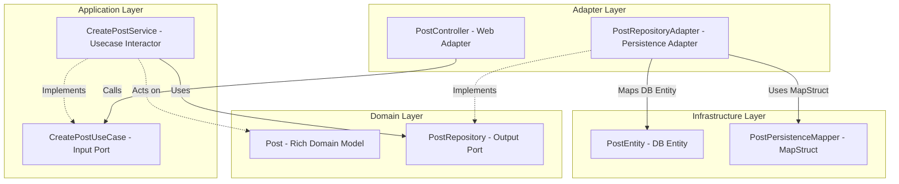

# Phân tích & Đúc kết Kinh nghiệm Kiến trúc Backend - Social-Pulse

Tài liệu này được biên soạn dưới góc nhìn của một **Code Architect** và **Senior Backend Engineer**, nhằm mục đích rà soát, phân tích và hệ thống hóa các kỹ thuật thiết kế, lập trình nâng cao đã được áp dụng trong codebase backend của dự án **Social-Pulse**. Đây là cẩm nang học tập giá trị giúp bạn đúc kết kinh nghiệm thiết kế hệ thống lớn, hiệu năng cao và có khả năng mở rộng tốt.

---

## 1. Kiến trúc & Tổ chức thư mục (Architecture & Folder Structure)

Dự án áp dụng mô hình kiến trúc **Screaming Architecture (Kiến trúc "gầm thét")** kết hợp với cấu trúc **Hexagonal Architecture (Ports & Adapters)** và được tổ chức theo tính năng nghiệp vụ (**Package-by-Feature**).

### 1.1. Cách tổ chức chi tiết
Thay vì gom nhóm lớp theo dạng kỹ thuật (như một thư mục chứa toàn bộ controllers, một thư mục chứa toàn bộ services), dự án chia nhỏ thành từng thư mục đại diện cho các miền nghiệp vụ (Domain): `post`, `user`, `feed`, `chat`, `auth`, `notification`, `follow`...

Bên trong mỗi miền nghiệp vụ, kiến trúc Hexagonal phân tách rõ ràng thành 4 lớp độc lập:
1. **`domain` (Lõi nghiệp vụ)**:
   - Chứa thực thể nghiệp vụ thuần túy như [Post.java](file:///home/damphuquy/Documents/Social-Pulse/backend/src/main/java/com/socialpulse/app/post/domain/model/Post.java). Các đối tượng này không mang annotation JPA/Hibernate hay bất cứ thư viện framework nào.
   - Định nghĩa các interfaces giao tiếp nghiệp vụ (Domain Ports) như [PostRepository.java](file:///home/damphuquy/Documents/Social-Pulse/backend/src/main/java/com/socialpulse/app/post/domain/repository/PostRepository.java).
2. **`application` (Tầng điều phối luồng)**:
   - Định nghĩa các Use Case interfaces như [CreatePostUseCase.java](file:///home/damphuquy/Documents/Social-Pulse/backend/src/main/java/com/socialpulse/app/post/application/usecase/CreatePostUseCase.java).
   - Thực thi nghiệp vụ bằng các lớp Service như [CreatePostService.java](file:///home/damphuquy/Documents/Social-Pulse/backend/src/main/java/com/socialpulse/app/post/application/service/CreatePostService.java). Các service này chỉ biết giao tiếp với interfaces trừu tượng của tầng Domain.
3. **`adapter` (Cổng kết nối thế giới bên ngoài)**:
   - `web`: Nhận dữ liệu HTTP REST như [PostController.java](file:///home/damphuquy/Documents/Social-Pulse/backend/src/main/java/com/socialpulse/app/post/adapter/web/PostController.java).
   - `persistence`: Thực thi các repository interfaces của tầng domain thông qua việc kết nối database thực tế như [PostRepositoryAdapter.java](file:///home/damphuquy/Documents/Social-Pulse/backend/src/main/java/com/socialpulse/app/post/adapter/persistence/PostRepositoryAdapter.java).
4. **`infrastructure` (Tầng hạ tầng kỹ thuật)**:
   - Chứa thực thể database mang annotation JPA như [PostEntity.java](file:///home/damphuquy/Documents/Social-Pulse/backend/src/main/java/com/socialpulse/app/post/infrastructure/persistence/entity/PostEntity.java).
   - Triển khai các JPA interfaces trung gian, MapStruct mapper chuyển đổi Model-Entity, và các lớp cấu hình Spring Bean tường minh như [PostConfig.java](file:///home/damphuquy/Documents/Social-Pulse/backend/src/main/java/com/socialpulse/app/post/infrastructure/config/PostConfig.java).



### 1.2. Ưu và Nhược điểm
* **Ưu điểm**:
  - **Độc lập Framework**: Phần lõi nghiệp vụ cốt lõi không có bất cứ sự phụ thuộc nào vào Spring Boot hay Hibernate. Điều này cho phép doanh nghiệp nâng cấp Spring, chuyển sang framework khác (Micronaut, Quarkus) hoặc thay đổi công nghệ lưu trữ (Postgres -> MongoDB) cực kỳ an toàn mà không phải viết lại logic nghiệp vụ.
  - **Độc lập Kiểm thử (Unit Testing)**: Vì các thành phần kết nối với nhau qua interfaces và POJOs thuần túy, việc viết Unit Test cho tầng nghiệp vụ vô cùng nhanh chóng, có thể mock mọi IO port mà không cần khởi chạy Spring Container chậm chạp.
  - **Tính bao đóng nghiệp vụ (Screaming)**: Cấu trúc package hiển thị rõ ràng những tính năng cốt lõi của mạng xã hội, giúp thành viên mới tham gia dự án dễ dàng định vị mã nguồn.
* **Nhược điểm**:
  - **Boilerplate lớn**: Phải duy trì song song hai loại Model (Domain Model thuần túy và JPA Entity) cùng các Mapper trung gian. Code có nhiều interface và lớp bọc (Adapter) tạo ra cảm giác "over-engineering" đối với các nghiệp vụ chỉ CRUD đơn giản.
  - **Độ phức tạp trong quản lý cấu hình**: Việc khai báo Spring bean thủ công tại các lớp `@Configuration` cục bộ thay vì quét tự động đòi hỏi lập trình viên phải quản lý phụ thuộc rất tỉ mỉ.

---

## 2. Kỹ thuật Cơ bản & Thiết kế (Design Principles)

### 2.1. Rich Domain Model vs Anemic Domain Model
Dự án ảnh hưởng bởi triết lý thiết kế hướng miền (DDD) thông qua **Rich Domain Model**.
* **Anemic Domain Model** (Mô hình thiếu máu): Các đối tượng domain chỉ đóng vai trò là cấu trúc chứa dữ liệu (DTO mang getter/setter), toàn bộ logic xử lý bị đẩy lên tầng Service. Điều này dẫn tới phình to dịch vụ và rò rỉ đóng gói nghiệp vụ.
* **Rich Domain Model**: Lớp [Post.java](file:///home/damphuquy/Documents/Social-Pulse/backend/src/main/java/com/socialpulse/app/post/domain/model/Post.java) tự bảo vệ trạng thái của chính nó. Ví dụ:
  - Các thay đổi thuộc tính bắt buộc phải đi qua các hàm hành vi: `changePrivacy(Privacy)`, `update(...)`.
  - Logic đếm và tính toán điểm hot (`updateHotScore()`) được đóng gói ngay tại đối tượng để đảm bảo trạng thái của Post luôn nhất quán (Invariant Enforcement).

### 2.2. Áp dụng các nguyên lý SOLID
* **Single Responsibility Principle (SRP)**: Phân rã tối đa các Use Cases. Thay vì gộp chung mọi phương thức vào một lớp `PostService` khổng lồ, dự án chia nhỏ thành [CreatePostService.java](file:///home/damphuquy/Documents/Social-Pulse/backend/src/main/java/com/socialpulse/app/post/application/service/CreatePostService.java), [ReactPostService.java](file:///home/damphuquy/Documents/Social-Pulse/backend/src/main/java/com/socialpulse/app/post/application/service/ReactPostService.java), [ViewPostService.java](file:///home/damphuquy/Documents/Social-Pulse/backend/src/main/java/com/socialpulse/app/post/application/service/ViewPostService.java)... Mỗi class chỉ chịu trách nhiệm duy nhất cho một tác vụ nghiệp vụ.
* **Dependency Inversion Principle (DIP)**: Tầng ứng dụng cấp cao (`CreatePostService`) không hề biết đến tầng lưu trữ dữ liệu cụ thể (`JpaPostRepository`). Cả hai thành phần này cùng phụ thuộc vào một abstractions nằm ở tầng Domain (`PostRepository`).
* **Open/Closed Principle (OCP)**: Hệ thống feed ranking được thiết kế dạng plugin. Lớp [FeedRankingService.java](file:///home/damphuquy/Documents/Social-Pulse/backend/src/main/java/com/socialpulse/app/feed/application/service/ranking/FeedRankingService.java) gọi các interface UseCases xếp hạng. Khi cần tích hợp giải pháp xếp hạng mới, chỉ cần triển khai một implementation mới mà không cần chỉnh sửa luồng điều phối lõi.

### 2.3. Dependency Injection & Explicit Configuration
Dự án hạn chế lạm dụng việc khai báo `@Service` hay `@Component` quét tự động bừa bãi. Thay vào đó:
- Sử dụng cấu hình tiêm phụ thuộc thông qua Java Config độc lập như [PostConfig.java](file:///home/damphuquy/Documents/Social-Pulse/backend/src/main/java/com/socialpulse/app/post/infrastructure/config/PostConfig.java).
- Cơ chế constructor injection giúp tránh các lỗi phụ thuộc vòng (Circular Dependency) lúc chạy và tăng cường tính rõ ràng khi viết test mock bằng tay.

---

## 3. Kỹ thuật Nâng cao & Tối ưu (Advanced Techniques)

### 3.1. Xử lý dữ liệu & Tối ưu hóa truy vấn (CQRS Pattern)
Hệ thống Social-Pulse áp dụng kiến trúc tách biệt luồng Đọc/Ghi dữ liệu (CQRS-like) ở mức độ truy cập cơ sở dữ liệu:
* **Giao dịch Ghi (Write Path)**:
  Sử dụng JPA/Hibernate thông qua đối tượng [PostEntity.java](file:///home/damphuquy/Documents/Social-Pulse/backend/src/main/java/com/socialpulse/app/post/infrastructure/persistence/entity/PostEntity.java).
  - Tận dụng thế mạnh của Hibernate trong quản lý vòng đời thực thể, tự động đồng bộ hóa trạng thái (Dirty checking), thiết lập chỉ mục index (`idx_hot_score`, `idx_post_user`), quản lý quan hệ phức tạp `@ElementCollection` cho danh sách topic slugs và kích hoạt các sự kiện vòng đời `@PrePersist`, `@PreUpdate` để quản lý audit log.
* **Giao dịch Đọc (Read Path)**:
  Đối với nghiệp vụ hiển thị bảng tin (Feed) yêu cầu hiệu năng đọc cực cao và kết hợp nhiều bảng, hệ thống bypass hoàn toàn JPA Hibernate để loại bỏ overhead quản lý trạng thái entity (Cache L1/L2 tracking).
  - Lớp [FeedRepositoryAdapter.java](file:///home/damphuquy/Documents/Social-Pulse/backend/src/main/java/com/socialpulse/app/feed/adapter/persistence/FeedRepositoryAdapter.java) sử dụng trực tiếp Spring `JdbcTemplate` thực thi SQL thô (Native Query) với lệnh `LIMIT/OFFSET` và liên kết JOIN tường minh. Điều này tối ưu hóa tối đa thời gian xử lý và loại bỏ triệt để lỗi N+1 SELECT.
* **Lazy Loading**: Áp dụng triệt để cơ chế `@ManyToOne(fetch = FetchType.LAZY)` để ngăn chặn việc tải dữ liệu dư thừa từ bảng Users khi truy vấn bài đăng.

### 3.2. Quản lý giao dịch và phối hợp tác vụ (Transaction Synchronization)
Để tránh các vấn đề không nhất quán dữ liệu giữa Hệ quản trị CSDL quan hệ (PostgreSQL) và các dịch vụ phi quan hệ / truyền thông điệp thời gian thực (Redis cache, SSE broadcast), dự án sử dụng cơ chế đăng ký đồng bộ giao dịch Spring:
```java
TransactionSynchronizationManager.registerSynchronization(new TransactionSynchronization() {
    @Override
    public void afterCommit() {
        // Tác vụ ghi Redis hoặc phát SSE thời gian thực chỉ chạy khi giao dịch DB thành công
        sseEmitterRegistry.broadcast("post_stats", data);
    }
});
```
* **Ý nghĩa**: Nếu xảy ra lỗi rollback trong database PostgreSQL, tác vụ ngoài luồng (như cập nhật cache Redis ảo hoặc phát SSE báo tin giả đến các client khác) sẽ không bao giờ được kích hoạt, đảm bảo tính nhất quán dữ liệu tối đa.

### 3.3. Write-Back (Write-behind) Caching
Với các hoạt động cập nhật lượt xem, bình luận, chia sẻ bài viết có tần suất cực lớn trên mạng xã hội:
- **Tối ưu hóa**: Tránh việc liên tục thực hiện cập nhật cập nhật đĩa xuống DB quan hệ (gây tắc nghẽn khóa hàng - Row lock). Khi người dùng chia sẻ, hệ thống chỉ tăng bộ đếm delta trong Redis một cách cực nhanh thông qua `opsForValue().increment()`.
- **Ghi chậm về DB**: Một scheduler chạy ngầm [SyncSchedule.java](file:///home/damphuquy/Documents/Social-Pulse/backend/src/main/java/com/socialpulse/app/common/schedule/SyncSchedule.java) định kỳ 10 giây thu thập toàn bộ các key delta trong Redis, sử dụng `getAndSet` nguyên tử để vừa đọc dữ liệu cũ vừa reset bộ đếm về "0", sau đó thực thi một lệnh cập nhật gộp (bulk update) duy nhất xuống database.

### 3.4. Concurrency & Luồng Real-time bất đồng bộ
* **Đồng bộ hóa an toàn luồng trong SSE**:
  Lớp [SseEmitterRegistry.java](file:///home/damphuquy/Documents/Social-Pulse/backend/src/main/java/com/socialpulse/app/realtime/application/service/SseEmitterRegistry.java) sử dụng cấu trúc dữ liệu an toàn đa luồng `ConcurrentHashMap` phối hợp cùng `CopyOnWriteArrayList` để lưu trữ các kết nối client SSE hoạt động. Cơ chế tự động dọn dẹp các kết nối lỗi/hết hạn trên các hook `onCompletion` và `onTimeout` giúp loại bỏ hoàn toàn rủi ro rò rỉ bộ nhớ (Memory Leak) phổ biến trong lập trình SSE.
* **Bất đồng bộ hóa phát sóng (Async Broadcasting)**:
  Tách biệt luồng phát SSE thời gian thực ra khỏi luồng xử lý HTTP request chính thông qua một thread pool cố định (`sseExecutor = Executors.newFixedThreadPool(10)`). Lệnh gửi không còn gây chặn luồng xử lý nghiệp vụ của REST API, giúp hệ thống phục vụ hàng ngàn người dùng trực tuyến đồng thời một cách mượt mà.
* **WebSocket Offline Queue & Delivery Delay**:
  Khi người dùng mất kết nối, hệ thống tạm trữ các thông báo trong hàng đợi Redis. Lớp [ReconnectionService.java](file:///home/damphuquy/Documents/Social-Pulse/backend/src/main/java/com/socialpulse/app/chat/infrastructure/websocket/ReconnectionService.java) lắng nghe sự kiện `SessionConnectedEvent`, sử dụng luồng nền chạy trễ 500ms để đợi client hoàn tất các cấu hình đăng ký hàng đợi STOMP (SUBSCRIBE) rồi mới đẩy tin nhắn cũ về, tránh mất mát thông tin.

### 3.5. Bảo mật nâng cao & Ràng buộc Validation
* **Type-safe Meta-Annotations**:
  Lớp [RequiresPermission.java](file:///home/damphuquy/Documents/Social-Pulse/backend/src/main/java/com/socialpulse/app/security/permission/RequiresPermission.java) định nghĩa các annotation kiểm soát quyền hạn có cấu trúc rõ ràng (như `@RequiresPermission.PostCreate` ánh xạ lên `@PreAuthorize("hasAuthority('post:create')")`). Phương án này giúp ngăn ngừa triệt để lỗi đánh máy chuỗi quyền hạn thô trong mã nguồn.
* **Auto-Sync DB Permissions**:
  Ứng dụng chạy ngầm bộ đồng bộ [PermissionSyncService.java](file:///home/damphuquy/Documents/Social-Pulse/backend/src/main/java/com/socialpulse/app/security/permission/PermissionSyncService.java) lúc khởi chạy. Lớp này ánh xạ động trạng thái Enum quyền hạn trong code vào bảng phân quyền dưới CSDL. Nhờ đó, việc thêm/sửa đổi quyền hạn chỉ cần thực hiện duy nhất trong code Java, hệ thống tự đồng bộ mà không cần viết các file SQL migration Flyway thủ công.
* **WebSocket STOMP Interceptors Security**:
  Triển khai bảo mật WebSocket 2 lớp:
  - Lớp [WebSocketAuthInterceptor.java](file:///home/damphuquy/Documents/Social-Pulse/backend/src/main/java/com/socialpulse/app/common/websocket/WebSocketAuthInterceptor.java) phân tích và giải mã token JWT ngay trên luồng kết nối `CONNECT`.
  - Lớp [WebSocketSecurityConfig.java](file:///home/damphuquy/Documents/Social-Pulse/backend/src/main/java/com/socialpulse/app/chat/infrastructure/config/WebSocketSecurityConfig.java) áp dụng bộ kiểm tra quyền gửi và đăng ký (`SEND` và `SUBSCRIBE`) trên các đích đường dẫn động (như `/topic/chat.*`), ngăn chặn người dùng đăng ký trái phép các kênh chat riêng tư của nhau.

---

## 4. Điểm sáng & Đề xuất cải thiện (Đã nghiệm thu)

### 🌟 Điểm sáng thiết kế lớn của hệ thống
1. **Kiến trúc phân lớp Hexagonal chuẩn mực**: Giữ tầng domain nghiệp vụ sạch hoàn toàn.
2. **Giải pháp CQRS cơ bản**: Sử dụng linh hoạt JPA cho Write và `JdbcTemplate` cho Read giúp tăng tốc xử lý Feed.
3. **Mô hình phối hợp giao dịch (Transaction Sync)**: Ý thức rất tốt trong việc tránh rò rỉ tác vụ ngoại biên khi rollback giao dịch cơ sở dữ liệu.
4. **WebSocket Custom Security Interceptor**: Giải pháp bảo mật phân quyền WebSocket gọn gàng, hiệu quả cao.

---

### 🛠️ Các cải tiến đã được refactor thành công (Sản xuất hoàn hảo)

#### 1. Sửa lỗi trùng lặp tính toán delta trong `SyncSchedule`
* *Trước đây:* Logic cập nhật DB được gọi ngay trong vòng lặp duyệt key của scheduler ngầm và map tạm tích lũy không được xóa sạch, dẫn đến việc cộng dồn sai số lượt share trong database quan hệ PostgreSQL khi có nhiều cập nhật đồng thời.
* *Đã sửa:* Đã di chuyển toàn bộ logic ghi đĩa cập nhật DB và dọn dẹp Redis ra bên ngoài vòng lặp `for`. Hệ thống hiện tại chỉ thực thi một lệnh bulk update duy nhất sau khi đã gom đủ thông tin tất cả delta, khắc phục triệt để lỗi sai số và giảm đáng kể số lượng transaction mở xuống DB.

#### 2. Kích hoạt Async và Scheduling trung tâm
* *Trước đây:* Thiếu annotation cấu hình `@EnableAsync` và `@EnableScheduling` tại tầng khởi chạy ứng dụng [Application.java](file:///home/damphuquy/Documents/Social-Pulse/backend/src/main/java/com/socialpulse/app/Application.java), dẫn đến việc gửi email đăng ký chạy đồng bộ gây tắc nghẽn luồng xử lý chính và scheduler đồng bộ share count không bao giờ chạy.
* *Đã sửa:* Đã bổ sung cấu hình kích hoạt đầy đủ trên lớp chạy chính của Spring Boot. Các tác vụ email và scheduler hiện tại chạy ẩn hoàn toàn bất đồng bộ đúng theo đặc tả thiết kế.

#### 3. Đồng bộ hóa tác vụ SSE tại ReactPostService
* *Trước đây:* Việc broadcast thống kê lượt bày tỏ cảm xúc (`post_stats`) được gọi trực tiếp trong hàm `@Transactional` của [ReactPostService.java](file:///home/damphuquy/Documents/Social-Pulse/backend/src/main/java/com/socialpulse/app/post/application/service/ReactPostService.java), gây rủi ro phát thông tin ảo lên giao diện khi DB bị rollback.
* *Đã sửa:* Đã bao bọc logic broadcast SSE vào cấu trúc `afterCommit()` của Spring Transaction Synchronization, đảm bảo tính nhất quán tuyệt đối về hiển thị dữ liệu cho client.

#### 4. Khắc phục nghẽn luồng xử lý trong SseEmitterRegistry
* *Trước đây:* Phương thức `broadcast` gửi SSE lặp tuần tự đồng bộ qua danh sách khách hàng kết nối hoạt động trực tiếp trên luồng HTTP Servlet chính, gây nghẽn nghiêm trọng khi có nhiều người dùng.
* *Đã sửa:* Bổ sung và triển khai một `ExecutorService` (Fixed Thread Pool 10 threads) độc lập để đẩy toàn bộ tiến trình ghi socket SSE vào luồng nền chạy độc lập, giải phóng ngay lập tức HTTP request threads xử lý API cho clients.

---

### 🚀 Đề xuất cải tiến hệ thống trong tương lai

1. **Tối ưu hóa hiệu năng SQL lấy bài viết ngẫu nhiên**:
   - *Hiện trạng:* Phương thức lấy bài viết ngẫu nhiên trong [FeedRepositoryAdapter.java](file:///home/damphuquy/Documents/Social-Pulse/backend/src/main/java/com/socialpulse/app/feed/adapter/persistence/FeedRepositoryAdapter.java#L100-L112) đang sử dụng lệnh `ORDER BY RANDOM() LIMIT ?`. Việc này buộc CSDL PostgreSQL phải quét và sắp xếp ngẫu nhiên toàn bộ bảng `posts`, làm sụt giảm nghiêm trọng tốc độ khi số lượng bài đăng đạt quy mô hàng triệu.
   - *Khuyến nghị cải tiến:* Thay thế bằng giải pháp lấy mẫu ngẫu nhiên nhẹ nhàng hơn sử dụng từ khóa `TABLESAMPLE SYSTEM (1)` của PostgreSQL để chỉ quét ngẫu nhiên khoảng 1% dữ liệu trước khi chọn lọc, hoặc thực hiện tính toán danh sách IDs ngẫu nhiên trước trên tầng Java rồi truy vấn bằng toán tử `WHERE id IN (...)`.
2. **Mở rộng cơ sở dữ liệu (Database Read Replica)**:
   - Khi hệ thống đạt quy mô truy cập lớn hơn, có thể nâng cấp mô hình CQRS hiện tại bằng cách phân tách hẳn database PostgreSQL: luồng ghi (JPA) trỏ trực tiếp vào DB Master chính, còn luồng đọc (JdbcTemplate/Feed) trỏ vào các DB Replicas (Read-Only) để chia sẻ tải đọc.
